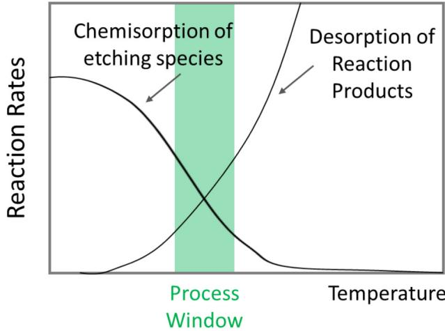
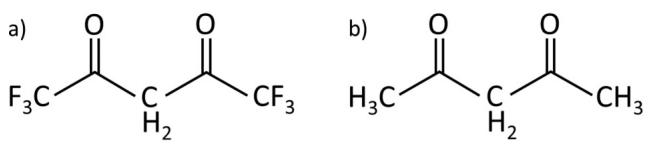
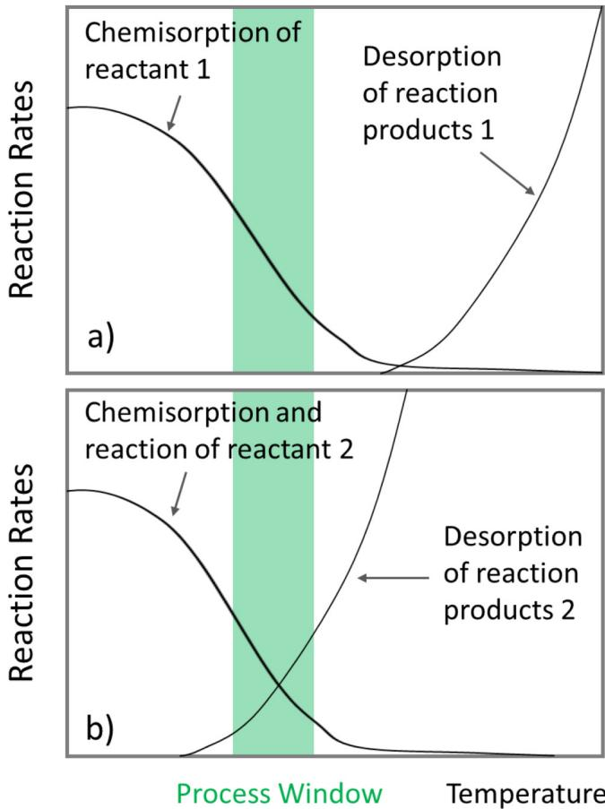
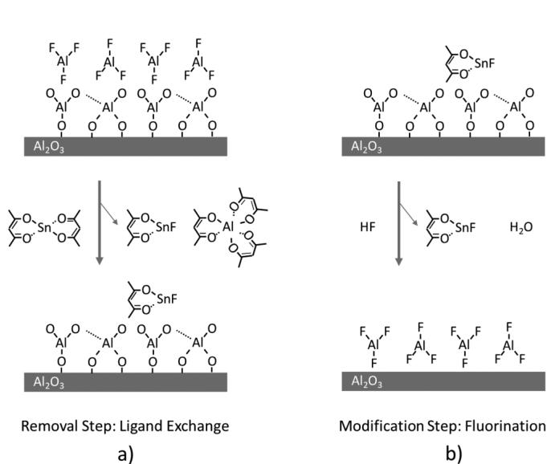
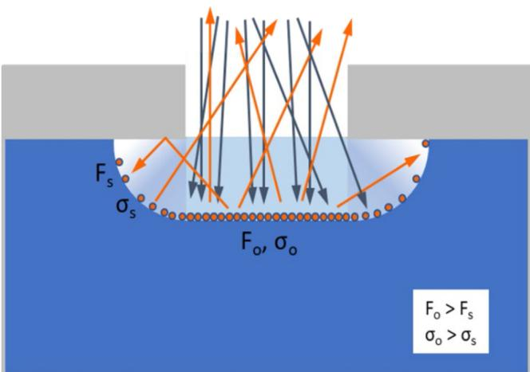
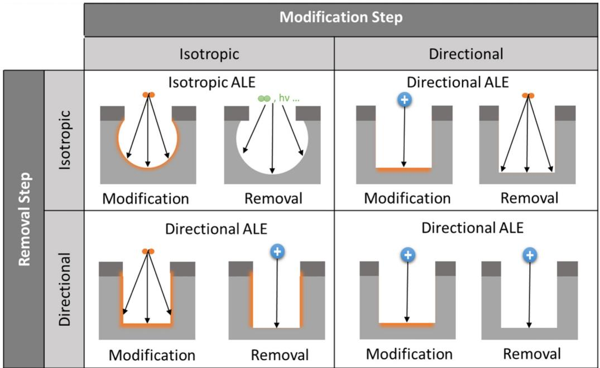
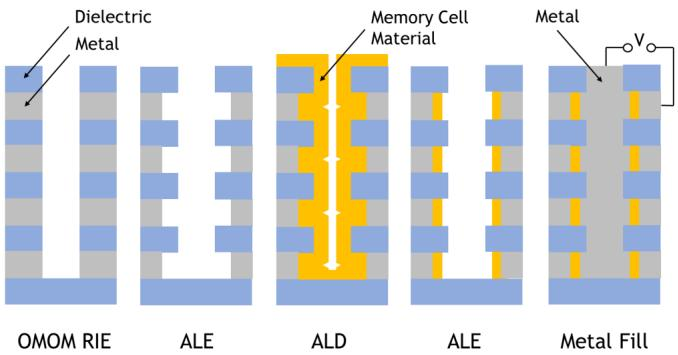
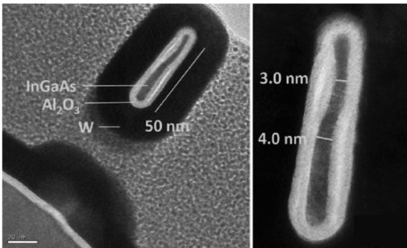

# Thermal atomic layer etching: A review 

Special Collection: Atomic Layer Etching (ALE)

Andreas Fischer; Aaron Routzahn; Steven M. George $\textcircled{1}$ ; Thorsten Lill

# Articles You May Be Interested In

Temperature-programmed desorption study of the etching of Ni(110) with 2,4-pentanedione

J. Vac. Sci. Technol. A (July 1998)

Surface reaction mechanisms of trifluoroacetylacetone on clean and pre-oxidized Ni(110): An example where etching chemistry does not follow volatility trends

J. Vac. Sci. Technol. A (November 1998)

In situ, simultaneous spectroscopic ellipsometry and quadrupole mass spectrometry studies of ZnO etching using Hacac and $\mathrm { ~ O ~ } _ { 2 }$ plasma

J. Vac. Sci. Technol. A (May 2025)

# Thermal atomic layer etching: A review

Cite as: J. Vac. Sci. Technol. A 39, 030801 (2021); doi: 10.1116/6.000   
Submitted: 24 December 2020 $\cdot$ Accepted: 25 February 2021 $\cdot$   
Published Online: 12 March 2021

Andreas Fischer,1,a) Aaron Routzahn,1 Steven M. George,2 and Thorsten Lill1

# AFFILIATIONS

1Lam Research Corporation, 4400 Cushing Parkway, Fremont, California 94538   
2 Department of Chemistry, University of Colorado at Boulder, Boulder, Colorado 80309

Note: This paper is part of the 2021 Special Topic Collection on Atomic Layer Etching (ALE). a)Electronic mail: andreas.fischer@lamresearch.com

# ABSTRACT

This article reviews the state-of-the art status of thermal atomic layer etching of various materials such as metals, metal oxides, metal nitrides, semiconductors, and their oxides. We outline basic thermodynamic principles and reaction kinetics as they apply to these reactions and draw parallels to thermal etching. Furthermore, a list of all known publications is given organized by the material etched and correlated with the required reactant for each etch process. A model is introduced that describes why in the nonsaturation mode etch anisotropies may occur that can lead to unwanted performance variations in high aspect ratio semiconductor devices due to topological constraints imposed on the delivery of reactants and removal of reactant by-products.

Published under license by AVS. https://doi.org/10.1116/6.0000894

# I. INTRODUCTION

As semiconductor devices are shrinking to the sub- $1 0 \mathrm { n m }$ dimension, etching technologies with atomic scale fidelity are required.1 Atomic layer etching (ALE), which has been studied in laboratories for 30 years, promises to deliver this level of performance. The first report on ALE was published in Yoder’s U.S. patent 4,756,794A entitled “Atomic layer etching.” 2 After a first wave of research during the 1990s, a second wave of interest and development started in the mid-2010s driven by the need for etching technologies with infinite selectivity and the ability to remove controlled amounts of material down to a submonolayer resolution.

A definition of ALE as an etching process comprised of at least two self-limited steps was adopted during a Sematech workshop on ALE in April 2014. This definition was implemented in analogy to its counterpart of Atomic layer deposition (ALD).3 Many of the established concepts in ALD were adopted in ALE. Correlations and similarities between ALD and ALE have been outlined as early as 2015 by Faraz et al.4 The separation of the etching process into separate self-limiting steps reduces the complexity in reactive ion etching (RIE) that is caused by the simultaneous fluxes of many different types of reactive species. The results are improved uniformity across the wafer, across the features with different critical dimensions, and reduced aspect ratio dependent etching (ARDE).1 In addition, there is higher surface smoothness after the completion of the etch. The first industrial implementation of ALE used ions in the second, so-called removal step. This type of ALE is called directional ALE because ions are accelerated toward the wafer surface, which results in a preferred direction of the etching process allowing the formation of devices from primarily horizontally oriented films.

Thermal ALE does not possess intrinsic directionality; it etches with the same rate in all directions. It is an isotropic etching technology. The fact that thermal ALE etches in the lateral direction with atomic scale precision enables the formation of electric devices with their active channels oriented vertically on the sidewalls of the corresponding support structures. It turns out that this is a key in the formation of integrated 3D devices, which will be at the center of the next wave of miniaturization of microchips along the path of Moore’s law.

Flash memory was the first device that was produced in a 3D architecture. It has found application in a large number of mobile devices as well as in datacenters where it has replaced a meaningful percentage of hard disk drives. Emerging memories are expected to follow suit in this decade. These new devices will contribute to the proliferation of the Internet of things and artificial intelligence. The ever-increasing amount of data generated by humans needs ever more computing power and memory space and 3D integration is one of the solutions. Thermal isotropic ALE is deemed to be one of the enabling processing technologies.

# II. THERMAL ETCHING

Thermal etching is a process that uses neutral gases and thermal energy or heat for activation. It is also referred to as gas phase or vapor etching. Thermal isotropic ALE can then be defined as a thermal process that requires a preceding modification step to enable thermal etching.

# A. Adsorption/desorption—Kinetics

The elementary steps of a thermal etching process are physisorption and chemisorption of the vapor-phase reactants to the surface, as well as their chemical reaction and desorption of by-products from the surface. The processes are temperature sensitive and typically follow exponential laws with respect to temperature. For thermal etching to occur, all steps must have nonzero rates at a given wafer temperature. Not many vapor-phase reactants meet this requirement for a given set of surface materials and, therefore, relatively few thermal etching processes are known and used in the semiconductor industry. The process window for thermal etching is defined by the area of overlap of the rate curves for adsorption of the vapor molecules and desorption of the reaction products as shown in Fig. 1. 5

For dissociative chemisorption of a molecule to occur, the molecule must first physisorb onto the surface and then overcome the activation barrier for chemisorption. At higher temperatures, physisorbed molecules may desorb at the same rate as they adsorb and, hence, may not take the next step to chemisorb. Therefore, initial sticking coefficients or chemisorption rates that decrease as a function of temperature are a fairly common observation.6–9 Such a behavior is consistent with a precursor-mediated adsorption model.10 Therefore, we represent the chemisorption rate of the etching species as a falling curve in Fig. 1. The desorption rate of the reaction products increases generally with temperature. For thermal etching to occur, chemisorption of the etching species and desorption of the reaction curves must have appreciable rates or probabilities as the same temperature. The region of overlapping rate curves represents the process window of a thermal etch process. Compared to ion driven etching processes, there are only a few thermal etch processes used in the semiconductor industry due to small or absent process windows.

  
Schematic illustration of the temperature process window for thermal FIG. 1.etching. From Lill et al., “Etching of semiconductor devices,” in Materials Science and Technology. Copyright 2019 by Wiley. Adapted with permission from Wiley.

# B. Thermodynamics

Thermodynamics imposes another constraint for thermal etching. The removal step in thermal isotopic ALE is also a chemical reaction with the solid surface, which forms volatile products. For a chemical reaction to proceed, it must be thermodynamically favorable. The Gibbs free energy must be negative. The Gibbs free energy can be calculated using commercial programs with databases of relevant thermodynamic data. The standard Gibbs free energy has enthalpic and entropic components,

$$
\Delta G ^ { 0 } = \Delta H ^ { 0 } - T \Delta S ^ { 0 } .
$$

Here, $\Delta H ^ { \circ }$ is the change in enthalpy. $\Delta S ^ { \circ }$ is the change in entropy for the reaction and reflects the change in order of the system. The superscripts denote standard conditions. For specific reactions, it must be calculated for the given conditions.

For example, etching of $\mathrm { T i O } _ { 2 }$ with HF is a good system to illustrate thermodynamical constraints. The reaction products are water (partially as a vapor, and partially as an adsorbed multilayer liquid film, depending on p and T) plus volatile titanium tetrafluoride, $\mathrm { T i F _ { 4 } } ,$ ,1

$$
\mathrm { T i O } _ { 2 ( s ) } + 4 \mathrm { H F } _ { ( g ) } \ \longrightarrow \mathrm { T i F } _ { 4 ( g ) } + 2 \mathrm { H } _ { 2 } \mathrm { O } _ { ( g , l ) } .
$$

The thermodynamics of this reaction has been discussed by Lee and George.12 According to them, the Gibbs free energy at standard conditions is $- 6 . 1 \mathrm { k c a l / m o l }$ at $2 5 ^ { \circ } \mathrm { C } ,$ which means that the reaction is favorable. The standard reaction enthalpy $\Delta H ^ { \circ }$ is $- 2 2 . 7 \mathrm { k c a l / m o l }$ at $2 5 ^ { \circ } \mathrm { C }$ .

This negative enthalpy value is maintained at high temperatures with $\Delta H ^ { \circ } = - 2 1 . 9 ~ \mathrm { { \ k c a l / m o l } }$ at $2 5 0 ^ { \circ } \mathrm { C }$ . However, the free energy change becomes unfavorable at temperatures ${ > } 1 5 0 ^ { \circ } \mathrm { C }$ because of the change to the entropy term at higher temperatures (TΔS dominates due to $T$ becoming large). The $\Delta G ^ { \circ }$ value at $2 5 0 ^ { \circ } \mathrm { C }$ is $+ 6 . 3 \mathrm { \ k c a l / m o l }$ . Nevertheless, etching of $\mathrm { T i O } _ { 2 }$ with HF has been observed at temperatures of $2 5 0 ^ { \circ } \mathrm { C }$ . To explain this discrepancy between the theory and experiment, the authors evoke nonequilibrium conditions such as excess HF concentrations at the surface due to fast removal of $\mathrm { T i F _ { 4 } }$ by purge gases.

This example illustrates that thermodynamics is a reasonably good first order predictor for etching, but experimental verification is needed. Besides nonequilibrium effects, reaction kinetics may alter thermodynamics predictions. Even if the Gibbs free energy is negative, a given reaction may not proceed due to reaction kinetics.

# C. Application examples

Typical examples of thermal etching are the reaction of silicon with fluorine or of $\mathrm { S i O } _ { 2 }$ with $\mathrm { H F } / \mathrm { H } _ { 2 } \mathrm { O }$ .13,14 Both applications are used in the manufacturing of MEMS devices where high etch rates are needed for etching processes to produce an undercut.

Molecular fluorine $( \mathrm { F } _ { 2 } )$ as well as fluorine radicals react with silicon spontaneously or thermally. To address the safety concerns that would arise from its handling, $\mathrm { X e F } _ { 2 }$ is frequently used in thermal etching of silicon instead of $\mathrm { F } _ { 2 }$ . 13 $\mathrm { X e F } _ { 2 }$ molecules undergo dissociative chemisorption to produce fluorine atoms in a similar way as $\mathrm { F } _ { 2 }$ molecules do. These fluorine atoms react with the fluorinated silicon surface to form $\mathrm { S i F _ { 4 } }$ . The reaction paths and corresponding activation energies must be very different for the two reactants because an etching rate difference of 4 orders of magnitude has been reported.13 The etching rate of silicon with $\mathrm { X e F } _ { 2 }$ can reach several micrometers per minute, which is much higher than typical RIE processes. Detailed information about this process can be found in a review article by Donnelly.15 Besides $\mathrm { F } _ { 2 }$ and ${ \mathrm { X e F } } _ { 2 } $ , other fluorine containing interhalogen compounds can be used to etch silicon. A list of them is provided in Table I. 16

$\mathrm { S i O } _ { 2 }$ , on the other hand, does not spontaneously etch with $\mathrm { F } _ { 2 }$ or with $\mathrm { X e F } _ { 2 }$ . This makes it a great stopping or masking material for silicon etching with these gases. To etch $\mathrm { S i O } _ { 2 }$ thermally, HF gas can be used. Early studies reported that both HF and $_ \mathrm { H _ { 2 } O }$ were needed to achieve meaningful etch rates even though $_ \mathrm { H _ { 2 } O }$ is the reaction product.14,17 The reaction can be described using the following chemical equation:

$$
\mathrm { S i O } _ { 2 } \ O _ { ( s ) } + 4 \mathrm { H F } _ { ( g ) } \longrightarrow \mathrm { S i F } _ { 4 } \ O _ { ( g ) } + \mathrm { H } _ { 2 } \ O \ O _ { ( l ) } .
$$

One of the mechanisms that was invoked to explain the need for $_ \mathrm { H _ { 2 } O }$ is that it forms a multilayer physisorbed film on the surface, which acts as a solvent medium for $\mathrm { \dot { H } F ^ { 1 4 } }$ and as an initiator of the reaction. As etching proceeds, the original layer is replenished by $_ \mathrm { H } _ { 2 } \mathrm { O }$ stemming from the reaction according to Eq. (3). More specifically, $_ \mathrm { H _ { 2 } O }$ is adsorbed at the $\mathrm { S i O } _ { 2 }$ surface to form silanol groups,1

$$
\mathrm { S i O } _ { 2 } + \mathrm { H } _ { 2 } \mathrm { O } \longrightarrow \mathrm { S i } ( \mathrm { O H } ) _ { 4 } ,
$$

which can then react with the silanol groups to form $\mathrm { S i F _ { 4 } }$ and $_ \mathrm { H _ { 2 } O }$ according to

Silicon etching rates and reaction probabilities of interhalogens and fluoTABLE I.rine. n-type (100) silicon wafers were used in the experiments. Reprinted with permission from Ibbotson et al., J. Appl. Phys. , 2939 (1984). Copyright 1984, AIP Publishing LLC.   

<table><tr><td>Reactant</td><td>Pressure (Torr)</td><td>Etching rate (Å/min)</td><td>Reaction probability</td></tr><tr><td>ClF3</td><td>4.7</td><td>5500</td><td>4.5×10−5</td></tr><tr><td>BrF3</td><td>1.0</td><td>50 000</td><td>2.4× 10−3</td></tr><tr><td>BrF5</td><td>8.1</td><td>11 800</td><td>7.8×10−5</td></tr><tr><td>IF5</td><td>4.6</td><td>9900</td><td>1.3 × 10−4</td></tr><tr><td>ClF</td><td>5.0</td><td>&lt;10</td><td>&lt;6×10−8</td></tr><tr><td>XeF2</td><td>0.2</td><td>45 300</td><td>1.2×10−2</td></tr><tr><td>F2</td><td>10</td><td>3</td><td>9×10−9</td></tr><tr><td>F</td><td>0.2</td><td>4600</td><td>4.1 × 10−4</td></tr></table>

$$
\mathrm { S i ( O H ) } _ { 4 } + 4 \mathrm { H F } \longrightarrow \mathrm { S i F } _ { 4 } + 4 \mathrm { H } _ { 2 } \mathrm { O } .
$$

Under these conditions, etching rates of 1000 to $2 0 0 0 \mathrm { \ : \mathring { A } / m i n }$ have been measured.17 The challenge of this process is precipitation of fluorosilicic acid, $\mathrm { H } _ { 2 } \mathrm { S i F } _ { 6 } ,$ on the surface, which slows down the etching rate over time and needs to be rinsed after the process is finished. When the temperature is increased to values where multilayer $_ \mathrm { H _ { 2 } O }$ adsorption is suppressed, etching of silicon oxide also slows down significantly.

Overall, this process is difficult to control because of the challenge in controlling the formation of the initial multilayer of $_ \mathrm { H _ { 2 } O }$ as the latter is not repeatable and reaction products negatively interfere with the ongoing $\mathrm { S i O } _ { 2 }$ etching process. Alcohols such as $\mathrm { C H } _ { 3 } \mathrm { O H }$ can be used to hydrate the $\mathrm { S i O } _ { 2 }$ surface at elevated temperatures where $_ \mathrm { H _ { 2 } O }$ does not accumulate. Etching rates of $2 0 0 \mathrm { ^ { \circ } \AA / m i n }$ at $2 5 ^ { \circ } \mathrm { C }$ and $1 0 \ \mathrm { \AA / m i n }$ at $9 5 ^ { \circ } \mathrm { C }$ have been reported for a methanol vapor pressure of 100 Torr for thermal oxide.18 The etching rate repeatability was greatly improved at higher temperatures and lower pressures in the absence of a physisorbed $_ \mathrm { H _ { 2 } O }$ layer at the surface with alcohol replacing $_ \mathrm { H _ { 2 } O }$ .

The examples for thermal etching of silicon and $\mathrm { S i O } _ { 2 }$ , which have been discussed so far, leverage the reactivity of halogens and volatility of halides for etching. When the surface halogens and oxides do not desorb at thermal energies, secondary reactions must be deployed to complete the etching process. These reactions have much more complicated chemical pathways.

An archetypical example is the etching of $\mathrm { F e } _ { 2 } \mathrm { O } _ { 3 }$ with hexafluoroacetylacetone (Hhfac) via a chelation reaction at temperatures between 140 and $4 0 0 ^ { \circ } \mathrm { C } ,$ ,19

$$
6 \mathrm { H h f a c } _ { ( g ) } + \mathrm { F e } _ { 2 } \mathrm { O } _ { 3 ( S ) } \longrightarrow 2 \mathrm { F e } ( \mathrm { h f a c } ) _ { 3 ( g ) } + 3 \mathrm { H } _ { 2 } \mathrm { O } _ { ( g ) } .
$$

Chelation is the formation of chemical bonds between a single central metal atom and organic molecules, which each form multiple bonds with the central atom to become ligands. In this specific reaction, the ligands are called chelants. Figure 2 shows the structural formulas for the keto tautomer of Hhfac. It also shows the related molecule acetyl-acetone Hacac. which can be used to thermally etch ${ \mathrm { Z n O } }$ .20

Hhfac does not react with metallic iron.19 Reaction (4) requires iron to be in the fully oxidized $3 ^ { + }$ state. Chelating reactants such as Hhfac and Hacac are not reactive enough to bond to most metal surfaces. This property can be used to design thermal isotropic ALE processes as we will discuss later in this article.

  
Structural formulas of the keto tautomers of Hhfac (a) and Hacac (b).

# III. THERMAL ISOTROPIC ALE—FUNDAMENTALS

# A. Mechanism and temperature process window

After discussing the fundamental steps and application examples for thermal etching, let us now turn to the process of thermal isotropic ALE. ALE processes are comprised of two steps with selflimiting reactions.1 A two-step reaction becomes necessary for those materials that do not form volatile compounds in a single step reaction with gases. For instance, many metals can react with oxidizing gases, but the melting points of the oxides and halides are too high for practical etching applications.21 In these cases, a second step is needed to remove the oxidized metal. This second step is called the removal step while the initial oxidation is called the modification step. In the case of metal oxides, the modification step involves exchanging oxygen with a halogen. The resulting halide at the surface can then be converted into a volatile product in the removal step. These are just two examples for two-step ALE processes; many others are possible and will be discussed later.

  
Schematic illustration of the temperature process window for thermal FIG. 3.isotropic ALE at constant temperature. Panel (a) shows the chemisorption of a reactant 1 without initiating etching representing a modification step in thermal ALE. In panel (b), this modified surface is exposed to a reactant 2, which results in a surface layer that desorbs at the given wafer temperature resulting in etching of the modified layer. From Lill et al., “Etching of semiconductor devices,” in Materials Science and Technology. Copyright 2019 by Wiley. Adapted with permission from Wiley.

Recalling the elementary steps of a thermal etching process of physisorption, chemisorption, chemical reaction, and desorption, many materials engage in chemical reactions and desorption at temperatures so high that a preceding precursor-mediated chemisorption process can no longer proceed with the sufficient rate. This is schematically illustrated in Fig. 3(a). To enable etching, one must cycle the temperature between a low temperature for chemisorption of the reactants and a high temperature to desorb the products. If the surface modification is self-limited, this is a viable way to implement thermal ALE.

However, this approach faces formidable engineering challenges. While heating the wafer in a short period of time is straightforward, cooling it with similar rates is challenging. The most common implementation of thermal isotropic ALE by far is in an isothermal process regime. For the thermal isotropic ALE process to proceed at constant surface temperatures, a second, so-called removal step must be introduced. The removal step initiates a surface reaction with products that desorb at lower temperatures. This is illustrated in Fig. 3(b). Now, adsorption of the gases in the modification step and desorption of the final reaction species is possible as the removal gas adsorbs and reacts at the same temperature.

One of the widely studied implementations of thermal isotropic ALE at constant wafer temperature is etching of $\mathrm { { A l } } _ { 2 } \mathrm { { O } } _ { 3 }$ with alternating HF (for instance in the form of HF-pyridine) and $\operatorname { S n } \ { \underset { \Delta } { \omega } }$ $\left( \mathsf { a c a c } \right) _ { 2 }$ gases.22 The metal oxide surface is converted into metal fluoride by HF in the modification step. The removal of aluminum atoms via a ligand-exchange reaction is illustrated in Fig. 4.

  
Schematic of proposed reaction mechanism for ${ \sf A } | _ { 2 } 0 _ { 3 }$ ALE showing (a) $\mathsf { S n } ( \mathsf { a c a c } ) _ { 2 }$ reaction and (b) HF reaction. Reprinted with permission from Lee and George, ACS Nano , 2061 (2015). Copyright 2015, American Chemical Society.

$\operatorname { S n } ( \mathsf { a c a c } ) _ { 2 }$ exchanges its acac ligands with the fluorine at the $\mathrm { A l F } _ { 3 }$ surface. This results in the formation of volatile SnF(acac) and Al $\left( \mathsf { a c a c } \right) _ { 3 }$ reaction products. The term “ligand-exchange” comes from this reaction mechanism. Modification and removal steps require two sequential or parallel surface reactions to convert ${ \mathrm { A l } } _ { 2 } { \mathrm { O } } _ { 3 }$ first into $\mathrm { A l F } _ { 3 }$ and then into $\operatorname { A l } ( \mathsf { a c a c } ) _ { 3 }$ .

A successful modification step works by adding reactive sites to the surface in form of additional atoms to which the reactants can easily bond to in the removal step. In the modification step, a reactive species must adsorb to the surface first at sufficient dosage to guarantee high enough removal rates for the full ALE process. The adsorption is established by forming either a physical or chemical bond, or both, between the incoming reactant molecules and the surface species. The ratio between physical and chemical bonds depends on the specific nature of interaction between the reactants in the vapor phase with the material on the surface, as well as on the surface temperature. It has been reported that in the case of a surface modification with HF, molecularly or dissociatively adsorbed fluorine may exist on the surface of materials such as $\mathrm { H f O } _ { 2 }$ , $\mathrm { Z r O } _ { 2 } .$ , or $\mathrm { { A l } } _ { 2 } \mathrm { { O } } _ { 3 }$ .24 Fischer et al. reported that the ratio between physically and chemically adsorbed fluorine on the surface shifts in favor of a chemical bond as the surface temperature rises since physically (weakly) bonded fluorine will “boil off” with temperature.25

If physically adsorbed reactants do not convert to a chemically bonded form, it is conceivable that they will impede the surface reactions in the following removal step by preventing access to the surface. This type of “surface poisoning” has been reported by Lee et al. for etching of $\mathrm { A l F } _ { 3 }$ with $\mathrm { H F } / \mathrm { S n } ( \mathrm { a c a c } ) _ { 2 }$ . 26 The authors reported that incomplete removal of SnF(acac) is the main reason for submonolayer etch per cycle (EPC) for $\mathrm { A l F } _ { 3 }$ ALE with $\mathrm { H F } / \mathrm { S n } ( \mathrm { a c a c } ) _ { 2 }$ . This layer is removed by HF in the modification step, which allows the ALE reaction to proceed. FTIR measurements revealed a reduced surface coverage of $\mathrm { S n F } ( \mathrm { a c a c } )$ at higher temperatures.26 Such a poisoning effect was not found for etching of ${ \mathrm { A l } } _ { 2 } { \mathrm { O } } _ { 3 }$ with HF/dimethylaluminum chloride $( \mathrm { D M A C } ) ^ { 2 5 }$ where DMAC is dimethylaluminum chloride.

In the removal step, new molecular species are formed at the surface via a number of reactions we will discuss below. These reaction products have the bond strength to their neighbors weakened such that the temperature window in which desorption can occur is greatly shifted to a lower value. Figure 3 depicts a scenario in which both windows overlap by a sufficiently large amount. 5

To put it in a different way, the two-step reaction approach that is exploited in thermal ALE is a method that closes the gap between the high temperature needed by certain materials, such as metal oxides, to undergo a chemical reaction and the relatively low temperature at which physisorption is still possible. Closing the gap is possible using an intermediate step, the modification step. The purpose of the removal step is to shift the temperature range in which desorption of the reaction products can occur to lower values.

# B. Diffusion into solids relevant to surface modification

In general, if there is a concentration gradient of foreign atoms in a solid such as a surface layer on top of a solid, a flux of these atoms attempting to null out this gradient will commence until, in equilibrium, the foreign atoms are distributed uniformly throughout the host material. This concept of diffusion works well for the oxidation of metals or silicon because there is no volatile product and it can therefore be treated by the Deal–Grove model27 with a diffusion barrier that restricts the diffusion into the bulk. Modifications relevant to ALE processes, however, are conversion reactions that are limited to the surface, which undergo very limited diffusion into the bulk. During fluorination and ligand-exchange, the modification involves a conversion of oxide to fluoride. This conversion is an exchange reaction where oxygen is displaced during the exchange process. For example, during the $\mathrm { A l _ { 2 } O _ { 3 } } + 6 \ \mathrm { H F }  2 \ \mathrm { A l F _ { 3 } } + 3 \ \mathrm { H _ { 2 } O }$ reaction, the oxygen is exchanged with fluorine on the surface. Although there could be some diffusion of fluorine into the $\mathrm { { A l } } _ { 2 } \mathrm { { O } } _ { 3 }$ bulk, the amount would be minimal and not necessary for a sustained ALE process.

Cano et $a l . ^ { \frac { \cdot ^ { 2 8 } } { 2 } }$ suggested a mechanism for $\mathrm { { A l } } _ { 2 } \mathrm { { O } } _ { 3 }$ fluorination based on rapid fluorination of the ${ \mathrm { A l } } _ { 2 } { \mathrm { O } } _ { 3 }$ surface and then slower fluorination of the near-surface region. The fluorination into the near-surface region followed a parabolic law behavior described by Deal and Grove.27 Cano et al. state that in metal oxides, fluorination of the near-surface region is expected to produce a fluoride thickness that grows inversely with fluoride thickness according to

$$
{ \frac { d x } { d t } } = \mathbf { k } / \mathbf { x } .
$$

In this equation, $\mathbf { k }$ is a constant that is dependent on the HF pressure, $\mathbf { k } = \mathbf { k } _ { 0 } \mathbf { p }$ . The inverse dependence of $d x / d t$ , the growth rate of the fluorinated layer, on $\mathbf { X }$ is consistent with a fluorinated layer that acts as a diffusion barrier for subsequent fluorination.28

Keeping the fluorination time fixed to $3 0 s _ { \mathrm { { \scriptscriptstyle ~ \mathscr ~ } } }$ , Cano et al. reported that diffusion into the host oxide is pressure dependent and reaches values on the order of $0 . 5 \mathrm { n m }$ at an HF pressure of 8 Torr as determined with XPS. The distance of $0 . 5 \mathrm { n m }$ is the approximate length of the a-lattice constant of ${ \mathrm { A l } } _ { 2 } { \mathrm { O } } _ { 3 }$ . 29 In other words, a fluorination time of $3 0 s$ at a substrate temperature of $3 0 0 ^ { \circ } \mathrm { C }$ is still insufficient for bulk diffusion and is keeping fluorine in a layer limited to the very surface of the host material. This is the basis for self-limitation in the modification step of the ALE process, which we will discuss in the following paragraph.

# C. Self-limitation and saturation mechanisms

Step saturation is achieved by having a limitation of the advancement of reactive species into deeper layers of the material either during the modification or the removal step. It is a defining quality of ALE. In most known cases of thermal isotropic ALE, the modification step is saturated by adsorption and diffusion. In contrast, the removal step etches just the modified layer but not the bulk material. Cases have been reported where the removal step is the limiting step for EPC. Mameli et al. studied ALE of ${ \mathrm { Z n O } }$ with $\mathrm { H a c a c } / \mathrm { O } _ { 2 }$ . 20 During the Hacac etching reaction that is assumed to produce $\mathrm { Z n } ( \mathrm { a c a c } ) _ { 2 }$ , carbonaceous species adsorbed on the ${ \mathrm { Z n O } }$ surface are suggested as the cause of the self-limiting behavior. The subsequent $\mathrm { O } _ { 2 }$ plasma step removes these carbonaceous species and resets the surface for the next ALE cycle.20

Self-limitation allows for the removal of material from a surface with atomic scale precision. This characteristic of ALE has a profound impact on the etch rate uniformity in modern wafer processing. As was pointed out in the previous paragraph, even at temperatures of $3 0 0 ^ { \circ } \mathrm { C }$ and pressures of up to 8 Torr, the diffusion of fluorine into a film of $\mathrm { { A l } } _ { 2 } \mathrm { { O } } _ { 3 }$ is limited to one unit-cell of the host material. As HF exposure continues, fluorine atoms will not migrate into the host lattice but will rather saturate the surface of the film. For fluorine to diffuse deeper, a fluorine atom would have to overcome the potential barrier that exists for hopping past the next-nearest neighbor. That barrier is generated by the “deformation potential” caused by the displacement of host atoms in the lattice due to added space required by the diffuser. As the barrier is significantly higher30 than the $5 0 \mathrm { m e V }$ thermal energy associated with a substrate temperature of $3 0 0 ^ { \circ } \mathrm { C } ,$ diffusion deeper into the bulk is unlikely.

# D. Isotropic etching of 3D features

In general, isotropy means “uniform” in all directions. The term derives from the Greek “isos” for “equal” and “tropos” meaning “way.” In material science of solids, the term “isotropic” is used to describe a parameter that is equal when measured in any direction. In the description of vapors or gases, the term is used if there is no directional preference in the gas or vapor phase for a parameter that is under consideration. For example, the gas pressure acting on the walls of a closed container at a given temperature is isotropic as it is equal on all container walls regardless of their orientation and regardless of the specific shape of the container.

Vapor-based etch processes that do not involve the use of any direction-imposing plasma steps should show a fundamental isotropy in etch rates. As molecules can move freely in vertical as well as in horizontal directions, interaction rates with surfaces in their paths should be the same regardless of the orientation of such surface. Extending this principle to surfaces inside nanostructures, reaction rates there should also etch at the same rate regardless of the structure’s wall orientations with respect to the incoming flux of reactants or outgoing flux of by-products, respectively. In particular, this should be true if both modification and removal steps are conducted in their corresponding saturation regimes.

Furthermore, the etch rate should not slow down with structural depth. In other words, there should not be an aspect ratio dependence of etch rate assuming that each ALE step is set up to operate in saturation. This is different from thermal etching where the etching rate can be limited by the transport of gas molecules inside high aspect ratio features. Transport limitation can cause ARDE. We note that complete isotropy can be expected for any vapor-based process, which is running in a fully saturated regime for both the modification as well as the removal step. However, inside intricate structures with high aspect ratios or in operation regimes requiring high substrate throughput to meet commercial targets, saturation may be very difficult to reach. The execution of an ALE process would, therefore, be performed in a partially saturated regime for at least one of the ALE process steps and in many cases for both. This modus operandi has implications on the uniformity of the etch process and may introduce an etch rate anisotropy or directionality of the etch front or to the aspect ratio dependence of the etch rate. The consequence is that the etch front progresses slower in a structure with a high ratio of structural depth to width than it does in those with a low ratio under otherwise identical process conditions.

In general, anisotropy can be understood as the opposite of “isotropy.” If a parameter differs in magnitude when measured in different directions, that parameter is said to be anisotropic. For example, in an etch process, the anisotropy can be determined by measuring the EPC in horizontal and vertical directions separately. In classical RIE of high aspect ratio structures, it is a requirement to obtain very high anisotropy (or directionality) of the etch process. This is typically achieved by utilizing a radio frequencypowered plasma, which provides an accelerating electric field normal to the substrate surface for ions from the bulk plasma.

One can define etch anisotropy of an ALE process by the expression

$$
\mathrm { A } = ( \mathrm { E P C } _ { \mathrm { v } } - \mathrm { E P C } _ { \mathrm { h } } ) / \mathrm { E P C } _ { \mathrm { v } } ,
$$

in which $\mathrm { E P C _ { h } }$ and $\mathrm { E P C } _ { \mathrm { v } }$ are the etch rates in horizontal and vertical directions, respectively. The quantity A is getting smaller when etching in vertical and horizontal directions commence at comparable rates and is equal to zero if both rates are exactly the same. The latter case corresponds to a perfectly isotropic etch process. Quantity A approaches one, its highest value, when horizontal etching can be suppressed in favor of vertical etching as is the case in plasma-based processing. In leading-edge plasma-based high-aspect-ratio processes, the target aspect ratio of the features can reach values close to 100. This high aspect ratio requires the etch process to be run with an anisotropy factor very close to unity, which is achieved with ultrahigh ion energies and by controlling the etch chemistry very carefully.

# E. Modification due to topological constraints

Operating an ALE process in commercial applications will most likely result in both ALE steps (modification and removal) to be reduced in process time or process pressure to achieve a high wafer throughput. In this regime, complete surface saturation of a film or a structure surface will have to be compromised in favor of processing speed. As a result, undesirable side effects may occur with regard to the etch performance.

Fischer et al. reported the existence of an etch rate anisotropy when structures with an overhanging mask were etched in a purely vapor-based ALE process at pressures of 30 mTorr. In that paper, a model considering two specific aspects of the etch process was proposed to explain this phenomenon.31 The first aspect targeted the HF adsorption process during the fluorination step. Based on previous fluorination experiments on blanket ${ \mathrm { A l } } _ { 2 } { \mathrm { O } } _ { 3 }$ films, the XPS-measured fluorine contents decreased with substrate temperature but etch rates increased indicating that weakly bonded fluorine will desorb from a surface.25 Observation of two fluorine states was also reported in studies by Mullins et al., applying the Natarajan– Elliott numerical analysis on materials of $\mathrm { H f O } _ { 2 }$ , $\mathrm { Z r O } _ { 2 }$ , and $\mathrm { { A l } } _ { 2 } \mathrm { { O } } _ { 3 }$ . 24

The second aspect of the anisotropy model considered the etched structure itself together with its topological constraints. Considering a topology as indicated in Fig. 5, it is clear that fluorine in the form of HF traveling in a straight path through the mask opening can reach the unshaded horizontal $\mathrm { { A l } } _ { 2 } \mathrm { { O } } _ { 3 }$ surface directly. Surface elements in the shaded areas under the mask, however, require fluorine in the form of HF to be desorbed from the open area first and then to travel into the shade. Thus, the flux to the shaded region under the mask is affected by the topological hindrance imposed on the reactants and reaction by-products. The term “hindrance” refers to the lack of accessibility for a reactant or by-product molecule, respectively, to arrive at a given surface inside a physical arrangement and is sometimes quantified with the parameter of “tortuosity.”

  
HF molecules reaching open areas directly, establishing flux $\mathsf { F } _ { \circ }$ and a FIG. 5.surface concentration $\sigma _ { 0 }$ . Shaded areas beneath the mask are only fluorinated indirectly at flux $\mathsf { F } _ { \mathsf { s } }$ by desorbed fluorine originating from the open area. $\sigma _ { \mathsf { S } }$ , the surface concentration in the shade, will be lower than $\sigma _ { 0 }$ if reactant dosing is not allowed to reach saturation resulting in a lower EPC beneath the mask. Reprinted with permission from Fischer et al., J. Vac. Sci. Technol., A , 042601 (2020). Copyright 2020, American Vacuum Society.

Surfaces in the shade can only be fluorinated indirectly by an adsorption-redesorption step originating from the open area. The weakly bonded fluorine will also desorb from the shaded area at the reaction temperature. Consequently, the nonsaturated maximum fluorine surface concentration in the shaded area will be less than the concentration in the open area.31 In other words, at process pressures and times relevant to achieving high substrate throughput, a reactant molecule may only reach a surface outside the straight line-of-sight path via a scattering event from a nearby surface resulting in a reduced influx there. A similar line of reasoning can be applied for the delivery of metal precursors during the ligand-exchange step. Therefore, the hindered delivery of reactants to the shaded parts of the surface beneath the mask and the continued desorption of reactants from these surfaces will result in lowered etch rates in the shade until reaching saturation.

This type of diffusion during the etching of high aspect ratio features, which involves adsorption and desorption, has been described as Knudsen diffusion or transport.32 Knudsen diffusion occurs when the characteristic diffusion length of a system is similar to or less than the mean free path of the particles that are diffusing. An elongated pore with a narrow diameter $\left( 2 \mathrm { - } 5 0 \mathrm { n m } \right)$ can be viewed as an example since molecules moving through the pore frequently collide with its wall. 33

The process of Knudsen diffusion or flow and can be parameterized in terms of the Knudsen number $\mathrm { K n }$ , which is defined as

$$
\mathrm { K n } = { \lambda } / \mathrm { L } .
$$

In this equation, $\lambda$ is the pressure-dependent mean free path of the molecules and $\mathrm { L }$ is the representative physical length scale of the structure. The Knudsen number is a good representation of the degree to which a diffusion process is Knudsen-like. A Kn number much greater than one indicates that Knudsen diffusion is important.

ALE processes operating at pressures between 30 (Ref. 25) and 8 Torr28 yield Knudson numbers between $2 . 9 \times 1 0 ^ { 5 }$ and 1087 for HF molecules based on a $1 0 0 \mathrm { n m }$ structure. These Knudsen numbers indicate that the transport regime of HF molecules is strongly Knudsen-like requiring many scattering events with preceding surfaces until the target location can be reached. Considering DMAC, the Knudsen numbers are reduced by an estimated factor of nine assuming a DMAC molecule size of 0.3 vs $0 . 1 \mathrm { n m }$ for HF.

We expect that Knudsen diffusion will play a particularly important role when etching nanostructures with high aspect ratios such as 3D NAND stacks. In these intricate structures, dozens of sequential overhangs and recesses will make the paths of reactants and reaction by-products particularly Knudsen-like. Because of that, accessibility and, thereby, surface concentration in deeper parts of such structures are greatly impeded and etch rates will be reduced as a consequence if process steps must be run in a nonsaturated regime to meet throughput targets. Depth dependence in the etch rate is an undesirable outcome as it introduces unwanted top-to-bottom performance variabilities in devices within one stack. When designing thermal ALE processes, care needs to be taken to dose surfaces deep down in holes or beneath overhangs in shelves at the same level as at the entrance of the structure. This requirement can be achieved by increasing the process time to operate all reactions closer to saturation or by introducing compensation steps in a similar fashion as is used in ALD to obtain conformality in the deposited film thickness.31,34

# IV. THERMAL ISOTROPIC ALE—IMPLEMENTATION

# A. Thermal isotropic ALE versus directional ALE

The field of thermal isotropic ALE is a relatively new implementation of ALE. While directional ALE, which uses ion in the removal step, has first been described in 1988,1,2 thermal isotropic ALE of metal oxides came to the scene through a series of papers published by Lee et al. around 2015.23,26,35,36 The need for such an etching process has been highlighted at the first ALE workshop at the 2015 ALE workshop by Carver et al. from Intel Corporation.37 This specific direction was stipulated by the advent of the design of 3D devices such as FinFET gates and 3D NAND flash in the semiconductor industry. Due to their complexity, 3D devices require the combination of sophisticated vertical and horizontal etch and deposition steps in sequence of each other. This situation is comparable with the complex design of elevator shafts and hallways in tall skyscrapers in New York City during the 20th century and today.3 8

Thermal ALE is a chemistry-based procedure of removing material from the surface of a substrate at an atomic layer scale with thermal energy only. For the initiation and continuation of all chemical reactions, no energy form is used other than thermal energy. In particular, due to the absence of any high-frequency plasma, no kinetic energy of ions as employed in anisotropic ALE is used in thermal ALE. As activation energies to initiate thermal ALE are typically higher than the $2 6 \mathrm { m e V }$ provided by room temperature, thermal ALE will necessitate higher substrate temperatures of several hundred degrees Celsius.

The species used in thermal isotropic etching are neutrals with isotropic distribution of the direction of their motion. Therefore, the resulting etching profile is also isotropic. Figure 6 shows some different cases of ALE based on the modification and removal steps.

Because only thermal energies are involved, thermal isotropic ALE chemistry is characterized by high etch selectivities between materials if the right precursors are chosen. For example, metal oxides such as alumina or hafnia may be etched with selectivities greater than 1000 with respect to other materials used in chip design such as silicon, silicon oxide, or nitride. This ability allows for a residue-less removal of certain materials, even in hard-to-reach places inside high-aspect-ratio structures without any erosion of the surfaces or even sharp corners and edges of these materials.

In comparison to thermal isotropic ALE, directional ALE uses ions to remove the modified layer. This etching process operates very close to the sputtering thresholds of the modified and bulk materials. The ion energy is adjusted to allow sputtering of the modified layer but not the bulk material. In that way, self-limitation of the removal step is achieved. In reality, the sputtering threshold of the two materials may be too close together to achieve perfect self-limitation.39

A defining feature of both directional and thermal isotropic ALE lies in the self-limiting character of at least one of its constituting process steps. The EPC of ALE is defined by the material itself that is being etched and not by the reactor design. It can be controlled by the choice of process conditions such as substrate temperature (setting the reaction rates) and the process pressure (defining the modification depth in the substrate surface). An etch per cycle that is self-limited means that the added reaction time will not result in added etching as is the case in thermal etching. This feature allows for a great simplification in reactor design in semiconductor device manufacturing. Expensive etch uniformity knobs, which would control the across-wafer etch rate uniformity, are no longer needed or can be greatly simplified. In thermal ALE, etch progress will solely be controlled by the number of cycles when the amount of material etched in each cycle is constant. Reactor design comes into play when using the process in high volume production where the time per ALE cycle must be reduced to reduce the cost.

# B. Classification of thermal ALE processes

There is a variety of ways to categorize thermal ALE. For example, ALE processes may be categorized by the precursors used or the number of steps required to ensure etching of the substrate material. A key method, however, is the classification of ALE processes based on the specifics of the reaction mechanism. This approach has been outlined by George who has identified ten mechanisms of thermal ALE, which are summarized here:38

  
Classification of ALE by directionality. Because thermal ALE uses nondirectional species both in the modification and removal step, the result is an isotropic FIG. 6.etching profile. Data reproduced from Ref. 5.

(1) Fluorination and ligand-exchange. The first example was published by Lee and George on $\mathrm { { A l } } _ { 2 } \mathrm { { O } } _ { 3 }$ ALE using HF and Sn $( \mathsf { a c a c } ) _ { 2 }$ to facilitate a ligand-exchange.23   
(2) Conversion. This mechanism uses a metal precursor to convert the surface of the original metal oxide to another metal oxide. Examples are the conversion of ${ \mathrm { Z n O } }$ to ${ \mathrm { A l } } _ { 2 } { \mathrm { O } } _ { 3 }$ using HF and trimethylaluminum (TMA) or $\mathrm { S i O } _ { 2 }$ using the same reactants. 40,41   
(3) Conversion to another metal oxide that etches spontaneously. Another mechanism has been established by conversion of a metal oxide into another metal oxide that etches spontaneously for example via exposure to HF. Johnson and George4 and Fischer et al.43 have reported about this approach for the oxides of tungsten and molybdenum, respectively.   
(4) Oxidation to raise the oxidation state. This approach has been used if a lower oxidation state of a metal is not reactive with a compound that volatilizes it, but the higher oxidation state is. In TiN, for example, the oxidation state of the metal can be increased from $^ { 3 + }$ when it is bonded to nitrogen to $^ { 4 + }$ via oxidation with ozone to $\mathrm { T i O } _ { 2 }$ . This mechanism has been reported by Lee and George. 12   
(5) Oxidation, conversion, fluorination, and ligand-exchange. This is an ALE mechanism that is particularly relevant for silicon ALE. Elemental silicon is oxidized either at high temperature with $\mathrm { O } _ { 2 }$ or with $\mathrm { O } _ { 3 }$ . Its oxide is then converted into aluminum oxide via TMA and the latter volatilized using ligand-exchange with TMA. This process has been described by Abdulagatov and George. 44   
(6) Oxidation, conversion, and fluorination to volatile fluoride. This class is very similar to 3, except that the conversion to another metal oxide such as $\mathrm { B } _ { 2 } \mathrm { O } _ { 3 }$ is preceded by a primary oxidation of the metal via $\mathrm { O } _ { 3 }$ or an $\mathrm { O } _ { 2 }$ plasma.42,43   
(7) Oxidation and ligand volatilization. Mohimi et al. have provided evidence for an ALE process for metallic copper in which the surface is first converted to an oxide via the application of $\mathrm { O } _ { 3 }$ and then volatilized by using hexafluoroacetylacetone.45   
(8) Halogenation followed by ligand volatilization. Similar to copper, a cobalt ALE process exists that uses chlorine to modify the surface and hexafluoroacetylacetone or acetylacetone in the removal step.46   
(9) Chlorine-fluorine ligand-exchange. For example, $\mathrm { T i O } _ { 2 }$ can be fluorinated via ${ \mathrm { W F } } _ { 6 }$ at lower temperatures $( < 1 7 0 ^ { \circ } \mathrm { C } )$ and its fluorine ligands replaced by chlorine via application of $\mathrm { B C l } _ { 3 }$ resulting in a volatilization of titanium.47   
(10) Temperature modulation mechanism. Finally, Ikeda et al. proposed an ALE mechanism for elemental germanium during which its surface is modulated with chlorine at lower temper-atures and then volatilized at a higher temperature.22

An alternative approach to categorizing thermal ALE processes is a classification based on the material that is being etched. The most common materials, based on the number of publications, are metal oxides followed by metals in their elemental form and semiconductors with their corresponding oxides. Another class particularly relevant for the semiconductor industry is nitrides consisting of silicon nitride or various metal nitrides.

# 1. Classification of thermal ALE processes by material

To classify materials relevant for ALE based by type, we propose five distinct classes. The distinction is based on basic material qualities such that the five classes are “metals,” “metal oxides,” “nitrides,” “semiconductors,” and “semiconductor oxides.” In most cases, the class of material will determine the precursors that can etch them after a conversion of the top surface has taken place.

The thermal ALE of metals in their elemental form typically involves raising the oxidation state of the metal from zero to a higher value. The surface modification to obtain the higher oxidation states involves reacting the elemental metal with a halogen or oxygen reactant. The higher oxidation states are necessary because the volatile complexes of metals usually have the metal in these higher oxidation states. The precursors for volatile release of the modified surface layer cannot easily both change the oxidation state and complex with the metal. One example of precursors for the removal step are diketones for Co, Cu, and Fe ALE, where the oxidation state of the volatile metal complex can be $+ 2$ or $+ 3$ . Another example of a precursor for the removal step is $\mathrm { B C l } _ { 3 }$ for W and Mo ALE, where the oxidation state of the volatile metal complex can be $^ { + 6 }$ .

Metal oxides that include the oxides of Ga, V, $Z \mathrm { n } ,$ and InGaZn together with high-k oxides such as $\mathrm { A l } _ { 2 } \mathrm { O } _ { 3 } , \mathrm { H f O } _ { 2 }$ , and $\mathrm { Z r O } _ { 2 }$ are characterized by the common fluorination and ligand-exchange theme. In the conversion step, ligand-exchange reactants such as TMA, DMAC, or $\mathrm { S n } ( \mathrm { a c a c } ) _ { 2 }$ can be used with a few exceptions (for example, fluorinated $\mathrm { Z r O } _ { 2 }$ will not etch with TMA).

Heterogeneous semiconductors such as InAlAs or InGaAs follow the same trend as high-k oxides in that their fluorides can react directly with DMAC, whereas Si requires a conversion to $\mathrm { { A l } } _ { 2 } \mathrm { { O } } _ { 3 }$ via exposure to TMA first before the latter can be etched.

Silicon nitride requires an oxidation first to its oxide before the conversion to ${ \mathrm { A l } } _ { 2 } { \mathrm { O } } _ { 3 }$ , whereas TiN must be converted to a fourvalent oxide (via ozone) before it can be etched spontaneously with HF. A summary of these five classes of materials together with their precursors and modification pathways is given in Table II.

# 2. Classification of modification steps

Modification steps by themselves can be categorized into “oxidation” steps where oxidation refers to an increase in the oxidation state of the cation in the material that is to be etched. This generalized oxidation can either be administered in the form of molecular oxygen or ozone or in the form of a halogen such as molecular chlorine, HF, $\mathrm { X e F } _ { 2 }$ , ${ \mathrm { S F } } _ { 4 } ,$ or $\mathrm { N F } _ { 3 }$ . Metal oxides are typically modified using fluorine in the form of HF as the oxidation agent, whereas metals require molecular chlorine or ozone to increase the oxidation state.

Materials such as Mo and W, some nitrides, and silicon need an oxidation to their corresponding oxides first which is followed by a conversion step to another oxide, for example, $\mathrm { B } _ { 2 } \mathrm { O } _ { 3 }$ . In the case of Si or $\mathrm { S i } _ { 3 } \mathrm { N } _ { 4 }$ ALE, the conversion step replaces silicon oxide with aluminum oxide. The resulting “secondary” oxide may then be removed via an HF clean step in the W and Mo cases, as HF etches $\mathrm { B } _ { 2 } \mathrm { O } _ { 3 }$ spontaneously or via ligand-exchange after HF/TMA exposure (in the cases of $\mathrm { S i }$ or $\mathrm { S i } _ { 3 } \mathrm { N } _ { 4 }$ ).42–44

Summary of material classes in ALE.   

<table><tr><td></td><td>Conversion</td><td></td></tr><tr><td>Material class</td><td>into</td><td>Precursors</td></tr><tr><td>Metals</td><td></td><td></td></tr><tr><td>Co</td><td>Chloride</td><td>Hhfac, Hacac</td></tr><tr><td>Cu, Ni</td><td>oxide</td><td>Hhfac</td></tr><tr><td>Fe</td><td>chloride</td><td>Hacac</td></tr><tr><td>Ge</td><td>chloride</td><td>thermal cycling</td></tr><tr><td>Mo, W</td><td>oxide, then B2O3</td><td>BCl3</td></tr><tr><td>Metal oxides</td><td></td><td></td></tr><tr><td>Ga2O3, VO2, ZnO, InGaZnO4, Al2O3, HfSiO2, HfO2, HfZrO2,</td><td>Fluoride for all</td><td>TMA, DMAC, Sn(acac)2</td></tr><tr><td>ZrO2 Nitrides</td><td></td><td></td></tr><tr><td>AIN</td><td>Fluoride</td><td>Sn(acac)2</td></tr><tr><td>GaN</td><td>fluoride</td><td>BCl3</td></tr><tr><td>Si3N4</td><td>oxide, then</td><td>TMA</td></tr><tr><td>TiN</td><td>Al2O3</td><td>HF</td></tr><tr><td></td><td>oxide</td><td></td></tr><tr><td>Semiconductors</td><td></td><td></td></tr><tr><td>InAlAs, InGaAs</td><td>Fluoride</td><td>DMAC</td></tr><tr><td>Si</td><td>Al2O3</td><td>TMA</td></tr><tr><td>Semiconductor oxides</td><td></td><td></td></tr><tr><td>SiO2</td><td>Fluoride</td><td>TMA</td></tr><tr><td>InGaZnO4</td><td>fluoride</td><td>DMAC</td></tr></table>

# 3. Classification of removal steps

A removal step can come in a variety of types and needs to be tailored exactly to suit the intermediate products that exist after modification or conversion. The most common removal step is ligand-exchange in which ligand groups in the modified layer on the substrate are being exchanged with ligands of the incoming metal precursor from the vapor phase. An example of this is the “classical” reaction of fluorinated aluminum oxide with TMA. Clancey et al. provided detailed measurements of the reaction by-products coming off the surface of ${ \mathrm { A l } } _ { 2 } { \mathrm { O } } _ { 3 }$ after a ligand step with TMA or DMAC, respectively, using quadrupole mass spectroscopy.48 They found that products are leaving the modified surface in the form of dimers or trimers of dimethylaluminum fluoride (DMAF) with itself (DMAF-DMAF) or with TMA (DMAF-TMA).

Another type of removal step involves the spontaneous etching of an oxide that exists due to a previous conversion step. An example of this is the volatilization of $\mathrm { { B } } _ { 2 } \mathrm { { O } } _ { 3 }$ upon exposure to HF (melting point of BF3 is −126.8 °C) as is applied in W or Mo ALE.42,43

A third category of removal step involves the application of diketones, either Hacac or Hhfac, after an oxidation or chlorination step. This third class is commonly applied in ALE of metals such as for copper, cobalt, nickel, or iron.

A fourth category is tied to temperature cycling in which a modification was formed on the surface material at lower temperatures at which the modified layer does not volatilize. This modified surface can be removed by cycling the substrate to a temperature where the modified layer begins to volatilize. This process type has been explored by Ikeda et al. for germanium22 and by Miyoshi et al. for $\mathrm { S i } _ { 3 } \mathrm { N } _ { 4 }$ . The latter describes the conversion of $\mathrm { S i } _ { 3 } \mathrm { N } _ { 4 }$ into an $\mathrm { ( N H _ { 4 } ) 2 S i F _ { 6 } }$ layer through exposure to a hydrofluorocarbon plasma at $2 0 ^ { \circ } \mathrm { C }$ and a subsequent thermal anneal at $1 5 0 ^ { \circ } \mathrm { C }$ to desorb the $\mathrm { ( N H _ { 4 } ) 2 S i F _ { 6 } }$ layer.49

# 4. Classification by the nature of self-limitation

A third way to classify thermal isotropic ALE is to ask a more fundamental question of these atomic layer etch processes that helps identify what imposes the etch depth limitation. The ten classes of separate chemical reactions listed above do, while they may appear very different, ultimately serve the same purpose. These processes have one individual reaction that fundamentally defines the potential maximum etch amount per cycle and sets the self-limiting nature of the etch. The rest of the steps in the ALE process can occur spontaneously. ALE processes are made up of steps that may be divided into three classes of reactions based on their role in etching.

(1) Modification reactions that affect (or create) the anionic portion of the surface material. Ultimately, these reactions will be limited by two factors: total flux exposed to the surface and diffusion kinetics of the anion. The first factor will be limited by the process pressure and reactant exposure time in the modification step. The second factor, diffusion kinetics, can be much more involved. The rate of diffusion is the fundamental speed with which a foreign atom migrates through a given solid. The simplest way to affect diffusion is with temperature. In addition, the conversion does in fact change the solid as it proceeds, as has been observed in solution-phase cation exchange reactions. The conversion may (1) make a change in the crystal morphology of the host material thereby limiting the availability of vacancies or (2) induce stress or strain in the host crystal, which would make the conversion of the host not thermodynamically favorable.50,51 A consequence of (2) has been reported by Murdzek and George in which a reduction in etch per cycle was observed when going from amorphous to crystalline Hf, $Z \mathbf { r } ,$ and Hf-Zr oxides.52

(2) A volatilization reaction focuses on removing the native cationic (or metal) species. These reactions are often thermal spontaneous etching and may leave behind a new species on the surface of the native material. These are cases where the reaction is purely thermal and well understood such as $\mathrm { { A l } } _ { 2 } \mathrm { { O } } _ { 3 }$ thermal ALE with HF/DMAC. The same cannot be said for conversion reactions that lead to a newly deposited surface layer. In many examples, this newly deposited surface layer has been depicted as a conformal layer.40,41 Further experiments should verify this assumption. For example, studies are needed to confirm that a complete layer of ${ \mathrm { A l } } _ { 2 } { \mathrm { O } } _ { 3 }$ is formed on top of ${ \mathrm { Z n O } }$ after the complete removal of $\mathrm { Z n F } _ { 2 }$ during ${ \mathrm { Z n O } }$ ALE. If the ${ \mathrm { Z n O } }$ layer is only partially covered, this could lead to patches of ${ \mathrm { A l } } _ { 2 } { \mathrm { O } } _ { 3 }$ that may have separate etch rates and lead to an increase in surface roughness.

(3) Cleanup reactions focus on removing any species left behind on the surface of the native material. This non-native material can either be removed concomitantly within the first two steps or a third, highly selective removal or cleanup step. This cleanup step may also provide the reversal to the self-limiting behavior, as the cleanup eliminates intermediate surface species from interfering with the main ALE reactivity as was shown by Lee et al.36

These three reaction building blocks can ultimately be used to discuss any given current ALE process. This classification would lead to three different ALE schemes: 1-2, 2-3, and 1-2-3. The numbering refers to the reaction types indicated above.

The model and most studied thermal ALE process is the etching of alumina. The underlying chemistry appears to involve reactions that are rich in chemistry and showcase a majority of possible ALE schemes.48 The typical reaction of this system involves the fluorination (modification) of alumina with anhydrous hydrogen fluoride and the volatilization of the aluminum fluoride with an organo-aluminum reagent. Mass spectroscopy studies of the TMA and DMAC based processes display a complex product stream consisting of multimeric methyl-aluminum halides.48

Experiments utilizing $\mathrm { A l F } _ { 3 }$ films performed with DMAC showed that a continuous etch is possible via spontaneous etching.25,53 The material amount removed directly scaled with exposure time to DMAC, but no such removal was observed when alumina was exposed to DMAC. This behavior indicates that the conversion of a thin layer of alumina to aluminum fluoride, which was observed by XPS, defines the etch per cycle in the HF-DMAC process. Experiments of the HF-converted alumina films indicated that not all $\mathrm { A l F } _ { 3 }$ is removed, potentially implying that a minimum fluorine atomic-percentage is necessary for the reaction to proceed.52 Since the fluorine concentration is expected to decrease parabolically with increasing diffusion depth, a remanent fluoridecontaining skin is left behind.

Such reactions of fluorination and removal have been shown to occur for a variety of additional oxides such as $\mathrm { S i O } _ { 2 }$ , $\mathrm { V O } _ { 2 }$ , $\mathrm { H f O } _ { 2 }$ , $\mathrm { Z r O } _ { 2 }$ , $\mathrm { I n G a Z n O _ { 4 } }$ , $\mathrm { H f S i O _ { 4 } }$ , $\mathrm { H f Z r O } _ { 2 }$ , and ${ \mathrm { G a } } _ { 2 } { \mathrm { O } } _ { 3 }$ . All utilize a similar reaction sequence: exposure to a fluorine source and then to specific organo-metallic reagents. The specific choice in chemistry appears to be most significant in determining the etch selectivity to other materials. Selectivity can be derived from the many reactions in Table I. For example, $\mathrm { Z r O } _ { 2 }$ is only able to be etched with DMAC and not TMA. The addition of the chlorine into the volatilizing reagent enables the reaction although the exact mechanism has not been confirmed by mass spectrometry studies.

A more complicated example develops when $\operatorname { S n } ( \mathrm { a c a c } ) _ { 2 }$ is used as the volatilization chemistry. A continuous etch of aluminum fluoride with $\operatorname { S n } ( \mathrm { a c a c } ) _ { 2 }$ has not been observed and instead requires repeated exposure to HF or $\mathrm { H } _ { 2 }$ plasma to ensure the reaction can continue.36,54 When exposed to $\mathrm { S n } ( \mathrm { a c a c } ) _ { 2 } ,$ $\mathrm { A l F } _ { 3 }$ is hypothesized to give $\mathrm { S n } ( \mathrm { a c a c } ) \mathrm { F }$ and $\operatorname { A l } ( \mathsf { a c a c } ) _ { 2 } \operatorname { F } ,$ both of which are volatile. The selflimiting nature must then originate from the $\operatorname { S n } ( \mathrm { a c a c } ) _ { 2 }$ and has been shown (with IR spectroscopic support)36 to be due to the accumulation of acac ligands on the surface of the $\mathrm { A l F } _ { 3 }$ . It may be accumulation of these ligands on the surface that ultimately blocks the chemistry and prevents further etch. These ligands can be removed with the HF treatment restoring reactivity. The ultimate cause of this accumulation is not known. Possibly, there is a more fundamental change to the surface chemistry that is responsible for stopping the etch. In addition, preventing this self-limiting nature may be possible at sufficiently high temperatures if the ligands desorb.

# C. Grand summary of all known ALE processes versus temperature and precursor

In Table III, all known ALE publications are arranged by the material that is being etched. This table includes the number of ALE steps and reactants used in each etch process. Different materials covered in one paper are indicated by the same table background color.

# D. Applications

Thermal isotropic ALE is a new etching technology and applications in the semiconductor industry are still emerging.56 The characteristic performance attributes such as selectivity, isotropic etching, low ARDE, and their ability to etch metals and metal oxides are very attractive for patterning of advanced semiconductor devices. Many metals and metal oxides, which are challenging to etch with RIE, can be etched isotropically and selectively by thermal isotropic ALE. These materials include $\mathrm { { A l } } _ { 2 } \mathrm { { O } } _ { 3 }$ , $\mathrm { H f O } _ { 2 }$ , $\mathrm { Z r O } _ { 2 }$ , cobalt, copper, iron, and others. Coincidentally, these are materials that are also considered for emerging memory devices.

Vertical device integration is one of the responses of the semiconductor industry to the performance and cost challenges in traditional scaling. FinFET logic devices and 3D NAND flash memory are good examples. Vertical integration can, in principle, also be applied to emerging memory devices such as resistive randomaccess memory (RERAM) and phase change memory devices. This is a field of active development.

Figure 7 shows a hypothetical, simplified integration flow for a RERAM memory. A stack of alternating dielectric and metal layers is etched using reactive ion etching to form holes. Figure 7 shows the cross section through these holes. The dielectric materials can, for instance, be $\mathrm { S i O } _ { 2 }$ with TiN being the metal. The TiN layer can be recessed with thermal ALE selectively and with excellent control of the recess depth. The memory material, for instance, $\mathrm { T i O _ { x } }$ or $\mathrm { T a O } _ { \mathrm { x } } ,$ is deposited into the vertical hole and the recessed areas using ALD. The thickness of the ALD layer must be at least twice the thickness of the recessed dielectric film to ensure that the recesses are completely filled.

The memory layer is then etched back with thermal ALE to form a vertical layer, which is tens of nanometers thick depending on the device. Some of these devices require a second vertical layer, which is called a selector. The material can be $\mathrm { N b O _ { x } }$ . If a selector layer is needed, the combination of ALD and ALE must be repeated using the selector material and the recess must be deeper to accommodate the memory cell and the selector.

The next step is the formation of a second TiN electrode by ALD. The resulting memory cell is located at the cross sections of the horizontal TiN plates and the vertical TiN columns. They form so-called memory arrays, which are connected to control circuits next to or under the memory array via metal connections. Other implementations have the memory device at the crossing of metal lines rather than at the intersections of plates and columns. This requires a few more etching and deposition steps, but the use of ALE is very similar.

Summary of all known ALE publications arranged by the material that is being etched.   

<table><tr><td rowspan="2">Material etched</td><td colspan="4">Reactant</td></tr><tr><td>Reactant 1</td><td>Reactant 2</td><td>Lead author</td><td>Reference</td></tr><tr><td>Al203</td><td>HF</td><td>TMA</td><td>Can028</td><td>J. Phys. Chem. 123, 10346 (2019)</td></tr><tr><td>Al2O3</td><td>HF</td><td>TMA, DMAC</td><td>Clancey48</td><td>J. Phys. Chem. C 124, 287 (2020)</td></tr><tr><td>Al203</td><td>HF</td><td>TMA</td><td>DuMont55</td><td>J. Chem. Phys. 146, 052819 (2017)</td></tr><tr><td>Al2O3</td><td>HF</td><td>DMAC</td><td>Fischer53</td><td>66th AVS Symposium, Columbus, Ohio, October 2019</td></tr><tr><td>Al203</td><td>HF</td><td>DMAC</td><td>Fischer25</td><td>J. Vac. Sci. Technol., A 38, 022603 (2020)</td></tr><tr><td>Al2O3</td><td>HF</td><td>DMAC</td><td>Fischer31</td><td>J. Vac. Sci. Technol., A 38, 042601 (2020)</td></tr><tr><td>Al2O3</td><td>HF</td><td>TMA</td><td>George56</td><td>ACS Nano 10, 4889 (2016)</td></tr><tr><td>A12 3</td><td>HF, SF4</td><td>Sn(acac)2</td><td>Gertsch 7</td><td>Chem. Mater. 31, 3624 (2019)</td></tr><tr><td>Al2O3</td><td>HF</td><td>TMA</td><td>Hennessy 588</td><td>J. Vac. Sci. Technol., A 35, 041512 (2017)</td></tr><tr><td>Al203</td><td>HF</td><td>Sn(acac)2</td><td>Lee23</td><td>ACS Nano 9, 2061 (2015)</td></tr><tr><td>Al203</td><td>HF</td><td>Sn(acac)2</td><td>Lee³6</td><td>Chem. Mater. 27, 3648 (2015)</td></tr><tr><td>Al203</td><td>HF</td><td>Sn(acac)2, TMA, DMAC, SiCl4</td><td>Lee59</td><td>Chem. Mater. 28, 7657 (2016).</td></tr><tr><td>Al2O3</td><td>HF</td><td>TMA</td><td>Lee60</td><td>Chem. Mater. 28, 2994 (2016)</td></tr><tr><td>A1203</td><td>HF</td><td>DMAC</td><td>Lee1</td><td>J. Phys. Chem. C 123, 18455 (2019)</td></tr><tr><td>Al203</td><td>CHF3</td><td>TMA</td><td>Rahman62</td><td>ACS App1. Mater. Interfaces 10, 31784 (2018)</td></tr><tr><td>Al2O3</td><td>HF</td><td>TMA</td><td>Zywotko63</td><td>J. Vac. Sci. Technol., A 36, 061508 (2018)</td></tr><tr><td>Al203</td><td>HF, DFT study of fluorination reaction</td><td></td><td>Natarajan64</td><td>Chem. Mater. 30, 5912 (2018)</td></tr><tr><td>AIF3</td><td>HF</td><td>Sn(acac)2</td><td>Lee26</td><td>J. Phys. Chem. C 119, 25385 (2015)</td></tr><tr><td>AIN</td><td>HF</td><td>Sn(acac)2</td><td>Johnson 5</td><td>J. Vac. Sci. Technol, A 34, 050603 (2016)</td></tr><tr><td>Co</td><td>Cl_</td><td>Hhfac, Hacac</td><td>Konh46</td><td>J. Vac. Sci. Technol., A 37, 021004 (2019)</td></tr><tr><td>Co</td><td>02</td><td>Hhfac</td><td>Zhao66</td><td>Appl. Surf. Sci. 45 (2018)</td></tr><tr><td>Cu</td><td>03</td><td>Hhfac</td><td>Mohimi45</td><td>ECS J. Solid State Sci. Technol. 7, 491 (2018)</td></tr><tr><td>Fe</td><td>$Cl_$</td><td>Hacac</td><td>Lin67</td><td>J. Vac. Sci. Technol., A 36, 051401 (2018)</td></tr><tr><td>Ga2O3</td><td>HF</td><td>BCl3, DMAC, TMA, TiCl4, Ga[N(CH3)2]3</td><td>Lee68</td><td>Chem. Mater. 32, 5937 (2020)</td></tr><tr><td>GaN</td><td>XeF2$</td><td>BCl3</td><td>Johnson09</td><td>Appl. Phys. Lett. 114, 243103 (2019)</td></tr></table>

(Continued.)   

<table><tr><td colspan="5">Material</td></tr><tr><td>etched</td><td>Reactant 1</td><td>Reactant 2</td><td>Lead author</td><td>Reference</td></tr><tr><td>Ge</td><td>$Cl_2$</td><td>Thermal cycling</td><td>Ikeda22</td><td>App1. Surf. Sci. 112, 87 (1997)</td></tr><tr><td>HfO2</td><td>HF</td><td>Sn(acac)2</td><td>Lee³35</td><td>ECS J. Solid State Sci. Technol. 4, N5013 (2015)</td></tr><tr><td>HfO2</td><td>HF</td><td>Sn(acac)2, TMA, DMAC, SiCl4</td><td>Lee59</td><td>Chem. Mater. 28, 7657 (2016)</td></tr><tr><td>HfO2</td><td>HF</td><td>TiCl4</td><td>Lee70</td><td>J. Vac. Sci. Technol., A 36, 061504 (2018)</td></tr><tr><td>$HfO2$</td><td>HF</td><td>DMAC</td><td>Lee1</td><td>J. Phys. Chem. C 123, 18455 (2019)</td></tr><tr><td>HfO2</td><td>HF, DFT study of fluorination reaction</td><td></td><td>Mullins24</td><td>Chem. Mater. 32, 3414 (2020)</td></tr><tr><td>HfO2</td><td>HF</td><td>DMAC, TiCl4</td><td>Murdzek1</td><td>2019 International Symposium on VLSI, TSA (2019), p. 18970301.</td></tr><tr><td>HfO2</td><td>HF, XeF2, SF4</td><td>DMAC, TiCl4</td><td>Murdzek52</td><td>J. Vac. Sci. Technol, A 38, 022608 (2020)</td></tr><tr><td>HfZrO2</td><td>HF</td><td>DMAC, TiCl4</td><td>Murdzek71</td><td>2019 International Symposium on VLSI, TSA (2019), p. 18970301.</td></tr><tr><td>HfZrO2</td><td>HF, XeF2, SF4</td><td>DMAC, TiCl4</td><td>Murdzek52</td><td>J. Vac. Sci. Technol., A 38, 022608 (2020)</td></tr><tr><td>InGaAs</td><td>HF</td><td>DMAC</td><td>Lu²2</td><td>IEDM (2018), 895.</td></tr><tr><td>InAlAs</td><td>HF</td><td>DMAC</td><td>Lu 3</td><td>Nano Lett. 19, 5159 (2019).</td></tr><tr><td>InGaAs</td><td>HF</td><td>DMAC</td><td>Lu73</td><td>Nano Lett. 19, 5159 (2019).</td></tr><tr><td>InGaZnO4</td><td>HF</td><td>DMAC</td><td>Routzahn74</td><td>U.S. patent pending</td></tr><tr><td>Mo</td><td>03</td><td>BCl3</td><td>HF Fischer3</td><td>U.S. patent pending</td></tr><tr><td>Ni</td><td>02</td><td>H+hfac</td><td>Basher75</td><td>J. Vac. Sci. Technol. A 38, 052602 (2020)</td></tr><tr><td>Si</td><td>02</td><td>HF</td><td>TMA Abdulagatov444</td><td>Chem. Mater. 30, 8465 (2018).</td></tr><tr><td>Si</td><td>ClF3, BrF3, BrF5, IF5</td><td></td><td>Ibbotson16</td><td>J. Appl. Phys. 56, 2939 (1984).</td></tr><tr><td>Si</td><td>Cl₂$</td><td>Thermal cycling</td><td>Imai76</td><td>Jpn. J. Appl. Phys. 34, 9A (1995)</td></tr><tr><td>Si3N4</td><td>O2,03</td><td>HF</td><td>TMA Abdulagatov7777</td><td>J. Vac. Sci. Technol., A 38, 022607 (2020)</td></tr><tr><td>SiO2</td><td>TMA</td><td>HF</td><td>DuMont41</td><td>ACS Appl. Mater. Interfaces 9, 10296 (2017)</td></tr><tr><td>SiO2,</td><td>CHF3</td><td>TMA</td><td>Rahman2</td><td>ACS Appl. Mater. Interfaces 10, 31784 (2018)</td></tr><tr><td>TiN</td><td>03</td><td>HF</td><td>Lee12</td><td>Chem. Mater. 29, 8202 (2017)</td></tr><tr><td>TiN</td><td>CHFz/O2 downstream plasma</td><td>Thermal cycling</td><td>Shinoda78</td><td>J. Phys. D: Appl. Phys. 52, 475106 (2019)d)</td></tr></table>

(Continued.)   

<table><tr><td>Material etched</td><td colspan="5">Reactant Reactant 2 3</td></tr><tr><td>TiO2</td><td>WF6</td><td>BCl3</td><td></td><td>Lemaire47</td><td>Chem. Mater. 29, 6653 (2017)</td></tr><tr><td>TiO2</td><td>WF6</td><td>BCl3</td><td></td><td>Song78</td><td>Chem. Mater. 31, 4793 (2019)</td></tr><tr><td>$VO2</td><td>HF, SF4</td><td>Sn(acac)2</td><td></td><td>Gertsch57</td><td>Chem. Mater. 31, 3624 (2019)</td></tr><tr><td>w</td><td>02,03</td><td>BCl3</td><td>HF</td><td>Johnson42</td><td>ACS Appl. Mater. Interfaces 9, 34435</td></tr><tr><td>W</td><td>O2,03</td><td>WF6</td><td></td><td>Xie79</td><td>(2017) ACS Appl. Mater. Interfaces 10, 9147</td></tr><tr><td>W</td><td>O2,03</td><td>WCl6</td><td></td><td>Xie80</td><td>(2018) J. Vac. Sci. Technol., A 38, 022605</td></tr><tr><td>WO3</td><td>02, 03</td><td>BCl3</td><td>HF</td><td>Johnson42</td><td>(2020) ACS Appl. Mater. Interfaces 9, 34435</td></tr><tr><td>ZnO</td><td>Hacac</td><td>O2 plasma</td><td></td><td>Mameli20</td><td>(2017). ACS Appl. Mater. Interfaces 10, 38588</td></tr><tr><td>ZnO</td><td></td><td></td><td></td><td></td><td>(2018)</td></tr><tr><td>ZrO2</td><td>HF HF</td><td>TMA Sn(acac)2, TMA, DMAC,</td><td></td><td>Zywotko40 Lee59</td><td>Chem. Mater 29, 1183 (2017) Chem. Mater. 28, 7657 (2016)</td></tr><tr><td>ZrO2</td><td></td><td>SiCl4</td><td></td><td></td><td></td></tr><tr><td>ZrO2</td><td>HF HF, DFT study of</td><td>DMAC</td><td></td><td>Lee^1 Mullins24</td><td>J. Phys. Chem. C 123, 18455 (2019) Chem. Mater. 32, 3414 (2020)</td></tr><tr><td></td><td>fluorination reaction</td><td></td><td></td><td></td><td></td></tr><tr><td>ZrO2</td><td>HF</td><td>DMAC, TiCl4</td><td></td><td>Murdzek71</td><td>2019 International Symposium on VLSI, TSA (2019), p. 18970301</td></tr></table>

In another example, gate-all-around InGaAs fins and nanowires have been fabricated using thermal isotropic ALE.72,73 The process utilized HF/DMAC at $3 0 0 ^ { \circ } \mathrm { C } ,$ which gave an EPC of 0.24 and $0 . 6 2 \mathrm { n m }$ for $\mathrm { I n } _ { 0 . 5 3 } \mathrm { G a } _ { 0 . 4 7 } \mathrm { A s }$ on $\mathrm { I n } _ { 0 . 5 2 } \mathrm { A l } _ { 0 . 4 8 } \mathrm { A s }$ . In a first step, fins comprised of $\mathrm { I n } _ { 0 . 5 3 } \mathrm { G a } _ { 0 . 4 7 } \mathrm { A s }$ on $\mathrm { I n } _ { 0 . 5 2 } \mathrm { A l } _ { 0 . 4 8 } \mathrm { A s }$ with a width of $2 8 \mathrm { n m }$ were etched with RIE. Then, thermal isotropic ALE was used to reduce the width of the $\mathrm { I n } _ { 0 . 5 3 } \mathrm { G a } _ { 0 . 4 7 } \mathrm { A s }$ to $4 \mathrm { n m }$ while the $\mathrm { I n } _ { 0 . 5 2 } \mathrm { A l } _ { 0 . 4 8 } \mathrm { A s }$ layer underneath was completely removed. Thus, a suspended $\mathrm { I n } _ { 0 . 5 3 } \mathrm { G a } _ { 0 . 4 7 } \mathrm { A s }$ horizontal nanowire was formed and subsequently encapsulated with dielectric $\mathrm { { A l } } _ { 2 } \mathrm { { O } } _ { 3 }$ . The TEM of the final structure is shown in Fig. 8. The resulting FET device was fully functional.72,73

The reasons why thermal isotropic ALE is used in these applications can be found in the unique properties of this etching technology:

(1) Isotropic etching: This capability allows etching in a horizontal direction to trim or separate vertical devices.   
(2) High selectivity: Because this process uses thermal energy, chemical reaction pathways can be utilized to achieve infinite selectivity.   
(3) Because the process uses separate processing steps where at least one is self-limiting, flux dependence and transport limited effects causing ARDE are greatly reduced as long as the precursor dose is large enough.   
(4) Thermal isotropic ALE has been shown to etch many metals and metal compounds. Many of these materials are difficult to etch with RIE or radicals, which are based on the formation of volatile halides and hydrides, which do not exist for many metals. Thermal isotropic ALE introduces a very wide range of chemistry options.

Another potential field of use of thermal isotropic ALE is to enhance area selective ALD as shown by Song et al.81 Patterning by means of etching requires deposition of the material, the deposition of a mask film, lithography, and etching. Selective depositing on certain areas of the wafer is one potential approach to reduce cost. Another advantage of area selective deposition is perfect alignment with the underlying features. One of the techniques to achieve area selective deposition is the combination of selective ALD and selective ALE. The ALE process can be used to remove grown material in the nongrowth area selectively. Thermal isotropic ALE is well suited to be such a “repair” step because of its high intrinsic selectivity.

  
Schematic illustration of the formation of horizontal devices using a 3D FIG. 7.Vertical integration scheme.

# E. Plasma assisted isotropic ALE

Plasma can be utilized to generate radicals that may enhance thermal isotropic ALE processes. This situation is similar to ALD, where plasma generated ions and radicals are applied in the reaction steps. In ALE, radicals can effectively be used in the modification step to eliminate temperature effects of the adsorption steps. For instance, a remote inductively coupled plasma (ICP) was delivered to generate ozone, which enhanced the oxidation of tungsten in a conversion ALE process.42 An ICP plasma in direct contact with the wafer was applied to fluorinate ${ \mathrm { A l } } _ { 2 } { \mathrm { O } } _ { 3 }$ for subsequent removal with $\operatorname { S n } ( \mathrm { a c a c } ) _ { 2 }$ . 54 After a few cycles, thin film growth due to Sn accumulation was observed and an $\mathrm { H } _ { 2 }$ plasma step had to be implemented to remove the tin residues. Apparently, plasma exposure led to the dissociation of residual SnF(acac) on the surface. These residues have been reported for $\mathrm { { A l } } _ { 2 } \mathrm { { O } } _ { 3 }$ ALE with HF/Sn $\left( \mathsf { a c a c } \right) _ { 2 }$ . 36 In this case, however, HF was effective to remove SnF (acac) without leaving dissociation products behind.

In AlN ALE with $\mathrm { H F } / \mathrm { S n } ( \mathrm { a c a c } ) _ { 2 }$ , the EPC increased from 0.36 to $1 . 9 6 \mathrm { ~ \AA ~ }$ when a hydrogen plasma step was inserted after the Sn $\left( \mathsf { a c a c } \right) _ { 2 }$ removal step.65 This increase in EPC was attributed to the removal of acac residues. When an argon plasma was used instead of hydrogen, the EPC was $0 . 6 6 \mathrm { ~ \AA ~ }$ . This leads to the speculation that plasma exposure may create adsorption sites via formation of surface defects.

Another interesting plasma case was reported for ${ \mathrm { Z n O } }$ ALE with acac and an $\mathrm { O } _ { 2 }$ plasma.20 In this case, plasma was used to remove acac residues. The process relies completely on the selflimiting behavior of the acac reaction with ${ \mathrm { Z n O } }$ , which is a spontaneous thermal etching process leaving carbonaceous residues at the surface. When all adsorption sites were blocked by the carbonaceous residues, the etching stopped, and self-limitation took place. With an oxygen plasma, the surface could be reset and the process continued. This ALE process is unique because this process is lacking a modification step and uses plasma to reset the surface.

  
TEM cross sections of a $4 \times 5 0$ nm InGaAs nanowire covered by $4 . 7 \mathsf { n m }$ FIG. 8.ALD-grown $\mathsf { A l } _ { 2 } \mathsf { O } _ { 3 }$ and $2 0 \mathsf { n m }$ of ALD tungsten. Reprinted with permission from Lu et al., in International Electron Devices Meeting, San Francisco, 1–5 December 2018 (IEDM, Montgomery Village, 2018), p. 895. Copyright 2018, IEEE.

These examples illustrate that plasma can be a powerful tool to remove residues from the surface, which can form as by-products of the removal step. This can be important for the implementation of a wider range of precursors for thermal ALE. Some organic molecules undergo catalytic dissociation on metallic surfaces, which are an important class of materials to be etched. An example is the ALE process of $\mathrm { C o }$ using $\mathrm { C l } _ { 2 }$ gas and Hhfac as the organic precursor.82

Catalytic dissociation on metallic surfaces may not only limit the choice of precursors due to their stability, but the stability of reaction products may also be affected as they may be even more complex than the precursor molecules.

# V. CONCLUSIONS AND FUTURE DIRECTION

Isotropic ALE is a highly relevant field of work. Thermal ALE is enabling the sub- $1 0 \mathrm { n m }$ technology nodes in the semiconductor industry that require lateral etches in 3D chip design. Other applications extend to processes that exhibit a low tolerance for plasma-induced damage or to those requiring a high surface smoothness after the completion of an etch step.

Over the last 20 years, but particularly in the past 5, a tremendous amount of research has been completed in many parts of the world exploring this exciting field of study. At the time of writing this review, nearly 70 papers were published covering almost 30 different chemical compounds or materials. Innovation in this area is ongoing with high intensity with the discovery of ever more sophisticated chemistries almost becoming a new art form.

The new challenges that have arisen in this field are from the need of running these processes in a high throughput mode in commercial applications. These requirements force process steps to be operated far away from the saturated regime. As was pointed out, this may lead to unwanted device performance variations across the wafer or between the top and bottom of a 3D device stack. Future directions will need to address the trade-offs between processing speed and aspect ratio or device topology-induced accessibility constraints for reactants and by-products. These challenges can be overcome through multiple routes. For example, possible solutions include process regimes such as ultrahigh pressure, utilizing a certain degree of plasma assistance at least during the modification step, or by introducing additional process steps that counteract the topology challenges.

Additional work is needed in the near future by academia and the industry to make thermal isotropic ALE an integrated part of future semiconductor device manufacturing. We have started to understand many of the future requirements in shaping vertically integrated devices and to see an important role for thermal isotropic ALE. As one artist pointed out a long time ago on the challenges in his line of work, “The sculpture is already complete within the marble block, before I start my work. I just have to chisel away the superfluous material.” 83

# DATA AVAILABILITY

The data that support the findings of this study are available within the article and the articles listed in the Reference section.

# REFERENCES

$^ 1 \mathrm { K } .$ J. Kanarik, T. Lill, E. A. Hudson, S. Sriraman, S. Tan, J. Marks, V. Vahedi, and R. A. Gottscho, J. Vac. Sci. Technol. A 33, 020802 (2015).   
${ \bf { \ell } } ^ { 2 } { \bf { M } }$ . Yoder, U.S. patent 4,756,794A (12 July 1988).   
$^ { 3 } \mathrm { S } .$ . M. George, Chem. Rev. 110, 111 (2010).   
4 T. Faraz, H. C. M. Knoops, F. Roozeboom, and W. M. M. Kessels, ECS J. Solid State Sci. Technol. 4, N5023 (2015).   
${ \pmb { 5 } } _ { \mathrm { T } }$ . Lill, V. Vahedi, and R. Gottscho, “Etching of semiconductor devices,” in Materials Science and Technology (Wiley, Weinheim, 2019).   
${ \mathfrak { e } } _ { \mathrm { p } }$ . Gupta, C. H. Mak, P. A. Coon, and S. M. George, Phys. Rev. B 40, 7739 (1989).   
7 P. Gupta, P. A. Coon, B. G. Koehler, and S. M. George, J. Chem. Phys. 93, 2827 (1990).   
${ \mathfrak { s } } _ { \mathrm { P } } .$ . A. Coon, M. L. Wise, A. C. Dillon, M. B. Robinson, and S. M. George, J. Vac. Sci. Technol. B 10, 221 (1992).   
9 P. A. Coon, P. Gupta, M. L. Wise, and S. M. George, J. Vac. Sci. Technol. A 10, 324 (1992).   
$ { ^ { 1 0 } \mathrm { D } }$ . A. King and M. G. Wells, Proc. R. Soc. London 339, 245 (1974).   
11P. B. Chu, J. T. Chen, R. Yeh, G. Lin, J. C. P. Huang, B. A. Warneke, and S. J. Pister, “Controlled pulse-etching with xenon difluoride,” Proceedings of IEEE International Solid State Sensors and Actuators Conference (Transducers ‘97), Chicago, IL, 19 June 1997 (IEEE, New York, 1997), Vol. 1, pp. 665–668. 12Y. Lee and S. M. George, Chem. Mater. 29, 8202 (2017).   
$^ { 1 3 } \mathrm { H }$ . F. Winters and J. W. Coburn, Appl. Phys. Lett. 34, 70 (1979).   
14C. R. Helms and B. E. Deal, J. Vac. Sci. Technol. A 10, 806 (1992).   
15V. M. Donnelly, J. Vac. Sci. Technol. A 35, 05C202 (2017).   
$ { ^ 1 6 _ { \mathrm { D } } }$ . E. Ibbotson, J. A. Mucha, D. L. Flamm, and J. M. Cook, J. Appl. Phys. 56, 2939 (1984).   
17P. J. Holmes and J. E. Snell, Microelectron. Reliab. 5, 337 (1966).   
18J. Ruzyllo, K. Torek, C. Daffron, R. Grant, and R. Novak, J. Electrochem. Soc. 140, L64 (1993).   
$^ { 1 9 } \mathrm { { M } }$ . A. George, D. W. Hess, S. E. Beck, K. Young, D. A. Bohling, G. Voloshin, and A. P. Lane, J. Electrochem. Soc. 143, 3257 (1996). $^ { 2 0 } \mathrm { A } .$ Mameli, M. A. Verheijen, A. J. M. Mackus, W. M. M. Kessels, and F. Roozeboom, ACS Appl. Mater. Interfaces 10, 38588 (2018).   
${ } ^ { 2 1 } \mathrm { D }$ . R. Lide, CRC Handbook of Chemistry and Physics, 85th ed. (CRC, Boca Raton, 2004).   
$^ { 2 2 } \mathrm { K } .$ Ikeda, S. Imai, and M. Matsumuraf, Appl. Surf. Sci. 112, 87 (1997).   
$^ { 2 3 } \mathrm { Y } .$ . Lee and S. M. George, ACS Nano 9, 2061 (2015).   
$^ { 2 4 } \mathrm { R }$ Mullins, S. K. Natarajan, S. D. Elliott, and M. Nolan, Chem. Mater. 32, $^ { 2 5 } \mathrm { A } .$ 4 (2020).. Fischer, A. Routzahn, Y. Lee, T. Lill, and S. M. George, J. Vac. Sci. Technol. A 38, 022603 (2020).   
${ ^ { 2 6 } \mathrm { Y } } .$ . Lee, J. W. DuMont, and S. M. George, J. Phys. Chem. C 119, 25385 (2015). ${ } ^ { 2 7 } \mathrm { B } .$ . E. Deal and A. S. Grove, J. Appl. Phys. 36, 3770 (1965).   
$^ { 2 8 } \mathrm { A }$ . M. Cano, A. E. Marquardt, J. W. DuMont, and S. M. George, J. Phys. Chem. $\textrm { C }$ 123, 10346 (2019).   
$^ { 2 9 } \mathrm { M }$ . Lucht, M. Lerche, H.-C. Wille, Yu. V. Shvyd’ko, H. D. Rüter, E. Gerdau, and P. Becker, J. Appl. Crystallogr. 36, 1075 (2003).   
${ \bf { \bar { s o } } _ { B } }$ . Diawara, Y. Beh, and P. Marcus, Atomistic Simulation of the Passivation of Iron-Chromium Alloys Using Calculated Local Diffusion Activation Barriers (Elsevier, Paris, 2006), p. 651.   
${ \mathbf { \bar { s 1 } } } _ { \mathrm { A } }$ . Fischer, A. Routzahn, S. Wen, and T. Lill, J. Vac. Sci. Technol. A 38, 042601 (2020).   
$^ { 3 2 } \mathrm { J }$ . W. Coburn and H. F. Winters, Appl. Phys. Lett. 55, 2730 (1989).   
$^ { 3 3 } \mathrm { K } .$ Malek and M.-O. Coppens, J. Chem. Phys. 119, 2801 (2003).   
$^ { 3 4 } \mathrm { J }$ . Abel, K. Lavoie, and K. Purushottam, U.S. patent 10727046 (28 July 2020). ${ } ^ { 3 5 } \mathrm { Y } .$ . Lee, J. W. DuMont, and S. M. George, ECS J. Solid State Sci. Technol. 4, N5013 (2015).   
${ } ^ { 3 6 } \mathrm { Y } .$ . Lee, J. W. DuMont, and S. M. George, Chem. Mater. 27, 3648 (2015). ${ } ^ { 3 7 } \mathrm { C }$ . T. Carver, J. J. Plombon, P. E. Romero, S. Suri, T. A. Tronic, and R. B. Turkot, ECS J. Solid State Sci. Technol. 4, N5005 (2015).   
${ } ^ { 3 8 } \mathrm { S } .$ . M. George, Acc. Chem. Res. 53, 1151 (2020).   
${ } ^ { 3 9 } \mathrm { K }$ . J. Kanarik et al., J. Vac. Sci. Technol. A 35, 05C302 (2017).   
${ ^ { 4 0 } \mathrm { D } }$ . R. Zywotko and S. M. George, Chem. Mater. 29, 1183 (2017).   
41J. W. DuMont, A. E. Marquardt, A. M. Cano, and S. M. George, ACS Appl. $^ { 4 2 } \mathrm { N }$ er. Interfaces 9, 10296 (2017). . R. Johnson and S. M. George, ACS Appl. Mater. Interfaces 9, 34435 (2017). 43A. Fischer, A. Routzahn, T. Lill, and S. Varadarajan, U.S. patent pending (2019). 44A. I. Abdulagatov and S. M. George, Chem. Mater. 30, 8465 (2018).   
$^ { 4 5 } \mathrm { E }$ Mohimi, X. I. Chu, B. B. Trinh, S. Babar, G. S. Girolami, and J. R. Abelson, ECS J. Solid State Sci. Technol. 7, P491 (2018).   
$^ { 4 6 } \mathrm { M }$ . Konh, C. He, X. Lin, X. Guo, V. Pallem, R. L. Opila, A. V. Teplyakov, Z. Wang, and B. Yuan, J. Vac. Sci. Technol. A 37, 021004 (2019).   
${ } ^ { 4 7 } \mathrm { P } .$ . C. Lemaire and G. N. Parsons, Chem. Mater. 29, 6653 (2017).   
$^ { 4 8 } _ { \mathrm { J } }$ . W. Clancey, A. S. Cavanagh, J. E. T. Smith, S. Sharma, and S. M. George, J. Phys. Chem. C 124, 287 (2020).   
$^ { 4 9 } \mathrm { N }$ . Miyoshi, H. Kobayashi, K. Shinoda, M. Kurihara, T. Watanabe, Y. Kouzuma, K. Yokogawa, S. Sakai, and M. Izawa, Jpn. J. Appl. Phys. 56, 06HB01 (2017).   
${ \bf 5 0 _ { \mathrm { R } } }$ D. Robinson, B. Sadtler, D. O. Demchenko, C. K. Erdonmez, L.-W. Wang, and A. P. Alivisatos, Science 317, 355 (2007).   
${ \mathfrak { s r } } _ { \mathrm { H } }$ . Li, M. Zanella, A. Genovese, M. Povia, A. Falqui, C. Giannini, and L. Manna, Nano Lett. 11, 4964 (2011).   
$^ { 5 2 } \mathrm { J }$ . A. Murdzek and S. M. George, J. Vac. Sci. Technol. A 38, 022608 (2020). 53A. Fischer, A. Routzahn, and T. Lill, in 66th AVS Symposium, Columbus, OH, October 2019 (AVS, New York, 2019).   
$^ { 5 4 } \mathrm { A } .$ Fischer, R. Janek, J. Boniface, T. Lill, K. J. Kanarik, Y. Pan, V. Vahedi, and R. A. Gottscho, Proc. SPIE 10149, 101490H (2017). ${ \pmb { 5 5 } } _ { \textstyle \ J }$ . W. DuMont and S. M. George, J. Chem. Phys. 146, 052819 (2017).   
$^ { 5 6 } \mathrm { S } .$ . M. George and Y. Lee, ACS Nano 10, 4889 (2016).   
57J. C. Gertsch, A. M. Cano, V. M. Bright, and S. M. George, Chem. Mater. 31, 3624 (2019).58J. Hennessy, C. S. Moore, K. Balasubramanian, A. D. Jewell, K. France, and S. Nikzad, J. Vac. Sci. Technol. A 35, 041512 (2017). ${ } ^ { 5 9 } \mathrm { Y } .$ Lee, C. Huffman, and S. M. George, Chem. Mater. 28, 7657 (2016).   
60Y. Lee, J. W. DuMont, and S. M. George, Chem. Mater. 28, 2994 (2016). 61Y. Lee and S. M. George, J. Phys. Chem. C 123, 18455 (2019).   
${ } ^ { 6 2 } \mathrm { R } .$ . Rahman, E. C. Mattson, J. P. Klesko, A. Dangerfield, S. Rivillon-Amy, D. C. Smith, D. Hausmann, and Y. J. Chabal, ACS Appl. Mater. Interfaces 10, 31784 (2018).   
$^ { 6 3 } \mathrm { D }$ . R. Zywotko, J. Faguet, and S. M. George, J. Vac. Sci. Technol. A 36, 061508 (2018).   
$^ { 6 4 } \mathrm { S } .$ . K. Natarajan and S. D. Elliott, Chem. Mater. 30, 5912 (2018).   
$^ { 6 5 } \mathrm { N }$ . R. Johnson, H. Sun, K. Sharma, and S. M. George, J. Vac. Sci. Technol. A 34, 050603 (2016).   
66J. Zhao, M. Konh, and A. Teplyakov, Appl. Surf. Sci. 455, 438 (2018).   
$^ { 6 7 } \mathrm { X } .$ . Lin, M. Chen, A. Janotti, and R. Opila, J. Vac. Sci. Technol. A 36, 051401 (2018).   
${ } ^ { 6 8 } \mathrm { Y } .$ Lee, N. R. Johnson, and S. M. George, Chem. Mater. 32, 5937 (2020). ${ } ^ { 6 9 } \mathrm { N } .$ . R. Johnson, J. K. Hite, M. A. Mastro, Charles R. Eddy, and S. M. George, Appl. Phys. Lett. 114, 243103 (2019).   
${ } ^ { 7 0 } \mathrm { { Y } } .$ Lee and S. M. George, J. Vac. Sci. Technol. A 36, 061504 (2018).   
${ } ^ { 7 1 } \mathrm { J }$ . Murdzek and S. M. George, in 2019 International Symposium on VLSI, TSA, Hsinchu, Taiwan, 22–25 April 2019 (IEEE, New York, 2019), p. 18970301. 72Y. Lu, J. Lee, J. Murdzek, A. Gertsch, A. Vardi, L. Kong, S. George, and J. del Alamo, in International Electron Devices Meeting, San Francisco, 1–5 December 2018 (IEDM, Montgomery Village, 2018), p. 895.   
73W. Lu, Y. Lee, J. C. Gertsch, J. A. Murdzek, A. S. Cavanagh, L. Kong, J. A. del Alamo, and S. M. George, Nano Lett. 19, 5159 (2019).   
${ ^ { 7 4 } \mathrm { A } } .$ . Routzahn, A. Fischer, and T. Lill, U.S. patent pending (2020).   
75A. H. Basher, M. Krstić, K. Fink, T. Ito, K. Karahashi, W. Wenzel, and S. Hamaguchi, J. Vac. Sci. Technol. A 38, 052602 (2020).   
${ } ^ { 7 6 } \mathrm { S } .$ . Imai, T. Haga, O. Matsuzaki, T. Hattori, and M. Matsumura, Jpn. J. Appl. Phys. 34, 5049 (1995).   
77A. I. Abdulagatov and S. M. George, J. Vac. Sci. Technol. A 38, 022607 (2020). 78K. Shinoda, N. Miyoshi, H. Kobayashi, M. Izawa, K. Ishikawa, and M. Hori, J. Phys. D: Appl. Phys. 52, 475106 (2019).   
79W. Xie, P. C. Lemaire, and G. N. Parsons, ACS Appl. Mater. Interfaces 10, 9147 (2018).   
80W. Xie and G. N. Parsons, J. Vac. Sci. Technol. A 38, 022605 (2020).   
81S. K. Song, H. Saare, and G. N. Parsons, Chem. Mater. 31, 4793 (2019).   
$^ { 8 2 } Z$ . Wang and R. L. Opila, J. Vac. Sci. Technol. A 38, 022611 (2020).   
83Michelangelo di Lodovico Buonarroti Simoni, 1475–1564.