# Anisotropic/lsotropic Atomic Layer Etching of Anisotr

Received March 31, 2020; revised May 12, 2020; accepted May 13, 2020

Doo San Kima , Ju Eun Kima , You Jung Gilla , Yun Jong Janga , Ye Eun Kima , Kyong Nam Kimb , Geun Young Yeoma,c, and Dong Woo Kima,\*

a School of Advanced Materials Science and Engineering, Sungkyunkwan University, Suwon 16419, Republic of Korea b School of Advanced Materials Science and Engineering, Daejeon University, Daejeon 34520, Republic of Korea c SKKU Advanced Institute of Nano Technology (SAINT), Sungkyunkwan University, Suwon 16419, Republic of Korea

\*Corresponding author E-mail: dwkim111@gmail.com

# ABSTRACT

To determine a suitable etching method for the fabrication of semiconductors with a few nm or less thickness, many atomic layer etching (ALE) techniques have been studied. Previously, ALE studies on silicon-based materials have been reported; however, recently, the number of ALE studies on metals have also been increasing. Metals are applied to semiconductor devices as electrodes and hard mask materials, thus, there is an increasing need for precise etching using ALE techniques. Therefore, in this brief review, recently reported ALE studies on metals will be summarized, and the ALE process results for various metals will be described for two ALE methods, namely, anisotropic ALE and isotropic ALE.

Keywords: Atomic layer etching, Metal, Anisotropic, Isotropic, Precise etch, Low damage

# 1. Introduction

In the semiconductor industry, the integration of semiconductors by miniaturization is still underway, in accordance with Moore’s law. However, as the integration further progresses, it is difficult to realize high integration of semiconductors with conventional process technology. To fabricate a semiconductor with a line width of less than a few nanometers, a new precision etching technology is required. This technology should be able to ensure precision etching thickness control, no physical and chemical damage caused by plasma, no loading effect, etc., which cannot be ensured by conventional etching technology [1-4]. In addition, next generation device structures are being built as 3-dimensional (3D) complex structures, such as gate all around (GAA) field effect transistors (FETs) and vertical FETs. Therefore, a new precision etching technology is required, not only for anisotropic etching, but also for isotropic etching. To address this issue, atomic layer etching (ALE) has been actively investigated as one of the precision etching technologies [5-7]. Recently, ALE studies on various materials, such as insulators, 2-dimensional materials, metals, and semiconductor materials, have been reported. In particular, the number of ALE studies on metals have been increasing recently [8-11]. ALE of metals, such as Cu, W, and Co, can be applicable to the etching of electrodes for semiconductor devices and the etching of mask materials used for photolithography, such as Cr [12-16]. In addition, ALE research is being conducted on materials such as Co, Fe, Ni, and $\mathrm { P t } ,$ used in the ferromagnetic material layer of next generation nonvolatile memory devices, such as magnetoresistive random access memory devices [17]. Moreover, ALE has been studied on metal nitrides, such as TiN, used for diffusion barriers and complementary metal-oxide-semiconductor gate electrodes and AlN, applicable to micro-electro-mechanical systems [18,19].

Conventional reactive ion etching (RIE) and ALE are compared in Fig. 1. In the case of RIE, reactive gases used for etching are dissociated and ionized and materials are rapidly etched through a combination of chemical and physical reactions. However, after the etching by reactive ions, chemical and physical damage remains on the surface, and it is difficult to precisely control the etch depth. ALE is a cyclic etch process, consisting of a reactive gas adsorption (chemisorption) step, which forms a chemically modified layer on the material surface, and a desorption step, which removes the modified layer formed during the adsorption step anisotropically or isotropically; the purge steps between the adsorption and desorption steps remove the gases that remain in the chamber. ALE is a method of modifying and etching the surface layer of the material through the self-limited reaction, which allows the precise thickness control of etching on the angstrom scale. It has the advantages of low physical and chemical etch damage, high etch selectivity, excellent etch uniformity, and an improved loading effect, compared to RIE [20-22]. The following sections briefly introduce anisotropic/isotropic ALE for metals.

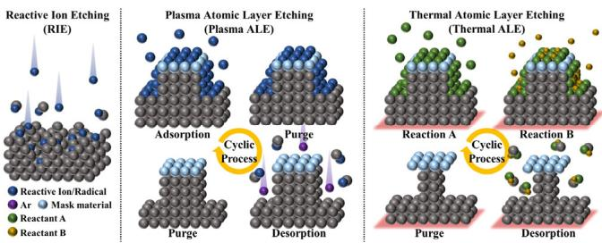  
Comparison of RIE and anisotropic and isotropic ALE processes. ALE Figure 1. processes are cyclic processes that repeat adsorption reaction and desorption.

# 2. Anisotropic atomic layer etching of metal

ALE can be divided into anisotropic ALE and isotropic ALE; anisotropic ALE primarily uses plasma. First, the surface is modified by adsorbing a reactive gas or radicals on the surface of the material to be etched, for the formation of a chemically modified layer. The surface modified layer is then removed, preferentially by ions with a controlled energy using plasma, and the residual gases that remain during the adsorption step and the desorption step are then purged during a purge step, between adsorption and desorption steps. Therefore, it is possible to remove materials vertically, layer by layer. This method has advantages, such as low ion damage, high etch selectivity, low surface roughness, and a precise etch depth/cycle.

For the adsorption step, reactive gas molecules/radicals can be adsorbed on the substrate surface by three different adsorption states, such as reversible saturation, irreversible non-saturation, and irreversible saturation, as shown in Figs. 2(a)–(c), respectively. Reversible saturation, is a physisorption state in which the reactive gas molecules/radicals are adsorbed with a weak bond of van der Waals force on the substrate surface. For the adsorption by reversible saturation, when the adsorption gas flow is stopped, the amount of the adsorbed species on the substrate surface is gradually decreased by the desorption of the adsorbed gas molecules/radicals. Irreversible non-saturation is another physisorption state having multilayer deposition of the reactive gas species, without saturation on the substrate surface. In this case, even though the reactive gas flow is stopped, no desorption of adsorbed species is observed. Irreversible saturation is obtained when the reactive gas molecules/radicals form strong chemical bonds with the atoms on the substrate surface. The reactive gas molecules/radicals are saturated by one monolayer on the substrate surface and, even though the reactive gas flow is stopped, the chemisorbed reactive gas molecules/radicals on the surface remain without desorption. For ALE, similar to atomic layer deposition (ALD), only one layer of the substrate surface needs to be chemisorbed uniformly without desorption or spontaneous etching; therefore, as the adsorption condition, Fig. $2 ( \mathrm { c } )$ is required. (Table I shows the characteristics of physical adsorption and chemical adsorption.)

Characteristics of physical adsorption and chemical adsorption.   

<table><tr><td rowspan=1 colspan=1>Physisorption</td><td rowspan=1 colspan=1>Chemisorption</td></tr><tr><td rowspan=1 colspan=1>Week, long range bonding</td><td rowspan=1 colspan=1>Strong, short range bonding</td></tr><tr><td rowspan=1 colspan=1>Not surface specific</td><td rowspan=1 colspan=1>Surface specific</td></tr><tr><td rowspan=1 colspan=1>∆Hads = 5~50 kJ/mol</td><td rowspan=1 colspan=1>∆Hads = 50~500 kJ/mo1</td></tr><tr><td rowspan=1 colspan=1>No surface reaction</td><td rowspan=1 colspan=1>Surface reactions may take place</td></tr><tr><td rowspan=1 colspan=1>Multilayer adsorption</td><td rowspan=1 colspan=1>Monolayer adsorption</td></tr></table>

When reactive gas molecules/radicals are chemically adsorbed on the surface of the substrate, the binding energy of the surface atoms are changed. As the reactive gas molecules/radicals are adsorbed on the surface, as shown in Fig. 3(a), the surface atoms in the substrate form strong chemical bonds with the reactive gas molecules/radicals with the binding energy $\mathrm { ( E _ { a } ) }$ . Due to the strong binding of surface atoms in the substrate with the reactive gas molecules/radicals, the binding energy between the surface atoms and the second layer atoms are weakened to a lower binding energy $\left( \operatorname { E } _ { \mathrm { s } } \right)$ from the binding energy between bulk atoms $\mathrm { ( E _ { b } ) }$ . Because $\mathrm { E } _ { \mathrm { s } }$ is lower than $\mathrm { E _ { a } }$ and $\mathrm { E _ { b } }$ $\mathrm { \cdot E _ { a } }$ is generally higher than $\mathrm { E _ { b , \cdot } }$ ), by using an ion energy higher than $\mathrm { E } _ { \mathrm { s } }$ and lower than $\mathrm { E _ { a } }$ during the desorption step, it is possible to remove one monolayer per cycle during the ALE process. In general, highly reactive halogen gas-based radicals, such as fluorine-based $\mathrm { C F _ { 4 } } ,$ $\mathrm { C H F } _ { 3 } ,$ etc.), chlorine-based $( \mathrm { C l } _ { 2 } , \mathrm { B C l } _ { 3 } ,$ etc.), and bromine-based (HBr) radicals, are used for adsorption, and these radicals form a strong bond with the atoms on the substrate surface. Therefore, the binding energy between the atoms of the second layer and those of the first layer bonded to halogen atoms is weakened from $\mathrm { E _ { b } }$ to $\mathrm { E } _ { \mathrm { s } }$ [23-25].

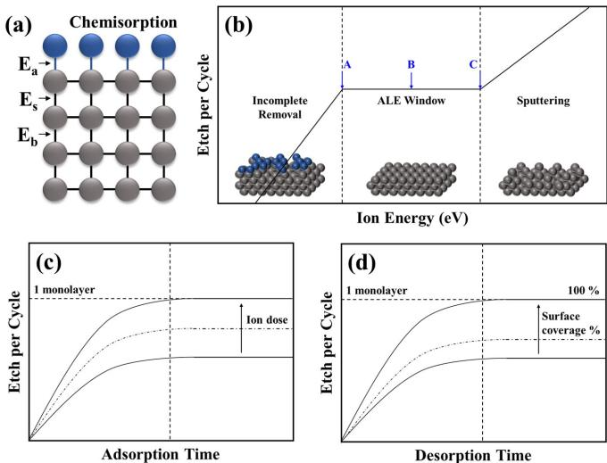  
(a) Binding energies between atoms when a reactant was chemisorbed on Figure 3. the surface. The binding energy between the chemical and the top atomic layer of the substrate is represented as $\mathsf { E } _ { \mathsf { a } } ,$ the binding energy of the layer immediately below as $\mathsf { E } _ { \mathsf { s } } ,$ and the binding energy in the bulk layer as $\mathsf { E } _ { \mathsf { b } }$ . (b) Etch per cycle (EPC), according to the change of the desorption energy in the cyclic process. EPC according to the change of (c) the adsorption dose and (d) the desorption ion dose in the cyclic process.

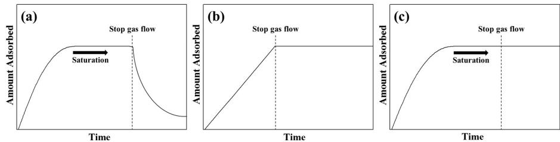  
Types of adsorption conditions. (a) reversible saturation, (b) irreversible-non saturation, and (c) irreversible saturation. For the ALE process, adsorption of the Figure 2. irreversible saturation state is required.

Figure 3(b) shows the etch amount per cycle, measured as a function of the average ion energy used during the desorption step after the adsorption in the ALE process for a fixed desorption time. It can be divided into three sections, and, in the region where the energy of the ions is low (in general, the energy of the ion has an energy distribution and, in this case, some ions have an energy higher than $\mathrm { E } _ { \mathrm { s } }$ and the rest have an energy lower than $\mathrm { E } _ { \mathrm { s } } ,$ and, with the increase in ion energy, the percentage of ions having $\mathrm { E } _ { \mathrm { s } }$ is increased until the ALE window is reached), only some of the atoms on the surface layer are removed, owing to the insufficient energy of the ions to remove the modified (chemisorbed) layer on the surface (and insufficient removal of surface atoms for the ions with an energy higher than $\mathrm { E } _ { \mathrm { s } }$ during the fixed desorption time). With an increase in the average ion energy, all of the chemisorbed layer can be removed within the desorption time, without noticeable sputtering of the materials, and it can continue until the ion energy is higher than $\mathrm { E _ { b } }$ . Therefore, the etch depth per cycle at this period stays the same until the ion energy reaches the energy for noticeable sputtering. However, if the ion energy is higher than $\mathrm { E _ { b } }$ (the sputter threshold energy), the etch depth per cycle is noticeably increased with the increase in ion energy by sputter, etching the atoms located under the chemisorbed layer after the removal of the top chemisorbed layer. Therefore, there is an appropriate energy range for ions for ALE and it is important to control it precisely. For the anisotropic ALE, inert gas ions, such as $\mathrm { H e ^ { + } }$ , ${ \mathrm { N e } } ^ { + } { \mathrm { ; } }$ , and $\mathrm { A r } ^ { + }$ , are typically used as the desorption ion and the ion energy is given by biasing the substrate for the conventional etch system; for the ion beam source, the ion energy is given by accelerating the ion using the grid system in the ion source.

In addition to the ion energy, obtaining a saturated etch depth per cycle, which corresponds to one monolayer per cycle, requires the full coverage of the surface by chemisorption by supplying a sufficient adsorption gas molecule/radical dose to the substrate surface. The chemisorbed species must be fully removed by supplying a sufficient desorption ion dose with adequate energy to the surface. The effect of the adsorption species dose and desorption species dose on the etch per cycle are shown in Figs. 3(c) and 3(d), respectively. The saturated etch per cycle is obtained only when a sufficient adsorption species dose and ion dose are supplied during the adsorption step and desorption step, respectively. When an insufficient dose is supplied during the adsorption step and/or desorption step, a saturated etch per cycle behavior is still observed; however, in this case, it is not only the etch per cycle that can be varied by changing the insufficient dose during the adsorption step and/or the desorption step, but an increased surface roughness is also observed.

During the chemical adsorption step of the reactive gas molecules/ radicals on the substrate surface, spontaneous etching can occur. During the desorption step by ion bombardment, in addition to the desorption of the chemisorbed layer (a compound of reactive adsorption species with first layer atoms on the substrate), the atoms exposed after the removal of the chemisorbed layer can be sputtered if the energy of the ions is higher than $\mathrm { E _ { b } }$ (in the ion energy distribution, even though the average ion energy is lower than $\mathrm { E _ { b } , }$ some of ions can have an energy higher than $\mathrm { E _ { b . } }$ ). Spontaneous etching (α) and sputter etching (β) can deteriorate the ideal saturation behavior of the ALE, which may be called the “ALE ideality $\%$ .” [26]

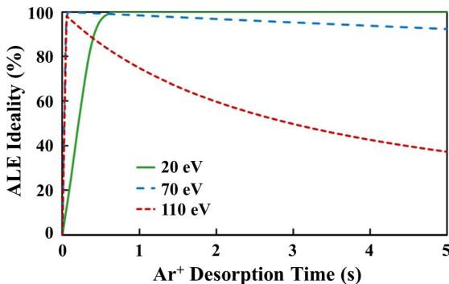  
ALE ideality percentage as a function of $\mathsf { A r } ^ { + }$ ion desorption time for different Figure 4. ion energies in the ALE process of Ta. Reproduced with permission from [27], Copyright 2018, AIP Publishing.

$$
{ \mathrm { A L E ~ i d e a l i t y ~ } } \% = { \frac { { \mathrm { E P C } } - ( \alpha + \beta ) } { \mathrm { E P C } } } \times 1 0 0 \% ,
$$

where EPC is the thickness removed per cycle, and α and $\beta$ represent the unwanted etch depth that occurs during the adsorption and desorption processes, respectively. The ideal ALE $\%$ should be close to $1 0 0 \%$ . Figure 4 shows the ALE ideality $\%$ according to ion irradiation during the desorption step for different average ion energy in the ALE process of Ta. As shown in Fig. 4, for the change of ALE ideality with the desorption time, the ideality is close to $1 0 0 \%$ in the low energy region (Region A in Fig. 3(b)). However, in this region, the process time to remove the chemisorbed layer completely is long, owing to the low momentum transfer to the substrate atoms. For the mid-energy region (Region B in Fig. 3(b)), the ideality is slightly lower than $1 0 0 \%$ (owing to the sputtering by some of the ions that have energy higher than $\mathrm { E _ { b . } }$ ) but the process time is decreased. For the high energy region, it can be observed that the ideality $\%$ decreases rapidly as the desorption time increases because sputtering is continuously increased [27].

For the desorption ion species, rather than using inert gas ions for the momentum transfer to remove the chemisorbed layer formed during the adsorption step, reactive ions can be used to form more volatile compounds with the chemisorbed layer on the substrate. Park et al. reported on the study of ion beam type anisotropic ALE of $\mathrm { C r }$ [28]. Two methods (physical desorption by conventional $\mathrm { A r } ^ { + }$ ions and chemical desorption using $\mathrm { C l ^ { + } }$ ions) were proposed for the anisotropic ALE of Cr. First, as the conventional desorption method, using $\mathrm { A r } ^ { + }$ for the desorption ion, a remote plasma was generated using a gas mixture of $\mathrm { O } _ { 2 } / \mathrm { C l } _ { 2 }$ to adsorb O and $\mathrm { C l }$ radicals together during the adsorption step to form a $\mathrm { C r O _ { \mathrm { x } } C l _ { \mathrm { y } } }$ layer on the surface of Cr, which is not noticeably volatile at room temperature without ion bombardment; the chemisorbed layer was desorbed with low energy $\mathrm { A r } ^ { + }$ ions during the desorption step. For the second chemical desorption method, using $\mathrm { C l ^ { + } }$ as the desorption ion, by generating an $\mathrm { O } _ { 2 }$ remote plasma, oxygen radicals are adsorbed on the surface of $\mathrm { C r }$ to form a $\mathrm { C r O } _ { \mathrm { x } }$ layer during the adsorption step. Low energy $\mathrm { C l ^ { + } }$ ions are then exposed to the surface of the $\mathrm { C r O } _ { \mathrm { x } }$ layer for the formation of $\mathrm { C r O _ { x } C l _ { y } }$ by $\mathrm { C l ^ { + } }$ ions and the desorption by the low energy $\mathrm { C l ^ { + } }$ bombardment, during the desorption step. Figure 5 shows the experiments for optimizing $\mathrm { C r }$ ALE conditions using O radicals and $\mathrm { C l ^ { + } }$ ions. Figure 5(a) shows the result of the etch thickness change when the $\mathrm { C l ^ { + } }$ ions were exposed to the surface of $\mathrm { C r }$ for $2 0 \mathrm { m i n }$ . In Fig. 5(a), the acceleration grid voltage of the ion beam is similar to, or slightly lower than, the actual ion energy of the substrate. It can be observed that Cr was not etched until a grid voltage of $+ 2 0 \mathrm { ~ V ~ }$ ; $\mathrm { C r }$ was then etched as the grid voltage was increased, together with Si and $\mathrm { S i } _ { 3 } \mathrm { N } _ { 4 }$ . For the Cr ALE, it can be observed that the acceleration grid voltage, i.e., the ion energy equal to or less than ${ \sim } 2 0 \ \mathrm { e V } ,$ , is suitable for ALE because no reactive ion etching of bulk $\mathrm { C r }$ is observed for this condition during the desorption step, after the removal of the chemisorbed layer. Figure 5(b) shows the etch thickness for different exposure times per cycle for $\mathrm { C l ^ { + } }$ ions, with $+ 2 0 \mathrm { V }$ for 100 cycles (therefore, a total of ${ \sim } 1 6 0 \ \mathrm { m i n }$ etch time). EPC is also shown on the right side of the figure. As shown, Cr was not etched until approximately $2 0 s /$ cycle; however, Cr etching was observed with $\mathrm { C l ^ { + } }$ ions at $+ 2 0 \mathrm { ~ V ~ }$ for a long exposure time, possibly due to some high energy portion of the ion beam. From the results of Figs. 5(a) and 5(b), the desorption conditions of $\mathrm { C l ^ { + } }$ ions were confirmed to be an acceleration grid voltage of $+ 2 0 \ \mathrm { V }$ and $2 0 ~ s /$ /cycle. The cyclic etching was performed by the adsorption of O radicals by oxygen remote plasma to form a chemisorbed species of $\mathrm { C r O } _ { \mathrm { x } }$ on the $\mathrm { C r }$ surface and by the desorption of the chemisorbed species by forming $\mathrm { C r O _ { x } C l _ { y } }$ using low energy $( + 2 0 \mathrm { V } )$ (d $\mathrm { C l ^ { + } }$ ions; the results are shown in Figs. 5(c) and 5(d). When the adsorption time of O radicals was varied, while keeping the $\mathrm { C l ^ { + } }$ ion exposure time (desorption time) at $1 0 \ s /$ cycle, the etch depth was saturated after the adsorption time of $8 \ : s /$ cycle, which means that the $\mathrm { C r O } _ { \mathrm { x } }$ layer was uniformly formed on the surface after the adsorption time of $_ \mathrm { ~ 8 ~ s ~ }$ . Therefore, it can be observed that the adsorption time for ALE requires at least $8 \ : s /$ cycle. Figure 5(d) shows the effect of the $\mathrm { C l ^ { + } }$ ion exposure time while keeping the adsorption time of O radicals at $1 0 s /$ cycle. When the exposure time of the $\mathrm { C l ^ { + } }$ ion beam is less than $1 0 \ s ,$ the etch thickness increases with increasing time, due to the insufficient removal of the $\mathrm { C r O } _ { \mathrm { x } }$ chemisorbed layer on the $\mathrm { C r }$ surface. At $1 0 ^ { - } 1 5 \ s ,$ the saturated etch depth with the $\mathrm { C l ^ { + } }$ exposure time was observed, indicating a complete removal of the $\mathrm { C r O _ { x } }$ layer by $\mathrm { C l ^ { + } }$ ions, without etching the exposed Cr underlayer for a few seconds, similar to the result in Fig. 5(b). This can be seen as the optimized ALE condition, and is called the ALE window. When the $\mathrm { C l ^ { + } }$ ion exposure time is longer than $1 5 s ,$ the etched thickness increases further, indicating that the $\mathrm { C r }$ underlayer is additionally etched by the $\mathrm { C l ^ { + } }$ ions even after all of the modified $\mathrm { C r O } _ { \mathrm { x } }$ layer is removed, as shown in Fig. 5(b).

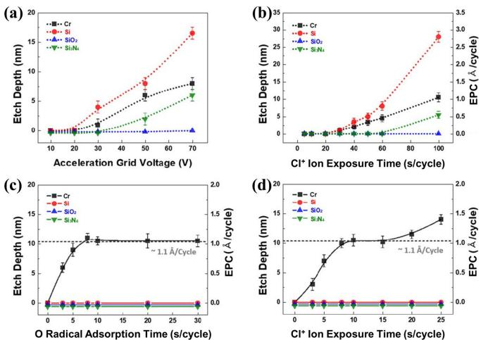  
Etch thickness measurement of Cr (with Si, $\mathsf { S i O } _ { 2 } ,$ and $\mathsf { S i } _ { 3 } \mathsf { N } _ { 4 }$ as references) Figure 5. for different etch conditions, including ALE conditions. (a) Etch depth as a function of ${ \tt C l } ^ { + }$ ion energy (acceleration grid voltage) when the materials were exposed for 20 min. (b) Etch per cycle when the materials were exposed only to ${ \tt C } | ^ { + }$ ions during the desorption step, without the adsorption step, and the etch depth after 100 cycles. The acceleration grid voltage was fixed at $+ 1 0 \ V .$ (c) Etch thickness as a function of O radical adsorption time per cycle while maintaining the desorption with $+ 1 0 \vee$ , ${ \complement } ^ { + }$ ions for 10 s/cycle. (d) Etch thickness as a function of ${ \tt C l } ^ { + }$ ion exposure time per cycle after O radical adsorption for 10 s/cycle. Reproduced with permission from [28], Copyright 2018, IOP Publishing.

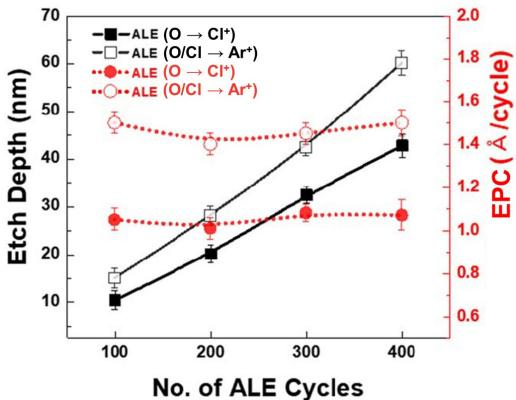  
Total etch depth and EPC, measured as a function of the number of cycles Figure 6. by using physical (O/Cl radical adsorption and $\mathsf { A r } ^ { + }$ ion desorption) Cr ALE and chemical (O radical adsorption and ${ \tt C } _ { } ^ { * }$ ion desorption) Cr ALE. Reproduced with permission from [28], Copyright $2 0 1 8$ , IOP Publishing.

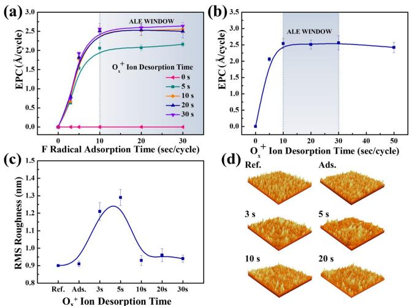  
EPC of W ALE as a function of (a) F radical adsorption time and (b) $0 ^ { + }$ ion Figure 7. desorption time. (c, d) Surface roughness after F radical adsorption and after the $0 ^ { + }$ ion irradiation as a function of $0 ^ { + }$ ion desorption, during the ALE of W. Reproduced with permission from [29], Copyright $2 0 1 9$ , John Wiley and Sons.

Figure 6 shows the etch depth and EPC measured as a function of etch cycles for the physical method (O/Cl radical adsorption and $\mathrm { A r } ^ { + }$ ion desorption) and the chemical method (O radical adsorption and $\mathrm { C l ^ { + } }$ ion desorption); both these methods are shown in Fig. 5. The EPCs for the two methods were not the same, at ${ \sim } 1 . 5$ and ${ \sim } 1 . 1$ Å/cycle for the physical method and chemical method, respectively. However, the etch depth increased linearly with the number of etch cycles for both cases; therefore, the Cr etch depth could be precisely controlled in the angstrom scale using both ALE methods. The higher EPC for the physical method could be related to the non-ideality factor α caused by possible spontaneous etching during the adsorption period.

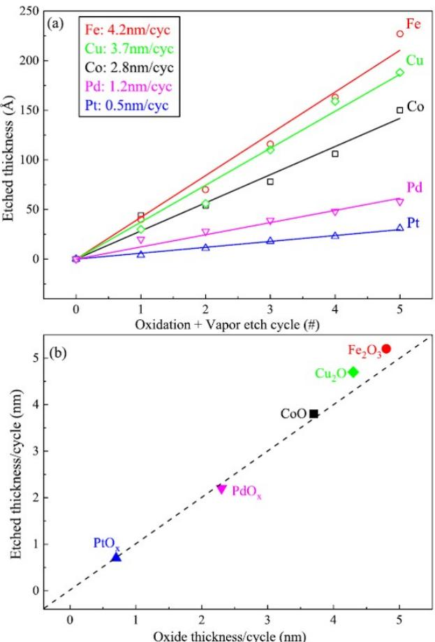  
(a) Total etch depth as a function of ALE cycles and (b) EPC of different Figure 8. metal oxide thickness/cycle for anisotropic ALE of Co, Fe, Pd, Pt, and $\mathsf { C u } ,$ using $\mathsf { O } _ { 2 }$ plasma and formic acid. Reproduced with permission from [17], Copyright 2017, AIP Publishing.

Kim et al. reported a study using ion beam type ALE of W [29]. For the ALE of W, $\mathrm { N F } _ { 3 }$ plasma was used to adsorb F radicals on the W surface to form $\mathrm { W F _ { y } }$ and $\mathrm { O ^ { + } }$ ion was also used for the desorption. The $\mathrm { W F _ { y } }$ layer was then converted to $\mathrm { W O } _ { \mathrm { x } } \mathrm { F } _ { \mathrm { y } }$ by $\mathrm { O ^ { + } }$ ions of low energy, which can be easily removed as a volatile compound. As shown in Figs. 7(a) and $7 ( \mathrm { b } )$ , through the optimization of the F radical adsorption time $( \leq 1 0 \ s )$ and $\mathrm { O ^ { + } }$ ion desorption conditions ( $+ 3 0 \mathrm { V }$ , $1 0 \leq \mathrm { t } \leq 3 0$ s/cycle), respectively, W could be etched at the atomic level per etch cycle at ${ \sim } 2 . 6 \mathrm { \AA } / $ cycle. Figures 7(c) and 7(d) show the change of surface roughness during one W ALE process. When F radicals are adsorbed on the W surface, the surface roughness is the same as that of the reference; therefore, it is believed that W is not spontaneously etched by the F radicals. As the $\mathrm { O ^ { + } }$ ions are exposed to the $\mathrm { W F _ { y } }$ layer, the surface roughness increases rapidly, indicating that the WFy layer is converted to $\mathrm { W O } _ { \mathrm { x } } \mathrm { F } _ { \mathrm { y } }$ by the $\mathrm { O ^ { + } }$ ions and is partially etched at random locations. When the $\mathrm { O ^ { + } }$ ions is exposed for approximately $1 0 \ s ,$ the $\mathrm { W F _ { y } }$ layer on the surface is almost removed, and again, the surface roughness is reduced, similarly to the reference. Thereafter, the surface roughness remains constant, even when the $\mathrm { O ^ { + } }$ ion exposure time increases.

Chen et al. also reported an ALE study for Co, Fe, Pd, Pt, and Cu without using $\mathrm { A r } ^ { + }$ ions for desorption [17]. The cycle was composed of the exposure to low energy $\mathrm { O ^ { + } }$ ions to the metal surface using $\mathrm { O } _ { 2 }$ plasma and the subsequent removal of the metal oxide using formic acid vapor. This is different from the typical anisotropic ALE method, where the desorption is achieved using ions after the adsorption of reactive radicals and the ALE is achieved by oxidizing the surface anisotropically using ions, then removing the oxide layer using the acid vapor. Therefore, it requires a high temperature at which the formic acid can react. At a process temperature of ${ \sim } 8 0 \mathrm { ~ \textdegree C }$ , it was confirmed that anisotropic ALE of 28, 42, 12, 5, and 37 Å/cycle were obtained for Co, Fe, Pd, Pt, and $\mathrm { C u } .$ , respectively. Figure 8(a) shows the etch depth of metals according to the number of cycles. Figure 8(b) shows the thickness of the oxide film formed per cycle of metals during the oxidation step and the thickness etched using formic acid in the ALE process. It can be observed that the thickness of the formed oxide film and that removed after ALE are almost identical. This means that all metal oxide formed during the oxidation step in each cycle was completely removed during the exposure to formic acid and a high etch selectivity between metal and metal oxide was maintained.

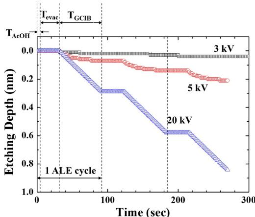  
Etch depth for each etch cycle of Cu using $\mathsf { O } _ { 2 }$ GCIB and acetic acid, for Figure 9. different acceleration voltages.

Toyoda et al. reported the ALE study of Cu by modifying the surface of Cu using acetic acid vapor and subsequently removing the surface layer using an $\mathrm { O } _ { 2 }$ gas cluster ion beam (GCIB) [30]. A gas cluster is a collection of thousands of gas atoms or molecules. When ionizing a gas cluster, the kinetic energy of ions is shared by thousands of atoms, thus, the kinetic energy of each atom in the cluster is only a few eV. If it is used for etching, it causes less damage and etching can be done at a low temperature. Figure 9 shows the result of the ALE cycle while changing the acceleration voltage $\mathrm { ( V _ { a } ) }$ of $\mathrm { O } _ { 2 }$ -GCIB to 3, 5, and $2 0 \mathrm { k V }$ . The step of adsorbing acetic acid is approximately 2 s, the exhausting time of the acetic acid remaining after the adsorption is approximately $3 0 \ s _ { \scriptscriptstyle \mathrm { i } }$ , and the GCIB treatment time is approximately 60 s. At $2 0 \mathrm { k V _ { : } }$ , the energy of the GCIB was so high that it etched linearly during the desorption time. At 5 and $3 \ \mathrm { k V }$ , the etching depth was nearly saturated with the GCIB treatment time and under the optimized ALE condition of $5 \mathrm { k V }$ , a Cu ALE of ${ \sim } 0 . 7 \mathrm { \ : \AA }$ cycle could be achieved.

# 3. Isotropic atomic layer etching of metal

Unlike anisotropic ALE, thermal isotropic ALE is a method in which reactant A is reacted on the surface to form a modified layer and reactant B is then reacted to remove the modified layer by converting it into a volatile compound. Figure 10 shows the process configuration of the isotropic ALE. In each step, the whole surface layer reacts thermally through a self-limiting reaction and because there are no directional ions involved in the reaction process or desorption process, the ALE occurs isotropically. Thermal ALE is applicable to manufacturing various next generation 3D devices and area selective ALD, for the selective and precise removal of materials deposited on unwanted areas during the selective ALD. Depending on how the reactant reacts with metal during the thermal ALE process, it is possible to etch the atomic layer of metal through various surface modification methods, such as “oxidation-conversion-fluorination,” “oxidation-fluorination,” and “condensation” reactions, which are shown in Fig. 11. Generally, for the thermal ALE of metal, the oxidation of the metal surface is required before the next step of the desorption process.

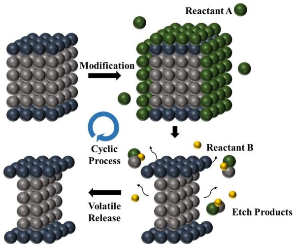  
Process configuration of thermal ALE.

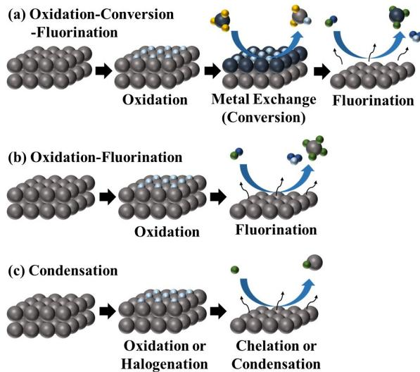  
Thermal ALE methods capable of metal ALE.

Johnson et al. etched W using a thermal ALE through the “oxidation-conversion-fluorination” method, where the W ALE process is divided into three steps [31]. First, the W surface is oxidized to ${ \bf W } { \bf O } _ { 3 }$ , using $\mathrm { O } _ { 2 }$ or $\mathrm { O } _ { 3 } ,$ by the “oxidation” process. The “conversion” process then changes the ${ \bf W } { \bf O } _ { 3 }$ layer to $\mathrm { B } _ { 2 } \mathrm { O } _ { 3 }$ by reacting the ${ \bf W } { \bf O } _ { 3 }$ with $\mathrm { B C l } _ { 3 . }$ At this point, $\mathrm { W O } _ { \mathrm { x } } \mathrm { C l } _ { \mathrm { y } }$ is formed, which is easily removed during the conversion process as a volatile compound. Finally, by the “fluorination” process, the $\mathrm { B } _ { 2 } \mathrm { O } _ { 3 }$ layer reacts with HF to form volatile $\mathrm { B F } _ { 3 }$ and $\mathrm { H } _ { 2 }$ , which are easily removed. Figure 12 shows the change in thickness of W with respect to the number of half-cycles at a $2 0 0 ~ \mathrm { ‰}$ process temperature. When the $\mathrm { O } _ { 2 }$ or $\mathrm { O } _ { 3 }$ treatment is performed on the W surface, ${ \bf W } { \bf O } _ { 3 }$ is formed and the thickness increases. The reactions that can occur in this process and the standard free energy changes are as follows:

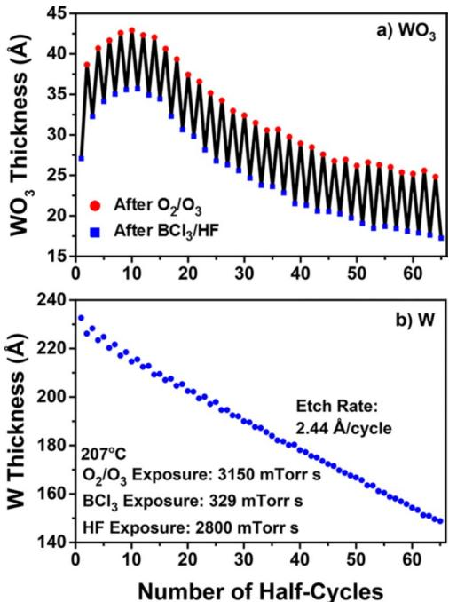  
Thermal W ALE by “oxidation-conversion-fluorination.” W thickness change Figure 12. measured according to the change in the number of half-cycles using $\mathsf { O } _ { 2 } / \mathsf { O } _ { 3 } ,$ , $\mathsf { B C l } _ { 3 } ,$ and HF at $2 0 0 ^ { \circ } \complement$ . Reproduced with permission from [31], Copyright 2017, American Chemical Society.

$$
\begin{array} { c } { { \mathrm { W } + 3 0 _ { 3 } ( \mathrm { g } )  \mathrm { W O } _ { 3 } + 3 0 _ { 2 } ( \mathrm { g } ) , \Delta \mathrm { G } ( 2 0 0 ~ \mathrm { \hat { C } } ) = - 2 9 6 . 7 \mathrm { k c a l / m o l } } } \\ { { } } \\ { { \mathrm { W } + 3 / 2 \mathrm { O } _ { 2 } ( \mathrm { g } )  \mathrm { W O } _ { 3 } , \Delta \mathrm { G } ( 2 0 0 ~ \mathrm { \hat { C } } ) = - 1 7 1 . 7 \mathrm { k c a l / m o l } } } \end{array}
$$

In this process, $\triangle G$ is negative, so the reaction occurs spontaneously. ${ \bf W } { \bf O } _ { 3 }$ is then converted to $\mathrm { B } _ { 2 } \mathrm { O } _ { 3 }$ by $\mathrm { B C l } _ { 3 }$ and the corresponding reaction is as follows:

$$
\begin{array} { r l r } & { } & { \mathrm { W O } _ { 3 } + 2 \mathrm { B C l } _ { 3 } ( \mathrm { g } )  \mathrm { B } _ { 2 } \mathrm { O } _ { 3 } + \mathrm { W C l } _ { 6 } ( \mathrm { g } ) , \Delta \mathrm { G } ( 2 0 0 \mathrm { ~ \% } ) } \\ & { } & { = - 7 . 7 \mathrm { k c a l / m o l } } \end{array}
$$

$$
\begin{array} { c } { \mathrm { W O _ { 3 } } + 4 / 3 \mathrm { B C l _ { 3 } } ( \mathrm { g } )  2 / 3 \mathrm { B _ { 2 } O _ { 3 } } + \mathrm { W O C l _ { 4 } } ( \mathrm { g } ) , \Delta \mathrm { G } ( 2 0 0 \mathrm { ~  ^ { \circ } C } ) } \\ { = - 4 . 3 \mathrm { k c a l / m o l } } \end{array}
$$

$$
\begin{array} { r l } & { \mathrm { W O } _ { 3 } + 2 / 3 \mathrm { B C l } _ { 3 } ( \mathrm { g } )  1 / 3 \mathrm { B } _ { 2 } \mathrm { O } _ { 3 } + \mathrm { W O } _ { 2 } \mathrm { C l } _ { 2 } ( \mathrm { g } ) , \Delta \mathrm { G } ( 2 0 0 \mathrm { ~ \textbar { C } } ) } \\ & { \mathrm { ~ \ ~ \ } = - 7 . 8 \mathrm { ~ k c a l / m o l ~ \mu ~ } } \end{array}
$$

Because this process also has a negative value of $\triangle G ,$ the reaction occurs spontaneously and the $\mathrm { W O } _ { \mathrm { x } } \mathrm { C l } _ { \mathrm { y } }$ that is formed after the reaction is removed in a gas state. The $\mathrm { { B } } _ { 2 } \mathrm { { O } } _ { 3 }$ layer, formed by conversion, is removed by HF and the corresponding reaction is as follows:

$$
\begin{array} { r l r } & { } & { \mathrm { B } _ { 2 } \mathrm { O } _ { 3 } + 6 \mathrm { H F } ( \mathrm { g } )  2 \mathrm { B F } _ { 3 } ( \mathrm { g } ) + 3 \mathrm { H } _ { 2 } \mathrm { O } ( \mathrm { g } ) , \Delta \mathrm { G } ( 2 0 0 \mathrm { ~ \textbar { C } } ) } \\ & { } & { = - 1 7 . 3 \mathrm { k c a l / m o l } } \end{array}
$$

In this process, the $\mathrm { B } _ { 2 } \mathrm { O } _ { 3 }$ layer is removed and the increased film thickness is reduced. By repeating this process, it was confirmed that the thickness of W decreased linearly as the number of cycles increased and the EPC was confirmed to be ${ \sim } 2 . 4 4 \mathrm { \AA }$ cycle. Among the three steps, the first oxidation step forming the $\mathrm { W O _ { x } }$ is not a selflimiting step and the $\mathrm { W O _ { x } }$ thickness increases with an increase in the oxidation time, even though the other two steps are self-limited. Therefore, the $\mathrm { W O _ { x } }$ formed during the first oxidation step needs to be carefully controlled so as to not have a thick $\mathrm { W O _ { x } }$ layer on the W surface during the ALE.

Lee et al. has reported the thermal ALE of TiN through the “oxidation-fluorination” method [18]. The thermal ALE process of TiN is shown in Fig. 13. First, when oxidation is performed using $\mathrm { O } _ { 3 }$ on the TiN surface, $\mathrm { T i O } _ { 2 }$ is formed. Even though the formation of $\mathrm { T i O } _ { 2 }$ from TiN is also not a self-limiting step, it appears that the thickness of $\mathrm { T i O } _ { 2 }$ is approximately controlled by the diffusion of $\mathrm { o }$ into TiN. The corresponding reaction is as follows:

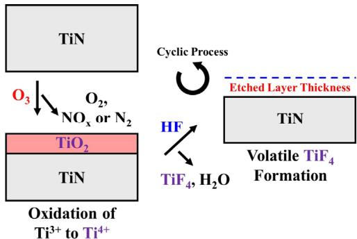  
Thermal ALE process and etch mechanism of TiN using “oxidationFigure 13. fluorination” method. Reproduced with permission from [18], Copyright 2017, American Chemical Society.

$$
\mathrm { T i N } + 3 \mathrm { O } _ { 3 } ( \mathrm { g } ) \to \mathrm { T i O } _ { 2 } + \mathrm { N O } ( \mathrm { g } ) + 3 \mathrm { O } _ { 2 } ( \mathrm { g } )
$$

NO and $\mathrm { O } _ { 2 }$ are removed in the gas state and $\mathrm { T i O } _ { 2 }$ is formed on the surface.

In the next step, the $\mathrm { T i O } _ { 2 }$ formed on the surface is converted to $\mathrm { T i F _ { 4 } }$ by the fluorination step, via the reaction with HF. The corresponding reaction is as follows:

$$
\mathrm { T i O } _ { 2 } + 4 \mathrm { H F } ( \mathrm { g } ) \to \mathrm { T i F } _ { 4 } ( \mathrm { g } ) + 2 \mathrm { H } _ { 2 } \mathrm { O } ( \mathrm { g } )
$$

Volatile $\mathrm { T i F _ { 4 } }$ is removed and TiN is etched. Figure 14 shows the etch depth by repeating this process and comparing the etch depth with other materials. The ALE process was performed at $2 5 0 \mathrm { ~ ‰ ~ }$ and it can be observed that the TiN thickness decreases linearly as the number of cycles increase; however, the thicknesses of $\mathrm { S i O } _ { 2 }$ and $\mathrm { S i } _ { 3 } \mathrm { N } _ { 4 }$ remain constant, even as the number of cycles increased, confirming that highly selective TiN etching can be achieved. Besides TiN, other metal nitrides can also be etched by the “oxidation-fluorination” thermal ALE method, which is also applicable to metal carbides, metal sulfides, and elemental metals.

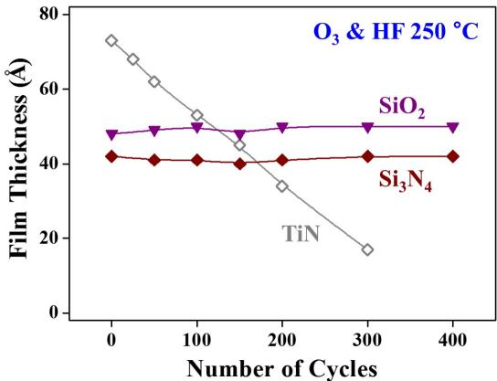  
Change of TiN thickness and other materials $S \mathrm { i } 0 _ { 2 }$ and $\mathsf { S i } _ { 3 } \mathsf { N } _ { 4 }$ ) according Figure 14. to the number of thermal ALE cycles. Reproduced with permission from [18], Copyright 2017, American Chemical Society.

Summary of reported ALE of metals.   

<table><tr><td>Materials</td><td>Direction</td><td>Reaction</td><td>Removal</td><td>Process Temperature (℃)</td><td>EPC (Å/cycle)</td><td>Time of cycle</td><td>Reference</td></tr><tr><td rowspan="2">Co</td><td>Anisotropy</td><td>02</td><td>Formic acid</td><td>80</td><td>28</td><td>350 sec</td><td>17</td></tr><tr><td>Isotropy</td><td>$Cl_}$</td><td>hfacH</td><td>140</td><td>2</td><td>95 sec</td><td>32</td></tr><tr><td>Fe</td><td></td><td></td><td>Formic acid</td><td></td><td>42</td><td>350sec</td><td></td></tr><tr><td>Pd</td><td rowspan="2">Anisotropy</td><td rowspan="2">02</td><td rowspan="2"></td><td rowspan="2">80</td><td>12</td><td>350sec</td><td>17</td></tr><tr><td>Pt</td><td></td><td>5</td><td>350sec</td></tr><tr><td>Cr</td><td>Anisotropy</td><td>$02$</td><td>$C_2}$</td><td>RT</td><td>1.1</td><td>40 sec</td><td>28</td></tr><tr><td rowspan="4">W</td><td rowspan="2">Isotropy</td><td>$02</td><td>WF6</td><td>300</td><td>6.3</td><td>320 sec</td><td>33</td></tr><tr><td>02/03</td><td>BC13 → HF</td><td>207</td><td>2.5</td><td>325 sec</td><td>31</td></tr><tr><td rowspan="2">Anisotropy</td><td>NF3</td><td>02</td><td>RT</td><td>2.6</td><td>40 sec</td><td>29</td></tr><tr><td>$C_₂}$</td><td>Ar</td><td>60</td><td>2.1</td><td>25 sec</td><td>26</td></tr><tr><td rowspan="2">Cu</td><td>Isotropy</td><td>$02$</td><td>Hfac</td><td>275</td><td>0.9</td><td>11 min</td><td>34</td></tr><tr><td>Anisotropy</td><td>Acetic acid</td><td>O2-GCIB</td><td>RT</td><td>0.7</td><td>92 sec</td><td>30</td></tr><tr><td>TiN</td><td>Isotropy</td><td>03</td><td>HF</td><td>250</td><td>0.15</td><td>64sec</td><td>18</td></tr><tr><td>AIN</td><td>Isotropy</td><td>HF</td><td>Sn(acac)2</td><td>275</td><td>0.36</td><td>280 sec</td><td>19</td></tr></table>

Finally, the “condensation” thermal ALE is a method investigated by Chen et al. [17] This study uses the same method as the anisotropic ALE of Co at the process temperature of ${ \sim } 8 0 ~ \mathrm { ‰}$ by using a directional oxygen ion beam, followed by the removal of the metal oxide by exposing it to acid vapor. For the “condensation” thermal ALE, by using oxygen radicals for the oxidation, instead of the directional oxygen ion beam, or by using other isotropic oxidation methods, and by removing all the metal oxide formed on the metal surface by acid vapor, the isotropic ALE was obtained.

The anisotropic ALE and isotropic ALE studies of metals that are currently being investigated are briefly summarized in Table II, detailing the adsorption and desorption chemistry, process temperature, and etch per cycle for each material.

# 4. Summary and prospect of metal ALE

Next generation semiconductor devices require precise etching, ultra-high selective etching, etching with no damage, etc. Owing to these requirements, ALE, which can remove a self-limited atomic layer per etch cycle by a cyclic etch method, is being widely investigated. This technology is required to etch the materials used for GAA FETs, vertical FETs, etc., requiring Å scale precision in etching, with extremely high etch selectivity. ALE methods are divided into anisotropic ALE, using directional ions during the adsorption step or plasma during the desorption step, and isotropic ALE, using chemical reactants for reactions and vaporization of the compounds formed during the previous steps at a heated state. For metals, it has been found that ALE with a few Å per cycle is also possible without increasing the surface roughness. However, the investigation of metal ALE is still limited and further investigation is required. For devices using metallic compounds, such as magnetic devices, particularly spin-transfer torque magnetoresistive random access memory and phase change random access memory, ALE techniques for various metals may be required.

Moreover, there are some challenges in applying the metal ALE process directly to the industry. The biggest challenge is the long process time resulting in poor throughput, similar to the ALE of other materials. In addition, it is difficult to precisely control ion energy in the case of anisotropic ALE using plasma, which makes it difficult to obtain ultrahigh selective etching, and in the case of thermal ALE, a high process temperature and the chemicals used in the etching may damage the surface after the ALE. Therefore, it is not only the processing techniques, but also the tools for metal ALE that need to be further investigated for the successful application of metal ALE to next generation semiconductor devices.

# Acknowledgments

This work is supported by the MOTIE (Ministry of Trade, Industry & Energy (20003588) and KSRC (Korea Semiconductor Research Consortium) support program for the development of the future semiconductor device and the National Research Foundation of Korea (NRF) grant funded by the Korean government (MSIT) (2018 R1A2A3074950).

# References

[1] K. J. Kanarik, T. Lill, E. A. Hudson, S. Sriraman, S. Tan, J. Marks, V. Vahedi, and R. A. Gottscho, J. Vac. Sci. Technol. 33, 020802 (2015).   
[2] K. S. Min, C. Park, C. Y. Kang, C. S. Park, B. J. Park, Y. W. Kim, B. H. Lee, J. C. Lee, G. Bersuker, P. Kirsch, R. Jammy, and G. Y. Yeom, Solid-State Electron. 82 (2013).   
[3] J. Li, Y. Xia, B. Liu, G. Feng, Z. Song, D. Gao, Z. Xu, W. Wang, Y. Chan, and S. Feng, Appl. Surf. Sci. 378 (2016).   
[4] Y. Dong, Z. Jiang, and Y. Huang, Proceedings of the 2018 China Semiconductor Technology International Conference (Shanghai, China, March 11-12, 2018), pp. 1–3.   
[5] F. Roozeboom, F. van den Bruele, Y. Creyghton, P. Poodt, and W. M. M. Kessels, ECS J. Solid State Sci. Technol. 4, 6 (2015).   
[6] C. M. Huard, Y. Zhang, S. Sriraman, A. Paterson, K. J. Kanarik, and M. J. Kushner, J. Vac. Sci. Technol. A 35, 3 (2017).   
[7] C. T. Carver, J. J. Plombon, P. E. Romero, S. Suri, T. A. Tronic, and R. B. Turkot, ECS J. Solid State Sci. Technol. 4, 6 (2015).   
[8] K. S. Min, S. H. Kang, J. K. Kim, J. H. Yum, Y. I. Jhon, T. W. Hudnall, C. W. Bielawski, S. K. Banerjee, G. Bersuker, M. S. Jhon, and G. Y. Yeom, Microelectron. Eng. 114 (2014).   
[9] K. J. Kanarik, S. Tan, W. Yang, T. Kim, T. Lill, A. Kabansky, E. A. Hudson, T. Ohba, K. Nojiri, J. Yu, R. Wise, I. L. Berry, Y. Pan, J. Marks, and R. A. Gottscho, J. Vac. Sci. Technol. A 35, 5 (2017).   
[10] W. S. Lim, Y. Y. Kim, H. Kim, S. Jang, N. Kwon, B. J. Park, J. Ahn, I. Chung, B. H. Hong, and G. Y. Yeom, Carbon 50, 2 (2012).   
[11] K. S. Kim, K. H. Kim, Y. Nam, J. Jeon, S. Yim, E. Singh, J. Y. Lee, S. J. Lee, Y. S. Jung, G. Y. Yeom, and D. W. Kim, ACS Appl. Mater. Interfaces 9, 13 (2017).   
[12] J. Feng, X. Gong, X. Lou, and R. G. Gordon, ACS Appl. Mater. Interfaces 9, 12 (2017).   
[13] H. Shang, M. H. White, K. W. Guarini, P. Solomon, E. Cartier, F. R. McFeely, J. J. Yurkas, and W. Lee, Appl. Phys. Lett. 78, 20 (2001).   
[14] G. Wang, Q. Xu, T. Yang, J. Xiang, J. Xu, J. Gao, C. Li, J. Li, J. Yan, D. Chen, T. Ye, C. Zhao, and J. Luo, ECS J. Solid State Sci. Technol. 3, 4 (2014).   
[15] F. W. Mont, X. Zhang, W. Wang, J. J. Kelly, T. E. Standaert, R. Quon, and E. Todd, 2017 IEEE International Interconnect Technology Conference (Hsinchu, Taiwan, May 16-18, 2017), pp. 1–3.   
[16] S. Zhang, M. Shen, Y. Xu, Q. Wu, Y. Lin, and Y. Gu, ECS Trans. 44, 1 (2012).   
[17] J. K. Chen, N. D. Altieri, T. Kim, E. Chen, T. Lill, M. Shen, and J. P. Chang, J. Vac. Sci. Technol. A 35, 5 (2017).   
[18] Y. Lee and S. M. George, Chem. Mater. 29, 19 (2017).   
[19] N. R. Johnson, H. Sun, K. Sharma, and S. M. George, J. Vac. Sci. Technol. A 34, 5 (2016).   
[20] K. J. Kanarik, S. Tan, and R. A. Gottscho, J. Phys. Chem. Lett. 9, 16 (2018).   
[21] S. D. Sherpa and A. Ranjan, J. Vac. Sci. Technol. A 35, 1 (2017).   
[22] S. Tan, W. Yang, K. J. Kanarik, T. Lill, V. Vahedi, J. Marks, and R. A. Gottscho, ECS J. Solid State Sci. Technol. 4, 6 (2015).   
[23] A. Ludviksson, M. Xu, and R. M. Martin, Surf. Sci. 277, 3 (1992).   
[24] D. Metzler, R. L. Bruce, S. Engelmann, E. A. Joseph, and G. S. Oehrlein, J. Vac. Sci. Technol. A 32, 2 (2014).   
[25] K. Shinoda, N. Miyoshi, H. Kobayashi, M. Izawa, T. Saeki, K. Ishikawa, and M. Hori, J. Vac. Sci. Technol. A 37, 5 (2019).   
[26] K. J. Kanarik, S. Tan, W. Yang, T. Kim, T. Lill, A. Kabansky, E. A. Hudson, T. Ohba, K. Nojiri, J. Yu, R. Wise, I. L. Berry, Y. Pan, J. Marks, and R. A. Gottscho, J. Vac. Sci. Technol. A 35, 5 (2017).   
[27] I. L. Berry, K. J. Kanarik, T. Lill, S. Tan, V. Vahedi, and R. A. Gottscho, J. Vac. Sci. Technol. A 36, 1 (2018).   
[28] J. W. Park, D. S. Kim, W. O. Lee, J. E. Kim, and G. Y. Yeom, Nanotechnol. 30, 8 (2019).   
[29] D. S. Kim, J. E. Kim, W. O. Lee, J. W. Park, Y. J. Gill, B. H. Jeong, and G. Y. Yeom, Plasma Process Polym. 16, 9 (2019).   
[30] N. Toyoda and A. Ogawa, J. Phys. D: Appl. Phys. 50, 18 (2017).   
[31] N. R. Johnson and S. M. George, ACS Appl. Mater. Interfaces 9, 39 (2017).   
[32] M. Konh, C. He, X. Lin, X. Guo, V. Pallem, R. L. Opila, A. V. Teplyakov, Z. Wang, and B. Yuan, J. Vac. Sci. Technol. A 37, 021004 (2019).   
[33] W. Xie, P. C. Lemaire, and G. N. Parsons, ACS Appl. Mater. Interfaces 10, 10 (2018).   
[34] E. Mohimi, X. I. Chu, B. B. Trinh, S. Babar, G. S. Girolami, and J. R. Abelson, ECS J. Solid State Sci. Technol. 7, 9 (2018).