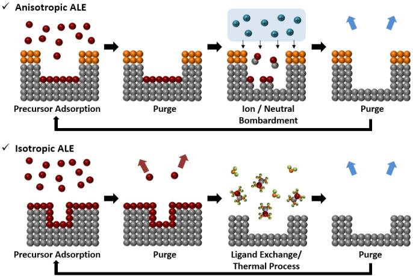
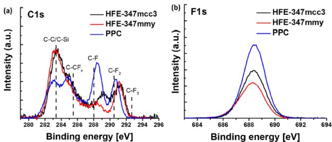
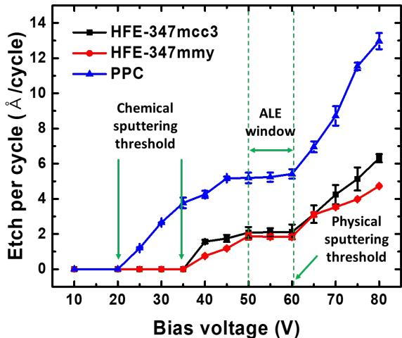
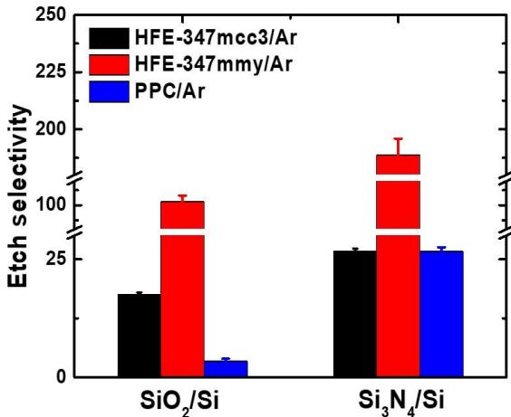
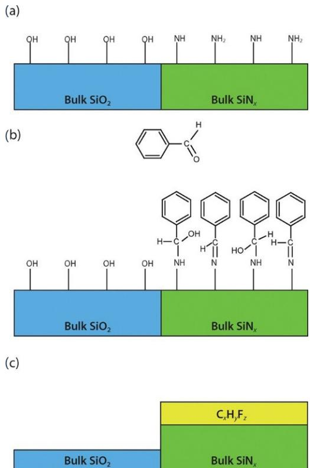
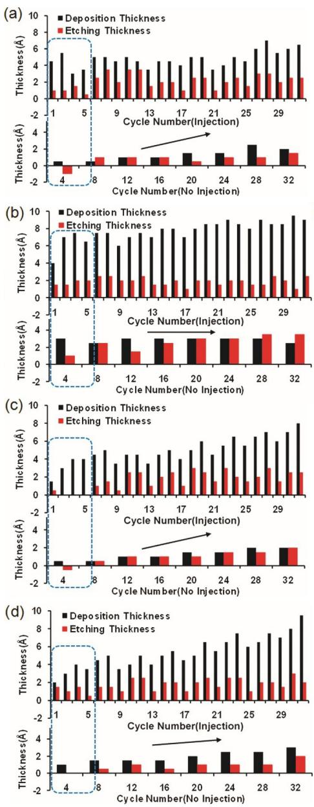
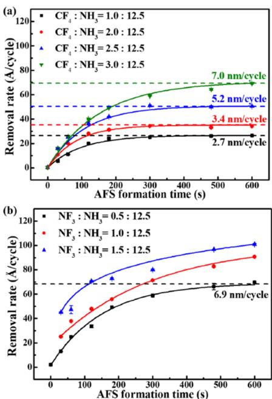

# Atomic Layer Etching of $S i O _ { 2 }$ for Nanoscale Semiconductor Devices: A Review

Received 22 December, 2023; accepted 28 December, 2023

Daeun Honga , Yongjae Kimb , and Heeyeop Chaea,b,c,∗ aSchool of Chemical Engineering, Sungkyunkwan University, Suwon 16419, Republic of Korea bSKKU Advanced Institute of Nano Technology (SAINT), Sungkyunkwan University, Suwon 16419, Republic of Korea cDepartment of Semiconductor Convergence Engineering, Sungkyunkwan University, Suwon 16419, Republic of Korea

∗Corresponding author E-mail: hchae@skku.edu

# ABSTRACT

In this paper, atomic layer etching (ALE) processes for $\mathrm { S i O } _ { 2 }$ are reviewed and categorized into two distinct group of anisotropic and isotropic ALE processes. Anisotropic ALE typically involves the fluorination of the silicon dioxide $\mathrm { ( S i O } _ { 2 } \mathrm { ) }$ ) surface by fluorocarbon deposition during surface modification, followed by the removal of fluorinated layers by relatively low-energy ions. The impacts of the precursor, ion energy, selectivity, and chamber wall conditions on anisotropic ALE processes are reviewed. Isotropic ALE involves the conversion of $\mathrm { S i O } _ { 2 }$ surfaces into a fluorinated layer or ammonium salt. This layer is subsequently eliminated through various chemical reactions, such as sublimation, fluorination, and ligand exchange. The mechanisms of etching in isotropic ALE are reviewed and classified into two subcategories of thermally isotropic and plasma-assisted isotropic ALE.

Keywords: Anisotropic etching, Atomic layer etching, Isotropic etching, Silicon oxide

# 1. Introduction

Silicon dioxide $\mathrm { ( S i O _ { 2 } ) }$ ) has been applied as an insulator in various nanoscale semiconductor devices, playing a crucial role in the semiconductor industry for the past 50 years [1,2]. $\mathrm { S i O } _ { 2 }$ exhibits exceptional insulating performance, a bulk resistivity of $1 { \bar { 0 } } ^ { 1 5 } \ \Omega \ \mathrm { c m }$ , and a dielectric breakdown strength of $1 0 ^ { 7 } \mathrm { ~ V ~ c m ^ { - 1 } }$ . Additionally, it is cost effective and easy to manufacture and demonstrates excellent compatibility with silicon bulk [3].

Plasma etching is a crucial and essential processing technique in semiconductor device fabrication. Its application to next-generation semiconductor devices is becoming increasingly challenging as the critical dimension (CD) of semiconductors decreases to $1 0 ~ \mathrm { { \fontfamily { q p l } \select n m } }$ level [4–7]. With decreasing CD and the adoption of three-dimensional structures, conventional reactive-ion etching processes are facing limitations in thickness controllability, etch selectivity, and surface roughness at the nanoscale [6–8]. Consequently, atomic layer etching (ALE) processes are under active development, offering atomic-level precision in layer removal, minimized surface roughness, and exceptional uniformity [4–15].

ALE is a cyclic process that facilitates the atomic-level removal of various layers through a modification step involving radicals or molecules, followed by a removal step utilizing ions or chemical reactions as shown in Fig. 1. ALE processes can provide precise thickness control, excellent surface roughness, and high uniformity at both atomic and nanometer scales [16–21]. A typical ALE process comprises four steps. Initially, the precursor chemisorbs onto the substrate surface through a chemical reaction, which may or may not be self-limiting. The second step involves purging to remove any physically adsorbed reactants. In the third step, modified surface layers are removed, forming volatile etch products via energetic ions or chemical reactions. It is classified as anisotropic ALE when the products are removed faster in one direction by directional energetic ions and as isotropic ALE when removal occurs uniformly in all directions. The final step involves purging the chamber with inert gases, similar to the second step. This sequence is then repeated in subsequent cycles.

In this review, recent advancements in the ALE of $\mathrm { S i O } _ { 2 }$ are categorized into anisotropic and isotropic ALE processes [8,22–43]. For anisotropic $\mathrm { S i O } _ { 2 }$ ALE, we summarize the effects of precursors, ion energy, selectivity, and chamber wall conditions. Isotropic $\mathrm { S i O } _ { 2 }$ ALE processes are reviewed in terms of various etching mechanisms such as surface modification and the formation of volatile products, encompassing conversion, fluorination, and ligand exchange.

  
Figure 1. Comparative schematic of anisotropic and isotropic ALE processes for ${ \mathsf { S i O } } _ { 2 }$ .

Table I. Summary of fluorocarbon precursors utilized in anisotropic ALE of $\mathsf { S i O } _ { 2 }$   

<table><tr><td>Precursor chemistries for fluorination</td><td>Removal</td><td>Process temp. (C)</td><td>Etching rate (Å/cycle)</td><td>Ref.</td></tr><tr><td>C4Fg/Ar plasma CHF3/Ar plasma</td><td>Ar plasma Ar plasma</td><td>10</td><td>2.5 3.5</td><td>[24]</td></tr><tr><td>C4F6/Ar plasma</td><td>Ar plasma</td><td>-10</td><td>13</td><td>[40]</td></tr><tr><td>C4Fg/Ar plasma C4F8/H2/Ar plasma C3H3F3/Ar plasma</td><td>Ar plasma Ar plasma Ar plasma</td><td>10</td><td>2.6 1.6 1.2</td><td>[31]</td></tr><tr><td>CHF3 plasma</td><td>O2 plasma</td><td>RT</td><td>6.8 4.0</td><td>[30]</td></tr><tr><td>CF3I/Ar plasma</td><td>Ar plasma O2 plasma</td><td>40</td><td>9.3</td><td>[41]</td></tr><tr><td>C4F8 plasma CHF3 plasma</td><td>Ar plasma O2 plasma</td><td>RT</td><td>5.8 4.1</td><td>[8]</td></tr><tr><td>n-C3F7OCH3 plasma n-C3F7OCH3 plasma i-C3F7OCH3 plasma CF3CF2CF2CH2OH plasma</td><td>Ar plasma</td><td>RT</td><td>2.1 2.1 1.8 5.2</td><td>[43]</td></tr></table>

# 2. Anisotropic $\mathsf { S i O } _ { 2 }$ ALE

# 2.1. Fluorocarbon precursors

For anisotropic $\mathrm { S i O } _ { 2 }$ ALE, the $\mathrm { S i O } _ { 2 }$ surface undergoes fluorination through the deposition of a fluorocarbon layer, using a range of fluorocarbon-based precursors, as summarized in Table I. Various precursors, including $\mathrm { C } _ { 4 } \mathrm { F } _ { 8 }$ , $\mathrm { C _ { 4 } F _ { 6 } }$ , $\mathrm { C H F } _ { 3 }$ , ${ \mathrm { C } } _ { 3 } { \mathrm { H } } _ { 3 } { \mathrm { F } } _ { 3 }$ , $\mathrm { C F } _ { 3 } \mathrm { I } ,$ and $\mathrm { C } _ { 4 } \mathrm { H } _ { 3 } \mathrm { F } _ { 7 } \mathrm { O }$ isomers, are employed in $\mathrm { S i O } _ { 2 }$ ALE. The chemical composition of the deposited fluorocarbon film, influenced by the precursor type, significantly impacts the etching characteristics. Studies have compared the ALE processes using $\mathrm { C _ { 4 } F _ { 8 } / A r }$ and $\mathrm { C H F } _ { 3 } / \mathrm { A r }$ plasmas, focusing on fluorocarbon and hydrofluorocarbon precursors [24]. These studies analyze the composition of the fluorocarbon film and the etching rate in relation to the $\mathrm { C _ { 4 } F _ { 8 } }$ and $\mathrm { C H F } _ { 3 }$ precursors, establishing a correlation between the $\mathrm { F / C }$ ratio in the fluorocarbon film and the $\mathrm { S i O } _ { 2 }$ etching rate with different precursors.

The addition of hydrogen atoms is known to reduce the fluorine radicals in fluorocarbon plasmas, whereas oxygen atoms enhance it [44–46]. $\mathrm { S i O } _ { 2 }$ ALE processes using $\mathrm { C } _ { 4 } \mathrm { F } _ { 8 }$ , $\mathrm { C _ { 4 } F _ { 8 } / \bar { H } _ { 2 } }$ , and ${ \mathrm { C } } _ { 3 } { \mathrm { H } } _ { 3 } { \mathrm { F } } _ { 3 }$ plasmas were investigated to determine the impact of hydrogen addition [31]. The fluorocarbon films generated by $\mathrm { C _ { 4 } F _ { 8 } / H _ { 2 } }$ and ${ \mathrm { C } } _ { 3 } { \mathrm { H } } _ { 3 } { \mathrm { F } } _ { 3 }$ plasmas exhibited a lower $\mathrm { F / C }$ ratio than those produced by $\mathrm { C } _ { 4 } \mathrm { F } _ { 8 }$ plasma. Consequently, the $\mathrm { S i O } _ { 2 }$ etching rate was higher in the $\mathrm { C _ { 4 } F _ { 8 } }$ plasma compared to the $\mathrm { C _ { 4 } F _ { 8 } / H _ { 2 } }$ and ${ \mathrm { C } } _ { 3 } { \mathrm { H } } _ { 3 } { \mathrm { F } } _ { 3 }$ plasmas, due to a higher F/C ratio of fluorocarbons on the $\mathrm { S i O } _ { 2 }$ surface. Furthermore, the $\mathrm { S i O } _ { 2 }$ ALE process utilizing $\mathrm { C _ { 4 } F _ { 8 } }$ , $\mathrm { C H F } _ { 3 }$ , and $\mathrm { C } _ { 3 } \mathrm { F } _ { 7 } \mathrm { O C H } _ { 3 }$ plasmas has been examined to assess the effects of both hydrogen and oxygen additions [8]. The fluorocarbon film formed by the $\mathrm { C } _ { 3 } \mathrm { \bar { F } } _ { 7 } \mathrm { O C H } _ { 3 }$ plasma exhibited the lowest $\mathrm { F / C }$ ratio compared to those produced by the $\mathrm { C _ { 4 } F _ { 8 } }$ and $\mathrm { C H F } _ { 3 }$ plasmas.

  
Figure 2. XPS spectra of fluorocarbon films on ${ \mathsf { S i O } } _ { 2 }$ surfaces: (a) C 1s and (b) F 1s, derived from $\mathsf { n } { - } \mathsf { C } _ { 3 } \mathsf { F } _ { 7 } { \mathsf { O C H } } _ { 3 }$ (HFE-347mcc3), $\mathsf { i } - \mathsf { C } _ { 3 } \mathsf { F } _ { 7 } \mathsf { O C H } _ { 3 }$ (HFE-347mmy), and $\mathsf { C F } _ { 3 } \mathsf { C F } _ { 2 } \mathsf { C F } _ { 2 } \mathsf { C H } _ { 2 } \mathsf { O H }$ (PPC) plasmas. Reproduced with permission from [43], Copyright 2023, American Chemical Society.

Table II. Ion energy windows in anisotropic ALE of ${ \mathsf { S i O } } _ { 2 }$   

<table><tr><td rowspan="2">Precursor chemistries for fluorination</td><td rowspan="2">Removal</td><td rowspan="2">lon energy in the removal step (Bias voltage)</td><td rowspan="2">Process temperature (C)</td><td rowspan="2">Etching rate (A/cycle)</td><td rowspan="2">Ref.</td></tr><tr><td></td></tr><tr><td>CHF3 plasma</td><td>Ar plasma</td><td>0-50V</td><td>-40-20</td><td>9.0-11.0</td><td>[33]</td></tr><tr><td>C F8 plasma beam</td><td>Ar ion beam</td><td>30-200V</td><td>RT</td><td>1.9</td><td>[27]</td></tr><tr><td>C4F6/Ar plasma C4F8 plasma</td><td>Ar plasma</td><td>10-100V</td><td>-10</td><td>14.2 5.8</td><td>[40]</td></tr><tr><td>CHF3 plasma C3F7OCH3 plasma n-C3F7OCH3 plasma</td><td>Ar plasma O2 plasma</td><td>30-90V</td><td>20</td><td>4.1 2.1 2.1</td><td>[8]</td></tr><tr><td>i-C3F7OCH3 plasma CF3CF2CF2CH2OH plasma</td><td>Ar plasma</td><td>10-80V</td><td>RT</td><td>1.8 5.2</td><td>[43]</td></tr></table>

The $\mathrm { S i O } _ { 2 }$ ALE process utilizing $\mathrm { C } _ { 4 } \mathrm { H } _ { 3 } \mathrm { F } _ { 7 } \mathrm { O }$ isomer plasmas was explored to elucidate the impact of chemical structure [43]. The composition of the resulting fluorocarbon film is dictated by the chemical bonding structure of the $\mathrm { C } _ { 4 } \mathrm { H } _ { 3 } \mathrm { F } _ { 7 } \mathrm { O }$ isomers, leading to variations in the F/C ratios as shown in Fig. 2. The F/C ratios of fluorocarbons generated by $\mathrm { n { \mathrm { - } C _ { 3 } F _ { 7 } O C H _ { 3 } } }$ and ${ \bf - C } _ { 3 } \mathrm { F } _ { 7 } \mathrm { O C H } _ { 3 }$ plasmas are lower compared to those formed by $\mathrm { C F } _ { 3 } \mathrm { C F } _ { 2 } \mathrm { C F } _ { 2 } \mathrm { C H } _ { 2 } \mathrm { O H }$ plasma, which can be attributed to the $\mathrm { C H } _ { 3 }$ radicals stemming from the presence of - ${ \mathrm { - O C H } } _ { 3 }$ in the molecule. Correspondingly, the etching rate of $\mathrm { S i O } _ { 2 }$ is highest in the $\mathrm { C F } _ { 3 } \mathrm { C F } _ { 2 } \mathrm { C F } _ { 2 } \mathrm { C H } _ { 2 } \mathrm { O H }$ plasma and lowest in the $\mathrm { i } { \mathrm { - C } } _ { 3 } \mathrm { F } _ { 7 } \mathrm { O C H } _ { 3 }$ plasma, mirroring the $\mathrm { F / C }$ ratio of the fluorocarbon films. It is observed that the addition of hydrogen to the plasma reduces the $\mathrm { F / C }$ ratio of fluorocarbon films and subsequently diminishes the etching rate of $\mathrm { S i O } _ { 2 }$ .

# 2.2. Ion energy: Threshold energy and ALE window

In the anisotropic $\mathrm { S i O } _ { 2 }$ ALE process, the parameters defining the ALE window include the precursor used in the fluorination step, the type of gas employed in the removal step, and the ion energy, as summarized in Table II. The threshold physical sputtering energies identified are $5 0 \mathrm { e V }$ for $\mathrm { S i O } _ { 2 }$ [24], $2 0 \mathrm { e V }$ for $\mathrm { S i } _ { 3 } \mathrm { N } _ { 4 }$ [23], and $2 0 \mathrm { e V }$ for Si [24]. Investigations into the physical sputtering of $\mathrm { S i O } _ { 2 }$ , based on the Ar bias voltage, revealed sputtering at ion energies above $6 5 \mathrm { e V }$ [27]. Surface modification allows for etching with lower ion energy and enables self-limiting removal of the modified layer [7]. In the ALE window region, selective removal of the modified layer from the bulk material occurs. Three distinct regions are discerned based on ion energy: the incomplete etching region, the ALE window region, and the physical sputtering region, as shown in Fig. 3 [43]. The removal of the modified layer is not complete at low ion energies, while sputtering of the underlying material occurs at higher ion energies.

  
Figure 3. ${ \mathsf { S i O } } _ { 2 }$ etching rates correlated with bias voltage in etching step, highlighting incomplete etching, ALE window, and physical sputtering regions based on ion energy. Reproduced with permission from [43], Copyright 2023, American Chemical Society.

The $\mathrm { S i O } _ { 2 }$ ALE window region has been reported with varying parameters. A previous study reported a window region of $5 0 { - } 6 0 \mathrm { V }$ with $1 5 \mathrm { W }$ source power of Ar plasma [8]. Another study identified an $\mathrm { S i O } _ { 2 }$ ALE window region with a bias voltage of approximately $1 5 \mathrm { e V }$ at $1 \mathrm { k W }$ of Ar source plasma power, highlighting a very low ion energy range for the ALE window due to the high source power [42]. These findings imply that interactions between chemical structure, ion energy, and process conditions determine the efficacy and characteristics of $\mathrm { S i O } _ { 2 }$ ALE processes.

# 2.3. Selectivity

The etching selectivity of $\mathrm { S i O } _ { 2 } / \mathrm { S i }$ and $\mathrm { S i O } _ { 2 } / \mathrm { S i } _ { 3 } \mathrm { N } _ { 4 }$ can be enhanced through various approaches, including the choice of precursors, control of fluorocarbon film thickness, ion energy management, etch step time adjustment, and selective deposition techniques, as outlined in Table III. The selectivity in anisotropic $\mathrm { S i O } _ { 2 }$ ALE is influenced by the thickness of the fluorocarbon film, which in turn is determined by the choice of precursor [23]. Improvements in $\mathrm { S i O } _ { 2 } / \mathrm { S i }$ and $\mathrm { S i O } _ { 2 } / \mathrm { S i } _ { 3 } \mathrm { N } _ { 4 }$ etch selectivity have been achieved using $\mathrm { C } _ { 4 } \mathrm { F } _ { 8 }$ , $\mathrm { C _ { 4 } F _ { 8 } / H _ { 2 } }$ , and ${ \mathrm { C } } _ { 3 } { \mathrm { H } } _ { 3 } { \mathrm { F } } _ { 3 }$ plasmas by studying the impact of hydrogen addition [31]. The etching selectivity of $\mathrm { S i O } _ { 2 } / \mathrm { S i }$ and $\mathrm { S i O } _ { 2 } / \mathrm { S i } _ { 3 } \mathrm { N } _ { 4 }$ were notably improved using the $\mathrm { C } _ { 3 } \mathrm { H } _ { 3 } \mathrm { F } _ { 3 }$ precursor, attributed to the reduction of fluorine concentration in the fluorocarbon film due to hydrogen. Additionally, the enhancement of $\mathrm { S i O } _ { 2 } / \mathrm { S i }$ etch selectivity has been discussed using $\mathrm { C } _ { 4 } \mathrm { H } _ { 3 } \mathrm { F } _ { 7 } \mathrm { O }$ isomer plasma, as shown in Fig. 4 [43]. A higher presence of Si-C bonds was observed in the fluorocarbon films generated by the $\mathrm { i } { - } \mathrm { C } _ { 3 } \mathrm { F } _ { 7 } \mathrm { O C H } _ { 3 }$ plasma, compared to those from $\mathrm { n - C } _ { 3 } \mathrm { \bar { F } _ { 7 } O C H _ { 3 } }$ and $\mathrm { C F } _ { 3 } \mathrm { C F } _ { 2 } \mathrm { C F } _ { 2 } \mathrm { C H } _ { 2 } \mathrm { O H }$ plasmas. These Si-C bonds act as inhibitors for Si etching, thereby decreasing the etching rate of Si and enhancing the $\mathrm { S i O } _ { 2 } / \mathrm { S i }$ etch selectivity. This evidence suggests that carefully selecting precursors can lead to high etch selectivity in anisotropic ALE processes. Moreover, selective functionalization of the $\mathrm { S i N _ { x } }$ surface with benzaldehyde has been shown to improve the etch selectivity of $\mathrm { S i O } _ { 2 } / \mathrm { S i N } _ { \mathrm { x } }$ , as shown in Fig. 5 [38]. Benzaldehyde selectively deposits on $\mathrm { S i N _ { x } }$ surfaces featuring - $- \mathrm { N H _ { x } }$ $( \mathbf { x } = 1 , 2$ ) groups, but not on $\mathrm { S i O } _ { 2 }$ surfaces with -OH groups. This selective deposition of benzaldehyde on $\mathrm { S i N _ { x } }$ surfaces fosters the formation of a hydrofluorocarbon film, which serves as a barrier against the etching of $\mathrm { S i N _ { x } }$ . The implication of these findings is that through strategic precursor selection and surface functionalization, the etching selectivity for different material combinations in anisotropic ALE processes can be effectively manipulated and optimized.

  
Figure 4. Precursor-dependent etching selectivity analysis for $\mathsf { S i O } _ { 2 } / \mathsf { S i }$ and $\mathsf { S i } _ { 3 } ^ { - } \mathsf { N } _ { 4 } / \mathsf { S i }$ in fluorination step. Reproduced with permission from [43], Copyright 2023, American Chemical Society.

Table III. Studies of etch rate selectivity in anisotropic ALE of $\mathsf { S i O } _ { 2 }$   

<table><tr><td>Selectivity of material</td><td>Selectivity</td><td>Improving etch selectivity method</td><td>Precursor chemistries for fluorination</td><td>Removal</td><td>Ref.</td></tr><tr><td>SiO2/Si₃N4</td><td>0.2-15.0</td><td>Precursor selection, Fluorocarbon film thickness, Ion energy, Etching step time</td><td>C4F8/Ar plasma CHF3/Ar plasma</td><td>Ar plasma</td><td>[24]</td></tr><tr><td>SiO2/Si3N4 SiO2/Si</td><td>&gt;7.0 &gt;10.0</td><td>Precursor selection</td><td>C₄Fg/Ar plasma C4F8/H2/Ar plasma C3H3F3/Ar plasma</td><td>Ar plasma</td><td>[31]</td></tr><tr><td>SiO2/Si</td><td>2.6-17.5</td><td>Precursor selection</td><td>C4F8 plasma CHF3 plasma C3F7OCH3 plasma</td><td>Ar plasma O2 plasma</td><td>[8]</td></tr><tr><td>SiO2/Si</td><td>17.5 102.8 3.4</td><td>Precursor selection</td><td>n-C3F7OCH3 plasma i-C3F7OCH3 plasma CF3CF2CF2CH2OH plasma</td><td>Ar plasma</td><td>[43]</td></tr><tr><td>SiO2/Si₃N4</td><td>2.1-4.5</td><td>Selective deposition (benzaldehyde)</td><td>C4F8g/Ar plasma</td><td>Ar plasma</td><td>[38]</td></tr></table>

  
Figure 5. Selective ALE process of ${ \mathsf { S i O } } _ { 2 }$ over $\mathsf { S i N } _ { \times }$ : (a) Initial functional groups on plasma-deposited surfaces; (b) selective functionalization of $\mathsf { S i N } _ { \times }$ surface with benzaldehyde; (c) aromatic aldehyde aiding graphitic hydrofluorocarbon film formation on $\mathsf { S i N } _ { \times }$ surface during ALE, inhibiting $\mathsf { S i N } _ { \times }$ etching. Reproduced with permission from [38], Copyright 2021, AIP Publishing.

# 2.4. Chamber wall effect

In the anisotropic $\mathrm { S i O } _ { 2 }$ ALE process, the etching rate is influenced by the fluorocarbon film left on chamber walls, as summarized in Table IV. Achieving a consistent etching rate is crucial in ALE and the fluorocarbon film on the chamber walls plays a significant role in the repeatability of the etching rate. Variations in the $\mathrm { S i O } _ { 2 }$ etching rate across multiple ALE cycles have been reported using in situ ellipsometry [26]. It was observed that a fluorocarbon film deposited on the chamber wall leads to an increase in the etching rate as the cycle repetition increased. The impacts of the quartz window temperature and a fluorocarbon film on the chamber wall on the etching rate was reported as shown in Fig. 6 [22]. Research focusing on mitigating the chamber wall effect has been conducted using $\mathrm { O } _ { 2 }$ plasma to maintain a constant etching rate [29]. The application of $\mathrm { O } _ { 2 }$ plasma effectively prevented the buildup of a fluorocarbon film on the chamber walls, thereby preserving the initial state of the chamber.

Table IV. Studies on impact of chamber wall conditions in anisotropic ALE of $\mathsf { S i O } _ { 2 }$   

<table><tr><td>Precursor chemistries for fluorination</td><td>Removal</td><td>Method of removal chamber wall effect</td><td>Etching rate (Å/cycle)</td><td>Ref.</td></tr><tr><td>C4Fg/Ar plasma</td><td>O2 plasma</td><td>O2 plasma Chamber</td><td>5.6-11.4</td><td>[29]</td></tr><tr><td>C4Fg/Ar plasma</td><td>Ar plasma</td><td>cleaning with O2 plasma, Chamber wall heating</td><td>3.0</td><td>[22]</td></tr></table>

  
Figure 6. Analysis of deposition and etching thickness under four conditions: (a) Cold/clean, (b) cold/with film, (c) hot/clean, and (d) hot/with film. Reproduced with permission from [22], Copyright 2016, AIP Publishing.

# 3. Isotropic $\mathsf { S i O } _ { 2 }$ ALE

# 3.1. Thermal isotropic ALE

In isotropic $\mathrm { S i O } _ { 2 }$ ALE processes, the $\mathrm { S i O } _ { 2 }$ surface undergoes modification through either thermal reactions or plasma-assisted methods. The etching mechanisms for thermal isotropic $\mathrm { S i O } _ { 2 }$ ALE are summarized in Table V. Here, the $\mathrm { S i O } _ { 2 }$ surfaces are modified by conversion to ${ \mathrm { A l } } _ { 2 } { \mathrm { O } } _ { 3 }$ or by formation of ammonium salt, and then the modified layers are removed through various chemical reactions including sublimation, fluorination, and ligand exchange. These etching mechanisms are categorized into two groups: conversion of $\mathrm { S i O } _ { 2 }$ into ${ \mathrm { A l } } _ { 2 } { \mathrm { O } } _ { 3 }$ or ammonium fluorosilicate (AFS) during the modification step. An example of the isotropic $\mathrm { S i O } _ { 2 }$ ALE process using triethylaluminium (TMA) and hydrogen fluoride (HF) precursors was reported [25]. In this process, $\mathrm { S i O } _ { 2 }$ is converted to ${ \mathrm { A l } } _ { 2 } { \mathrm { O } } _ { 3 }$ utilizing the TMA precursor, as indicated in Eq. (1), which represents the reaction for modification step. Subsequently, ${ \mathrm { A l } } _ { 2 } { \mathrm { O } } _ { 3 }$ undergoes fluorination to $\mathrm { A l F } _ { 3 }$ by HF, as shown in Eq. (2). Finally, $\mathrm { A l F } _ { 3 }$ is removed via a ligand exchange reaction forming volatile $\mathrm { A l F } ( \mathrm { C H } _ { 3 } ) _ { 2 }$ with TMA, as shown in Eq. (3), which represents the reaction for removal step. These reactions occur spontaneously at temperatures as high as $3 0 0 ~ ^ { \circ } \mathrm { C }$ without plasma assistance.

Table V. Studies on thermal isotropic ALE of ${ \mathsf { S i O } } _ { 2 }$ .   

<table><tr><td>Etching mechanism</td><td>ist step</td><td>2nd step</td><td>3rd step</td><td>Etching rate (A/cycle)</td><td>Ref.</td></tr><tr><td>Conversion: SiO2 →Al2O3 Fluorination: Al2O3 →A1F3</td><td>TMA (300 °C)</td><td>HF (300°C)</td><td>TMA (300 °C)</td><td>0.07-0.27</td><td>[25]</td></tr><tr><td>Ligand exchange: AlF3 →AlF (CH3)2</td><td>TMA (350C)</td><td>HF (350°C)</td><td>TMA (300 °C)</td><td>0.35-1.50</td><td>[32]</td></tr><tr><td>Conversion: SiO2 →(NH4)2SiF6 Heating: (NH4)2SiF6 →SiF4+ 2NH3+ 2HF</td><td>HF (20°C)</td><td>NH3 (20 C)</td><td>Heating (140 °C)</td><td>9</td><td>[42]</td></tr></table>

Table VI. Studies on plasma-assisted isotropic ALE of ${ \mathsf { S i O } } _ { 2 }$   

<table><tr><td>Etching mechanism</td><td>ist step</td><td>2nd step</td><td>3rd step</td><td>Etching rate (A/cycle)</td><td>Ref.</td></tr><tr><td>Conversion: SiO2 →(NH4)2SiF6</td><td>CF4/NH3 plasma NF3/NH3 plasma (20 °C)</td><td>Heating (160 °C)</td><td></td><td>27-70</td><td>[35]</td></tr><tr><td>Heating: (NH4)2SiF6 →SiF4+ 2NH3 + 2HF</td><td>NF3/H2 plasma (20 °C)</td><td>NH3 (20 °C)</td><td>Heating (150 °C)</td><td>75</td><td>[39]</td></tr></table>

$$
\begin{array} { r l } & { 3 \mathrm { S i O } _ { 2 } + 4 \mathrm { A l } ( \mathrm { C H } _ { 3 } ) _ { 3 }  2 \mathrm { A l } _ { 2 } \mathrm { O } _ { 3 } + 3 \mathrm { S i } ( \mathrm { C H } _ { 3 } ) _ { 4 } . } \\ & { \qquad \mathrm { A l } _ { 2 } \mathrm { O } _ { 3 } + 6 \mathrm { H F }  2 \mathrm { A l F } _ { 3 } + 3 \mathrm { H } _ { 2 } \mathrm { O } . } \\ & { \qquad \mathrm { A l F } _ { 3 } + 2 \mathrm { A l } ( \mathrm { C H } _ { 3 } ) _ { 3 }  3 \mathrm { A l F } ( \mathrm { C H } _ { 3 } ) _ { 2 } . } \end{array}
$$

Isotropic $\mathrm { S i O } _ { 2 }$ ALE process using HF and $\mathrm { N H } _ { 3 }$ gas has been also reported [42]. The AFS layer is formed by the reaction of $\mathrm { N H } _ { 3 }$ molecules with the adsorbed HF on $\mathrm { S i O } _ { 2 }$ surface, as shown in Eq. (4). In the removal step, the AFS layer decomposes at temperatures above 140 $^ { \circ } \mathrm { C } ,$ forming volatile reaction products such as $\mathrm { N H } _ { 3 }$ , HF, and $\mathrm { S i F _ { 4 } }$ , as shown in Eq. (5).

  
Figure 7. AFS formation time-dependent removal rates with (a) ${ \mathsf { C F } } _ { 4 } / { \mathsf { N H } } _ { 3 }$ plasma and (b) ${ \ N F } _ { 3 } / { \ N H } _ { 3 }$ plasma. Reproduced with permission from [35], Copyright 2020, AIP Publishing.

$$
\begin{array} { r } { \mathrm { S i O } _ { 2 } + 6 \mathrm { H F } + 2 \mathrm { N H } _ { 3 }  ( \mathrm { N H } _ { 4 } ) _ { 2 } \mathrm { S i F } _ { 6 } + 2 \mathrm { H } _ { 2 } \mathrm { O } . } \\ { ( \mathrm { N H } _ { 4 } ) _ { 2 } \mathrm { S i F } _ { 6 }  2 \mathrm { N H } _ { 3 } + 2 \mathrm { H F } + \mathrm { S i F } _ { 4 } . } \end{array}
$$

# 3.2. Plasma-assisted isotropic ALE

The etching mechanisms of plasma-assisted isotropic $\mathrm { S i O } _ { 2 }$ ALE are comprehensively summarized in Table VI. A specific isotropic $\mathrm { S i O } _ { 2 }$ ALE process employing $\mathrm { C F } _ { 4 } / \mathrm { N H } _ { 3 }$ or $\mathrm { N F } _ { 3 } / \mathrm { N H } _ { 3 }$ plasma has been examined. In this process, $\mathrm { S i O } _ { 2 }$ is converted to AFS in $\mathrm { C F } _ { 4 } / \mathrm { N H } _ { 3 }$ or $\mathrm { N F } _ { 3 } / \mathrm { N H } _ { 3 }$ plasma as shown in Eqs. (6) and (7). Subsequently, the AFS layer decomposes at temperatures above $1 6 0 ^ { \circ } \mathrm { C } ,$ forming volatile substances such as $\mathrm { N H } _ { 3 }$ , HF, and $\mathrm { S i F _ { 4 } }$ , as shown in Eq. (8). The selflimiting property of AFS formation was confirmed to be dependent on the plasma duration, with the etching rate escalating from 2.7 to 7.0 $\mathrm { n m } _ { I }$ /cycle based on the gas ratio, as shown in Fig. 7. The etching rate observed in the $\mathrm { N F } _ { 3 } / \mathrm { N H } _ { 3 }$ plasma was approximately threefold higher than that in the $\mathrm { C F } _ { 4 } / \mathrm { N H } _ { 3 }$ plasma. This discrepancy is attributed to the different bonding energies of F $\left( { \sim } 5 0 6 \mathrm { k J / m o l } \right)$ and N-F $\left( { \sim } 2 3 9 \mathrm { k J / m o l } \right)$ . $\mathrm { N F } _ { 3 }$ is more prone to dissociation than $\mathrm { C F _ { 4 } }$ under similar conditions, leading to the generation of a greater number of fluorine atoms in the $\mathrm { N F } _ { 3 } / \mathrm { N H } _ { 3 }$ plasma compared to the $\mathrm { C F _ { 4 } } / \mathrm { N H _ { 3 } }$ plasma. This results in more extensive AFS formation and consequently, a higher etching rate. This step is crucial as it ensures the complete removal of the modified layer, enabling the process to proceed to the next cycle effectively. The distinction in etching rates between the two plasma types underscores the importance of gas selection and plasma conditions in optimizing the isotropic ALE process for $\mathrm { S i O } _ { 2 }$ .

$$
\begin{array} { r l r } & { } & { \mathrm { N H } _ { 3 } + \mathrm { H F }  \mathrm { N H } _ { 4 } \mathrm { F } . \quad } \\ & { } & { \mathrm { S i O } _ { 2 } + 4 \mathrm { H F } + 2 \mathrm { N H } _ { 4 } \mathrm { F }  ( \mathrm { N H } _ { 4 } ) _ { 2 } \mathrm { S i F } _ { 6 } + 2 \mathrm { H } _ { 2 } \mathrm { O } . } \\ & { } & { ( \mathrm { N H } _ { 4 } ) _ { 2 } \mathrm { S i F } _ { 6 }  2 \mathrm { N H } _ { 3 } + 2 \mathrm { H F } + \mathrm { S i F } _ { 4 } . \quad } \end{array}
$$

# 4. Conclusions

In this review, we categorized recent research on the $\mathrm { S i O } _ { 2 }$ ALE process into anisotropic and isotropic processes. For anisotropic $\mathrm { S i O } _ { 2 }$ ALE processes, the effects of the precursor, ion energy, selectivity, and chamber wall conditions were examined. The choice of precursor influenced the F/C ratio in the film deposited on the $\mathrm { S i O } _ { 2 }$ surface, which subsequently affected the etching rate and selectivity. In the anisotropic ALE process, changes in ion energy affected the etching rate, and a consistent etching rate was observed within the defined ALE window. For isotropic $\mathrm { S i O } _ { 2 }$ ALE, we elucidated two types of mechanisms are summarized. $\mathrm { S i O } _ { 2 }$ surface into a fluorinated layer or ammonium salt, followed by removal through various chemical reactions, including sublimation, fluorination, and ligand exchange. Given the increasing complexity and three-dimensional nature of semiconductor device integration, the necessity for both anisotropic and isotropic ALE processes is evident. The selection of specific $\mathrm { S i O } _ { 2 }$ ALE mechanisms should be tailored to the device architecture. Future research on the nuances of the $\mathrm { S i O } _ { 2 }$ ALE mechanism is essential to further enhance the precision and efficiency of these processes in semiconductor fabrication.

# Acknowledgments

This work was supported by the Technology Innovation Program (RS-2022-00155706), funded by the Ministry of Trade, Industry & Energy (MOTIE, Korea).

# Conflict of interest

The authors declare no conflicts of interest.

# ORCID

Daeun Hong https://orcid.org/0009-0008-0576-8314   
Yongjae Kim https://orcid.org/0000-0002-2715-9906   
Heeyeop Chae https://orcid.org/0000-0002-6380-0414

# References

[1] J. Coburn, H. F. Winters, and T. J. Chuang, J. Appl. Phys. 48, 3532 (1977).   
[2] H. F. Winters and J. W. Coburn, Surf. Sci. Rep. 14, 162 (1992).   
[3] F. Palumbo, C. Wen, S. Lombardo, S. Pazos, F. Aguirre, M. Eizenberg, F. Hui, and M. Lanza, Adv. Funct. Mater. 30, 1900657 (2020).   
[4] V. M. Donnelly and A. Kornblit, J. Vac. Sci. Technol. A 31, 050825 (2013).   
[5] T. Faraz, F. Roozeboom, H. C. M. Knoops, and W. M. M. Kessels, ECS J. Solid State Sci. Technol. 4, N5023 (2015).   
[6] K. J. Kanarik, T. Lill, E. A. Hudson, S. Sriraman, S. Tan, J. Marks, V. Vahedi, and R. A. Gottscho, J. Vac. Sci. Technol. A 33, 020802 (2015).   
[7] G. Oehrlein, D. Metzler, and C. Li, ECS J. Solid State Sci. Technol. 4, N5041 (2015).   
[8] Y. Kim, S. Lee, Y. Cho, S. Kim, and H. Chae, J. Vac. Sci. Technol. A 38, 022606 (2020).   
[9] J. Kim, H. Kang, Y. Kim, M. Jeon, and H. Chae, Plasma Processes Polym. e2300216 (2024).   
[10] S. K. Sung, T. Y. Kim, E. S. Cho, H. J. Cho, B. Y. Choi, C. W. Oh, B. K. Cho, C. H. Lee, and D. Park, IEEE Trans. Nanotechnol. 5, 174 (2006).   
[11] H. Yun, T. Kim, C. B. Shin, C. -K. Kim, J. -H. Min, and S. H. Moon, Korean J. Chem. Eng. 24, 670 (2007).   
[12] N. R. Johnson and S. M. George, ACS Appl. Mater. Interfaces 9, 34435 (2017).   
[13] J. Kim, D. Shim, Y. Kim, and H. Chae, J. Vac. Sci. Technol. A 40, 032603 (2022).   
[14] Y. Lee, Y. Kim, J. Son, and H. Chae, J. Vac. Sci. Technol. A 40, 022602 (2022).   
[15] D. Shim, J. Kim, Y. Kim, and H. Chae, J. Vac. Sci. Technol. B 40, 022208 (2022).   
[16] N. R. Johnson, H. Sun, K. Sharma, and S. M. George, J. Vac. Sci. Technol. A 34, 050603 (2016).   
[17] Y. Lee and S. M. George, Chem. Mater. 29, 8202 (2017).   
[18] A. M. Cano, A. E. Marquardt, J. W. DuMont, and S. M. George, J. Phys. Chem. C 123, 10346 (2019).   
[19] S. M. George, Acc. Chem. Res. 53, 1151 (2020).   
[20] Y. Kim, H. Kang, H. Ha, M. Choi, M. Jeon, S. M. Cho, and H. Chae, Plasma Processes Polym. e2300161 (2023).   
[21] Y. Kim, H. Kang, H. Ha, C. Kim, S. Cho, and H. Chae, Appl. Surf. Sci. 627, 157309 (2023).   
[22] M. Kawakami, D. Metzler, C. Li, and G. S. Oehrlein, J. Vac. Sci. Technol. A 34, 040603 (2016).   
[23] C. Li, D. Metzler, C. S. Lai, E. A. Hudson, and G. S. Oehrlein, J. Vac. Sci. Technol. A 34, 041307 (2016).   
[24] D. Metzler, C. Li, S. Engelmann, R. L. Bruce, E. A. Joseph, and G. S. Oehrlein, J. Vac. Sci. Technol. A 34, 01B101 (2016).   
[25] J. W. DuMont, A. E. Marquardt, A. M. Cano, and S. M. George, ACS Appl. Mater. Interfaces 9, 10296 (2017).   
[26] R. J. Gasvoda, A. W. van de Steeg, R. Bhowmick, E. A. Hudson, and S. Agarwal, ACS Appl. Mater. Interfaces 9, 31067 (2017).   
[27] S. S. Kaler, Q. Lou, V. M. Donnelly, and D. J. Economou, J. Phys. D: Appl. Phys. 50, 234001 (2017).   
[28] D. Metzler, C. Li, C. S. Lai, E. A. Hudson, and G. S. Oehrlein, J. Phys. D: Appl. Phys. 50, 254006 (2017).   
[29] T. Tsutsumi, H. Kondo, M. Hori, M. Zaitsu, A. Kobayashi, T. Nozawa, and N. Kobayashi, J. Vac. Sci. Technol. A 35, 01A103 (2017).   
[30] K. Koh, Y. Kim, C. -K. Kim, and H. Chae, J. Vac. Sci. Technol. A 36, 01B106 (2018).   
[31] K. Y. Lin, C. Li, S. Engelmann, R. L. Bruce, E. A. Joseph, D. Metzler, and G. S. Oehrlein, J. Vac. Sci. Technol. A 36, 040601 (2018).   
[32] R. Rahman, E. C. Mattson, J. P. Klesko, A. Dangerfield, S. Rivillon-Amy, D. C. Smith, D. Hausmann, and Y. J. Chabal, ACS Appl. Mater. Interfaces 10, 31784 (2018).   
[33] S. Dallorto, A. Goodyear, M. Cooke, J. E. Szornel, C. Ward, C. Kastl, A. Schwartzberg, I. W. Rangelow, and S. Cabrini, Plasma Processes Polym. 16, 1900051 (2019).   
[34] R. J. Gasvoda, Y. G. Verstappen, S. Wang, E. A. Hudson, and S. Agarwal, J. Vac. Sci. Technol. A 37, 051003 (2019).   
[35] Y. Cho, Y. Kim, S. Kim, and H. Chae, J. Vac. Sci. Technol. A 38, 022604 (2020).   
[36] G. Antoun, T. Tillocher, P. Lefaucheux, J. Faguet, K. Maekawa, and R. Dussart, Sci. Rep. 11, 357 (2021).   
[37] A. Fischer, A. Routzahn, S. M. George, and T. Lill, J. Vac. Sci. Technol. A 39, 030801 (2021).   
[38] R. J. Gasvoda, Z. Zhang, E. A. Hudson, and S. Agarwal, J. Vac. Sci. Technol. A 39, 040401 (2021).   
[39] Y. J. Gill, D. S. Kim, H. S. Gil, K. H. Kim, Y. J. Jang, Y. E. Kim, and G. Y. Yeom, Plasma Processes Polym. 18, 2100063 (2021).   
[40] M. Y. Yoon, H. J. Yeom, J. H. Kim, W. Chegal, Y. J. Cho, D. C. Kwon, J. R. Jeong, and H. C. Lee, Phys. Plasmas 28, 063504 (2021).   
[41] S. Kim, I. Park, and J. Ahn, Appl. Surf. Sci. 589, 153045 (2022).   
[42] N. Miyoshi, H. Kobayashi, K. Shinoda, M. Kurihara, K. Kawamura, Y. Kouzuma, and M. Izawa, J. Vac. Sci. Technol. A 40, 012601 (2022).   
[43] Y. Kim, H. Kang, C. Kim, and H. Chae, ACS Sustainable Chem. Eng. 11, 6136 (2023).   
[44] C. Mogab, A. Adams, and D. Flamm, J. Appl. Phys. 49, 3796 (1978).   
[45] H. Doh, J. Kim, K. Whang, and S. Lee, J. Vac. Sci. Technol. A 14, 1088 (1996).   
[46] D. Marra and E. Aydil, J. Vac. Sci. Technol. A 15, 2508 (1997).